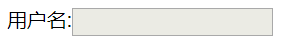

# 第一阶段 html+css 相关知识

## 一.html 相关知识

### html+css 常用标签

- 解析 html 生成标签里面的意思

```html
<!DOCTYPE html>
<!-- 声明文档类型 告诉游览器以h5版本去解析类型-->
<html lang="en">
  <!-- 默认英文环境 -->
  <head>
    <meta charset="UTF-8" />
    <!-- 设置字符集编码,utf-8是优化后的全球码 -->
    <meta name="viewport" content="width=device-width, initial-scale=1.0" />
    <meta http-equiv="X-UA-Compatible" content="ie=edge" />
    <title>Document</title>
  </head>
  <body>
    <!-- 常用标签 -->
    1.
    <hr />
    水平线,分割线 2. <br />
    换行标签 3. <strong></strong> 语义化加粗 4. <em></em> 语义化斜体 5.
    <ins></ins> 下标线 6. <sub></sub> 下标 <sup></sup> 上标
  </body>
</html>
```

- 文件的两种路径以及列表
  - 路径

```html
<!-- img的绝对路径 -->

<!-- tranget 设置跳转的方式 -->
<!-- target="_blank"  新窗口跳转-->
<!-- targrt="self" 默认值,当前窗口跳转 -->
<!-- tranget="_parent"  从父窗口打开-->
<!-- tranget="_top"  从顶级窗口打开-->

<!-- 图片找不到时给用户的提示信息 -->
<a href="http://www.baidu.com/"
  ></a>
```

- 列表

```html
1.
<!-- 自定义列表 -->
<dl>
  <dt>第一章</dt>
  <dd>html</dd>
  <dd>css</dd>
  <dd>js</dd>
  <dt>第二章</dt>
  <dd>es6</dd>
  <dd>移动端</dd>
  <dd>dom操作</dd>
</dl>
2.
<table border="1" cellspacing="20" cellpadding="30" align="center">
  <!-- cellspacing="10" 是单元格与单元格之间的距离   cellpadding="10"是文字与单元格之间的距离 a'lign是标签的属性 -->
  <tr>
    <th>姓名</th>
    <th>年龄</th>
    <th>爱好</th>
  </tr>
  <tr>
    <td>小红</td>
    <td>11</td>
    <td>吃</td>
  </tr>
  <tr>
    <td>小红</td>
    <td>11</td>
    <td>吃</td>
  </tr>
  <tr>
    <td>小红</td>
    <td>11</td>
    <td>吃</td>
  </tr>
</table>

3. 浏览器内核 1）Trident(IE内核) 2）Gecko(firefox) 3） webkit(Safari) 4）
Chromium/Blink(chrome) 5） Presto(Opera)
```
