# 第一阶段 html+css 相关知识

## 一.html 相关知识

### html+css 常用标签

- 解析 html 生成标签里面的意思

```html
<!DOCTYPE html>
<!-- 声明文档类型 告诉游览器以h5版本去解析类型-->
<html lang="en">
  <!-- 默认英文环境 -->
  <head>
    <meta charset="UTF-8" />
    <!-- 设置字符集编码,utf-8是优化后的全球码 -->
    <meta name="viewport" content="width=device-width, initial-scale=1.0" />
    <meta http-equiv="X-UA-Compatible" content="ie=edge" />
    <title>Document</title>
  </head>
  <body>
    <!-- 常用标签 -->
    1.
    <hr />
    水平线,分割线 2. <br />
    换行标签 3. <strong></strong> 语义化加粗 4. <em></em> 语义化斜体 5.
    <ins></ins> 下标线 6. <sub></sub> 下标 <sup></sup> 上标
  </body>
</html>
```

- 文件的两种路径以及列表
  - 路径

```html
<!-- img的绝对路径 -->

<!-- tranget 设置跳转的方式 -->
<!-- target="_blank"  新窗口跳转-->
<!-- targrt="self" 默认值,当前窗口跳转 -->
<!-- tranget="_parent"  从父窗口打开-->
<!-- tranget="_top"  从顶级窗口打开-->

<!-- 图片找不到时给用户的提示信息 -->
<a href="http://www.baidu.com/"
  ></a>
```

- 列表

```html
1.
<!-- 自定义列表 -->
<dl>
  <dt>第一章</dt>
  <dd>html</dd>
  <dd>css</dd>
  <dd>js</dd>
  <dt>第二章</dt>
  <dd>es6</dd>
  <dd>移动端</dd>
  <dd>dom操作</dd>
</dl>
2.
<table border="1" cellspacing="20" cellpadding="30" align="center">
  <!-- cellspacing="10" 是单元格与单元格之间的距离   cellpadding="10"是文字与单元格之间的距离 a'lign是标签的属性 -->
  <tr>
    <th>姓名</th>
    <th>年龄</th>
    <th>爱好</th>
  </tr>
  <tr>
    <td>小红</td>
    <td>11</td>
    <td>吃</td>
  </tr>
  <tr>
    <td>小红</td>
    <td>11</td>
    <td>吃</td>
  </tr>
  <tr>
    <td>小红</td>
    <td>11</td>
    <td>吃</td>
  </tr>
</table>

3. 浏览器内核 1）Trident(IE内核) 2）Gecko(firefox) 3） webkit(Safari) 4）
Chromium/Blink(chrome) 5） Presto(Opera)
```

### 二.表单和 css 样式

- 表单域有关属性

```html
<!-- 1.表单有关属性 -->

<form action="" method=""></form>

<!-- 1.action method -->

<!-- action:表单提交到服务器上的地址

        method:提交方式

            get提交:地址栏会显示,不安全,容量小,常用于获取信息

            post提交:地址栏不会显示,较安全,提交数据没有上线,常用于保存信息 -->
```

- 表单的有关属性

#### 表单里面一定要写 name!

1. disabled 禁用:
   
2. readonly 只读:多数用于文本域中内容,防止被修改
   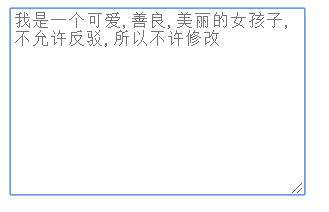
3. placeholder 占位符提供可描述输入字段预期值的提示信息
   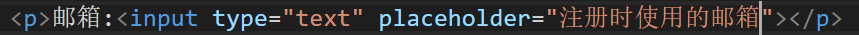
   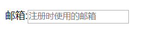
4. autofocus 元素应该自动获得焦点
   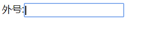
5. multiple 多文件上传 -->
   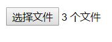
6. checked 默认选中下拉框里面默认选中使用 selected
   
7. label 标签以及其他组合标签注意

##### input 元素定义标注。作用：用于绑定一个表单元素, 当点击 label 标签的时候, 被绑定的表单元素就会获得输入焦点。

for 属性规定 label 与哪个表单元素绑定。

```html
<!-- lable第一种使用方法 -->
<label>男:<input type="radio" name="sex" value="0"/></label>
<label>女:<input type="radio" name="sex" value="1"/></label>
<!-- lable 第二种使用方法 -->
<label for="women"> 女:</label>
<input type="radio" id="women" />

<!-- 下拉菜单只需要给selected设置name -->
 <select name="age"" id="age">
    <option value="0">18</option>
    <option value="1">19</option>
    <option value="2">20</option>
</select>
<!--age=0  代表 选中18岁 -->

<!-- <fieldset> <legend> 可以实现表单的分组。 <fieldset> <legend>是一对组合标签-->
    <fieldset>
        <legend>基本信息</legend>
    </fieldset>
```

8. input 时出现的情况，可以设置文字
   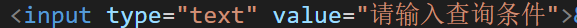
   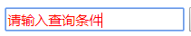
   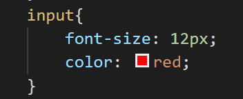

## 二：css 相关属性

1. id 像人的身份证,每个标签唯一标识
2. css 书写位置
   1） 外部样式 用的最多 可以复用 实现代码分离
   2）行内样式 少用 样式结构 严重耦合 不能复用 不能复用
   3）内部样式 平常演示代码时 经常用 不能复用 比如一个网页有三个子页面的头部样式一样,需要写三次,没办法引用
3. 复合选择器

- 后代选择器

```html
<div class="box">
  <div class="inner-box">我最美</div>
</div>
<!-- 样式 -->
.box .inner-box{ color:aquamarine; }
```

- 并集选择器需要逗号分隔

```html
<div>
  <p>1</p>
  <h1>2</h1>
  <div>3</div>
</div>
<!-- 样式 -->
h1, p, div{ background-color: pink; }
```

- 交集选择器,不需要带空格，是同时含有两个类名的选择器

```html
<div>
  <p class="red green">威威</p>
  <p class="red">威威</p>
  <p class="red">得到</p>
  <p class="red">得到</p>
</div>
<!-- 样式 -->
.red.green{ color:green; }
```

- 子代选择器虽然结果 D3 也是绿的,但是查看源代码 D3 中没有相关 background-color 的属性

```html
<div class="d1">
  我是D1
  <div class="d2">
    我是D2
    <div class="d3">我是D3</div>
  </div>
</div>
<!-- 样式 -->
.d1>.d2{ background-color: green; }
```

- 其他一些信息
  - 权重大小
    行内样式(1000)>id 选择器(100)>class 选择器(10)>标签选择器(1) > 通配符/继承属性(0)
  - 首行缩进
    text-indent: 2em;
    如果设置 width:2em;就是 2\*字体的大小
  - 标签的表现形式 - 块状标签：独占一行，宽高有效。比如：div p h1~h6 form table hr br ul>li ol>li dl>dt/dd - 行内块标签：可以同一行显示，宽高有效。比如: input select img button \*
    行内标签：可以同一行显示，但是宽高无效。比如：a span strong del ins em i b - block:块级元素 设置宽高有效,且独占一行
    inline-block:设置宽高有效,但是不换行
    inline:行内元素 设置宽高无效,且不换行
- font:italic bolder 20px/1.2 'Arial','Microsoft YaHei'
  20px/1.2:行高是字体大小\*1.2 倍数;

4. 盒子模型及浮动
   1. 背景图片
   - background-attachment: fixed/scroll;(此时相对于 body(视口)定位,不会随着网页滚动) \*/
   2. 隐藏元素的两种方式
   - display: none; 隐藏元素 不再占据位置 消失了
   - visibility: hidden; 隐藏 依然占据位置 好像 透明度
   - 显示:display: inline; display 只要不为 none,都会出现
     /_ visibility: visible; _/ - overflow:hidden
     overflow 用来处理超出部分 如何展示
     /_ 宽度有限 _/
     /_ 不能换行 _/
     /_ 超出打点 _/
     /_ 超出部分隐藏 _/

- 在 p 元素中:需要三个一起使用,不需要给高度
  white-space:nowrap; 不换行
  overflow:hidden 超出部分隐藏
  text-overflow:ellipsis; 显示不完整部分为.....显示
  5. 盒子添加 border 和 padding 会改变盒子的大小
     margin 不会改变盒子的大小

6. 遇到的一些问题

- span:padding 上下 没有作用 ,左右添加 padding 生效 只针对 span 标签吗? a 标签 padding 上下左右都起作用 标签 margin 上下左右都起作用:都显示 padding 和 margin 但是在页面中实际上不显示
  - margin-top/margin-bottom 对于行内元素无效。
    margin : 上下 没有作用 左右添加生效

7. margin 的两个问题

- margin 的嵌套坍陷问题
  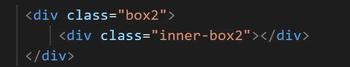
  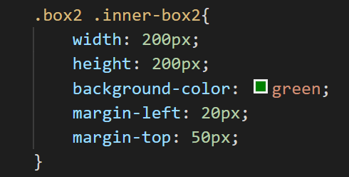
  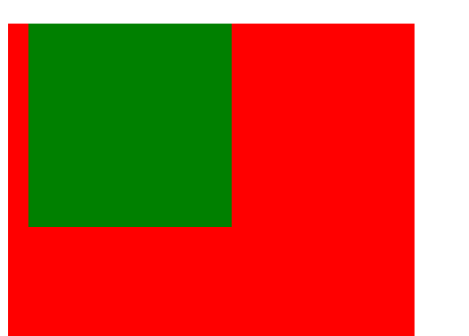
  -margin-left 有作用,margin-top 是外面的大盒子向下移动了 50px

- 解决办法:

1. 给父类盒子 添加 overflow: hidden;
2. 给父类添加极小的 padding 或者 border

- margin 出现重叠现象

  谁大听谁的

8. emment 的使用
   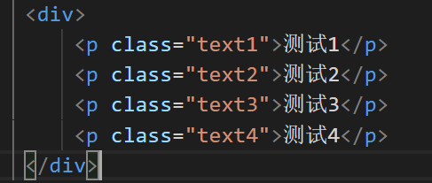
   这个样式如果用快捷键那就是 div>p.text${测试$}
9. 两栏自适应
   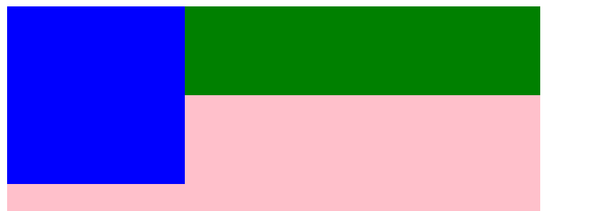
   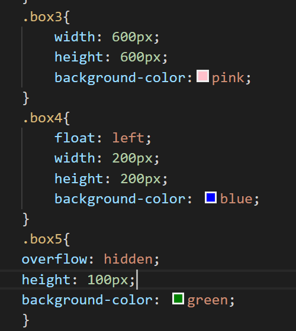
   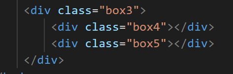
   左边左浮动,右边不要设置宽度,加一个 overflow:hidden;会实现右边自适应的情况

#### 浮动以及定位

1. `高度塌陷`

- 浮动会脱离标准文档流使其破坏文档结构,因为浮动后,不再撑起父盒子高度,下面的元素会上移
- 如何清除浮动:带来的影响
  解决方法:
  1):给父类盒子制定一个高度 2)在浮动元素后面加一个空盒子,然后样式中写上; clear:both; 3)给父类元素设置一个 overflow:hidden;

2. `定位`

- `sticky 粘性定位`粘性定位可以被认为是相对定位和固定定位的混合。
  - 元素在跨越特定阈值前为相对定位，之后为固定定位。
  - 比如给一个 div 设置 div{ top:10;position:sticky; }
  - 在网页滚动到元素 top 距离小于 10px 之前，元素为相对定位。之后，元素将固定在与顶部距离 10px 的位置，直到 网页回滚到阈值以下。
- `fixed 固定定位`元素会被锁定在屏幕的某个位置上，当访问者滚动网页时，固定元素会在屏幕上保持不动。 (相对于视口定位)
  (1)脱离文档流
  (2) 给元素设置固定定位之后 元素位置从浏览器左上角出发。 - 可以将行内元素转换块元素
- `relative 相对定位:不脱离文档流`
- `absolute 绝对定位`元素相对于视口或离他最近的祖先定位元素进行定位。

      	 - 当开启了绝对定位以后，可以使用 top、right、bottom、left 四个属性对元素进行定位。

  - 绝对定位会使元素完全脱离文本流。

  - 绝对定位的块元素的宽度会被其内容撑开。
  - 绝对定位会使行内元素变成块元素。
  - 一般使用绝对定位时会同时为其父元素指定一个相对定位，以确保元素可以相对于父元素进行定位。

- `z-index`index 只对定位的盒子设置层级有效
- `相对定位的盒子必须要有宽高`:比如 a 绝对定位,a 的父亲 b 相对定位,b 必须要有高度;

### 项目中遇到的问题

- `京东登录页面`
  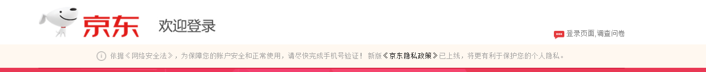
  - 在第二部分:文字方面,图片的两种方法
    (如果用定位,如果游览器或者字体变化,就破坏原有的结构,所以这种情况不建议用定位做)
    1. 图片与文字对齐
    - 用 img 里面放小图标,然后后面文字,用图片和文字对齐的方式
    - 给一个版心,版心不设置宽度,有内容
    2.  p 里面放文字,然后给 P 设置背景图片引入图标,接着给文字一个缩进,text-index; 可以设置图标位置:background-position:12px 0;
- `项目中文件的位置结构`
  - 遇到一个网站,几个页面的一种情况,怎么放位置
    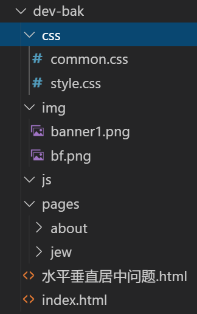
    首页:css 中放首页的样式(style.css)以及其他页面公用的样式(common.css)
    images 放首页的图片
    js 放首页的 js
    index.html 是首页的代码
    pages 文件夹是放其他页的相关代码 比如里面有关于我们的页面的代码样式
    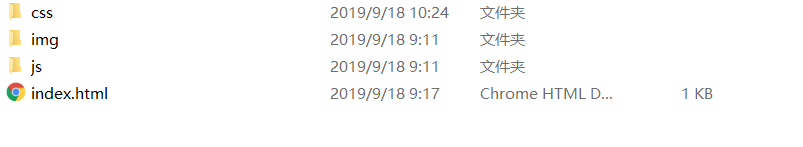
    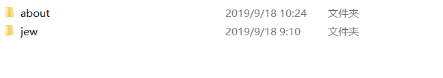
    about 文件夹里面的代码位置
- `婚纱案例banner部分的轮播图小圆点`

  - 因为小圆点 hover 上去的时候加了一个边框,如果直接 hover 上去加边框,宽度和高度改变,会挤动旁边的小圆点,所以,可以先给小圆点加一个透明的边框,hover 上去的时候,直接改变边框颜色,又因为,直接加边框,背景颜色默认从 border 平铺,小圆点会变大,所以,可以裁剪
    background-clip:content-box;
  - 婚纱首页里面，土拍你可以从彩色变成灰色的一个属性是：选中图片使其变成灰色 filter: grayscale(100%);
  - 如果需要 hover 的时候出现字体，可以设置 opcity

- `制作三角形`

```html
.box{ width:0; height:0; border: 10px solid; border-color:transparent
transparent green transparent;
```

- `垂直居中的几种方式`

  - 单行文本,垂直水平居中 text-align:center
  - 行内块元素 水平居中 给父类设置 text-align:center;
  - 块级元素 垂直水平居中
  - 知道宽高

    - width:100px;
      height:100px;
      position:absolute;
      left:50%;
      top:50%;
      margin-left:-50px;
      margin-top:-50px;

    第二种情况

    - .center {
      width: 100px;
      height: 100px;
      position: absolute;
      left: 0;
      top: 0;
      bottom: 0;
      right: 0;
      margin: auto;
      background-color: green;
      transition: all ease 3s;

  - 不知道宽高
    transform:对元素进行 位移旋转 拉伸 50% 相对于自身
    position:absolute;
    left:50%;
    top:50%;
    transform:translate(-50%,-50%);
    如果只是水平居中;transform:translate(-50%,0);
    垂直居中 transform:translate(0,-50%);

- `字体之间如何让设置更加合适`

  - 文字一个小标题,下面一段文字,可以给下面一个行高,上面标题距离下面的一个 padding

- `图片背景图片和html中引入图片`
  - 如果遇到一小排图片,建议,如果是死的,不经常更换,使用背景图片.如果需要定期去更换图片,在 html 页面中写路径更好一些

### 字体图标的引入

- 有关网址阿里巴巴 字体图标 https://www.iconfont.cn/
  font-class 引用

  - 为使用 class 来定义图标，所以当要替换图标时，只需要修改 class 里面的 unicode 引用。
  - 下载需要的图标，然后将文件里面的 iconfont.css 引入到页面

    ```html
    <span class="iconfont icon-gongpai"></span>
    ```

- font awesome 字体图标网站
  直接下载是全部的图标
  http://fontawesome.dashgame.com/
- 1.下载 font-awesome --> 2.引入 css 文件
  fa 和 fa 前缀
  只支持 675 个图标

### MarkDown 的使用方法

参考网站 https://maxiang.io

### iframe 标签的使用

```html
<!-- 内联框架标签 -->
<iframe
  src="https://www.baidu.com"
  frameborder="1"
  width="400"
  height="400"
></iframe>

<iframe src="01-字体图标.html" frameborder="2" width="400" height="400">
</iframe>
<iframe src="test.html" frameborder="1"></iframe>
```

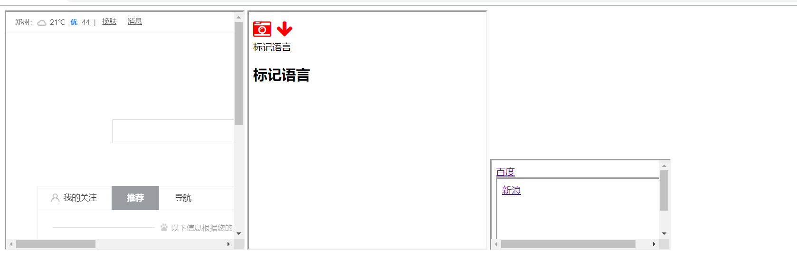

### `git`的使用

#### 下载安装

- git 官网 下载
- 安装即可

#### git 的四个区域

- 工作区 (操作代码)
- 暂存区 add
- 本地仓库 commit
- 远程仓库 push
  

#### git 配置

- 配置信息列表
  git config --list

- 设置用户名
  git config --global user.name "John Doe"

- 设置邮箱
  git config --global user.email johndoe@example.com

### 简单命令

- git init 初始化本地仓库
- git status 查看文件状态 (红色就是没有添加到暂存区,绿色就是已经添加到了暂存区,绿色红色都没有(目前工作区文件都已提交到了本地仓库))
- git add 文件名 (将文件添加到 暂存区)
- git add . (将所有文件添加到 暂存区)
- git commit -m'提交信息' 暂存区内容 提交到本地仓库
- git remote add origin [url]
- git push origin master

#### 如何上传笔记到 github 仓库

- 右键 git bash here 黑窗口（在需要上传的文件内打开）
- git init（只有第一次需要）
- git add .
- git commit -m''
- git git remote add origin [url](只需第一次)
- git push origin master

### HTML5 增改内容

- 新增 input type 类型
  - `email`限制用户输入必须为 URL 类型
  - `number`只能输入数字
  - `range`范围 滑动条
  - `color`拾色器
  - `time`时间
  - `date`选取日、月、年
  - `datetime`选取时间、日、月、年（UTC 时间）(移动支持)
  - `datetime-local`选取时间、日、月、年（本地时间
  - `month`选取月、年
  - `week`选取周和年
  - `time`时间
  - `time`时间
  - `部分类型是针对移动设备生效的，且具有一定的兼容性，在实际应用当中可选择性的使用。`
- 新增 form 表单元素
  - `oninput`用户输入内容时触发，可用于移动端输入字数统计
  - `oninvalid`验证不通过时触发
  ```html
  网址: <input type="url" required oninvalid="alert('请填写此字段')" /><br />
  ```
  - `tabindex`(控制 input 标签按 tab 键获取到焦点的顺序)
  ```html
  姓名: <input type="text" tabindex="1" /> <br />
  年龄: <input type="number" tabindex="3" /> <br />
  电话: <input type="tel" tabindex="2" /> <br />
  地址: <input type="text" tabindex="4" />
  ```
