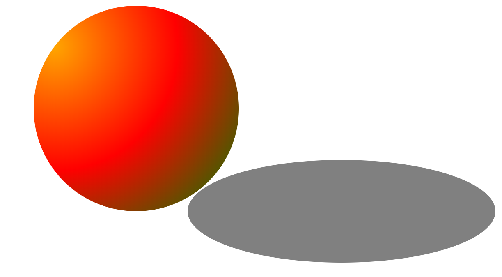

### css 选择器

- `属性选择器`: 每一个标签都有 title 属性
  /_ 包含 n 这个 字符 _/
  /_ ^ 以某个字符开始 _/
  /_ \$ 以某个字符结束 _/

```html
<ul>
  <li class="litem1" title="您好">text1</li>
  <li class="litem2" title="我最美">text2</li>
  <li class="litem3" title="我是最漂亮的">text3</li>
  <li class="litem4">text4</li>
  <li class="litem5">text5</li>
  <li class="litem6">text6</li>
</ul>
<!-- 样式 -->
li[title] { background-color: green; } li[title*="我"] { background-color: red;}
li[title^="我"] { color: blue; } li[title$="的"] { background-color: orange; }
```

效果图


- `+兄弟节点`：比如.litem4+li 会改变 litem5 的兄弟元素的属性，一次改变一个兄弟元素的值
- `~兄弟节点`：比如.litem4+li 会改变 litem5 和 liitem6 的兄弟元素的属性，改变是 litem4 后面的兄弟元素的值
- `伪类选择器`
  :link 是连接时显示的属性
  :active 点击时一瞬间显示的属性
  :visited 访问后，点击后显示的属性
  :hover 鼠标放上去的属性
- `结构为类` E:nth-child(n) E: 主要是用来确定父类

  - E:nth-child(n) 符合 第 n 个 孩子,而且 还害得 符合 E

  ```html
  <ul>
    <li>li01</li>
    <p>不凡学院</p>
    <li>li02</li>
    <li>li03</li>
    <li>li04</li>
    <li>li05</li>
    <li>li06</li>
  </ul>
  <div class="box">
    不敢
  </div>
  <div class="box"></div>
  <div class="box">&nbsp;</div>
  li:first-child { color: red; } li:last-child { color: aqua; } li:nth-child(2)
  { /* 这个时候第2 个元素 不是li 标签 匹配不到 */ color: green; }
  <!--E:empty 选中没有任何子节点的E元素；注意，无法选择有空格或者回撤的标签  -->
  .box:empty { background-color: red; }
  <!-- 第一个div有字。选中第二个  第三个有空格-->
  ```

- 锚点

```html
<ul>
  <li class="li1">1</li>
  <li class="li2">2</li>
  <li class="li3">3</li>
  <li id="li4" class="li4">4</li>
  <li class="li5">5</li>
  <li class="li6">6</li>
</ul>
<a href="#li4">点击</a>
```

点击 a 连接，会跳转到，有 a 连接 herf 属性所填的 id 属性的内容部分

- `伪元素`
  ::before
  ::after
  /_ 默认为行内元素 _/
  可以清除浮动的影响

  ```html
  .clearFix::after { /* 这个属性要有 */ content: ''; display: block; clear:
  both; }
  ```

### 透明度

- 什么时候用，搞清楚
  - 一般元素透明用 opacity：用于图片和字体一起改变透明度
  - 遮罩层 rgba 背景透明
  - 制作三角的时候用 transparent

### 阴影

- `文字阴影`
  水平偏移 垂直偏移 模糊度 颜色
  text-shadow: 2px 2px 2px red, -3px -3px 2px green;
- `盒子阴影`
  box-shadow: 10px 10px 5px 5px green;

### 盒子模型

- content-box:对象的实际宽度等于设置的 width 值和 border、padding 之和
- border-box： 对象的实际宽度就等于设置的 width 值，即使定义有 border 和 padding 也不会改变对象的实际宽度，即 ( Element width = width )
  我们把这种方式叫做 css3 盒模型

## 不能给伪元素添加 transform 属性

### 边框图片 border-image:

属性是一个简写属性，用于设置以下属性：

• border-image-source 图片
• border-image-slice 图片边框向内偏移量
• border-image-width 边框宽度
• border-image-outset 边框图像区域超出边框的量
• border-image-repeat 图像边框是否应平铺(repeated)、铺满(rounded)或拉伸(stretched)

### 渐变

- 线性渐变
  - linear-gradient 线性渐变指沿着某条直线朝一个方向产生渐变效果
    语法：background: linear-gradient(direction, color-stop1, color-stop2, ...)
  - 添加私有化前缀 时 方向 不带 to 而且正好相反 background: -webkit-linear-gradient(top, red, yellow, green);
- 径向渐变
  - radial-gradient 径向渐变指从一个中心点开始沿着四周产生渐变效果
    语法：background: radial-gradient(center, shape size, start-color, ..., last-color);
    径向渐变案例

```html
<div class="box"></div>
.box { position: relative; width: 400px; height: 400px; background:
radial-gradient(circle at 10% 20%, orange, red, green); margin: 100px auto;
border-radius: 50%; } .box::after { content: ""; width: 600px; height: 200px;
position: absolute; left: 300px; top: 300px; background-color: gray;
border-radius: 50%; }
```



### 背景

- background-size:cover/contain
- 图片比例不变
- cover 不保证图片展示完整
- contain 会保证把 图片显示完整 但是盒子会有留白
  ps:比如有一个盒子，100*100 ，但是图片 100*200；如果用 cover，那就是图片右边部分看不到，铺满盒子
  如果用的是 content，图片就变成了 50\*100 的，放在盒子里面会有留白

### 背景图片

- `裁剪背景`
  background-clip:content-box;
  background-clip: padding-box;
  background-clip: border-box 默认
- `设置背景图片 以哪个位置为起点`
  background-origin: padding-box; 默认
  background-origin: content-box;
  background-origin: border-box;

### 过渡

- 指定过渡的属性 transition-property: width；
- 指定过渡持续时间 transition-duration: .8s;
- 指定过渡开始的延迟时间 transition-delay: 1s;
- 指定时间运动函数
  transition-timing-function: linear（匀速）|ease（变速默认）|ease-in|ease-out|ease-in-out|cubic- bezier(n, n, n, n);
- 简写 transition: all .4s ease 1s;最后一个是延迟时间

### 2d 变换

transform 可以实现 2d 变换 旋转(rotate) 平移(translate) 拉伸(skew) 缩放（scale）
