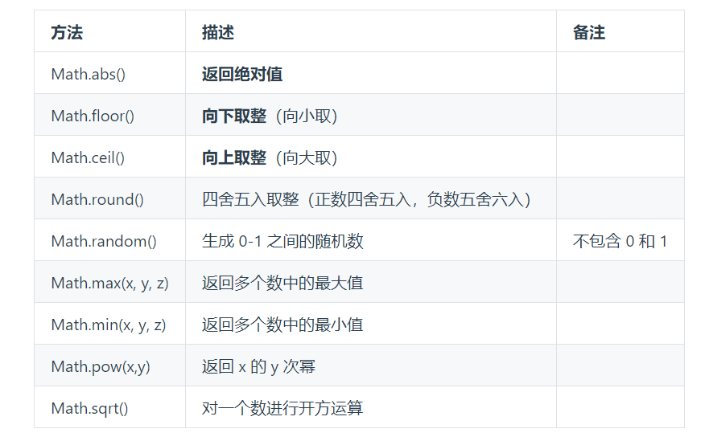
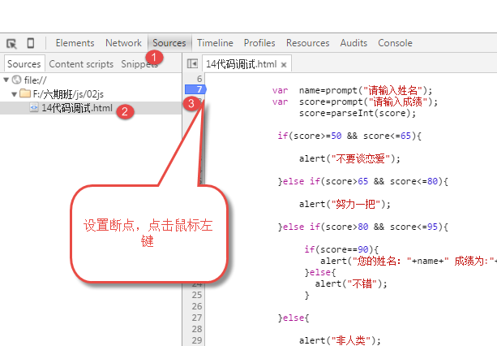
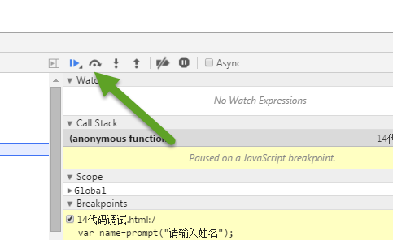
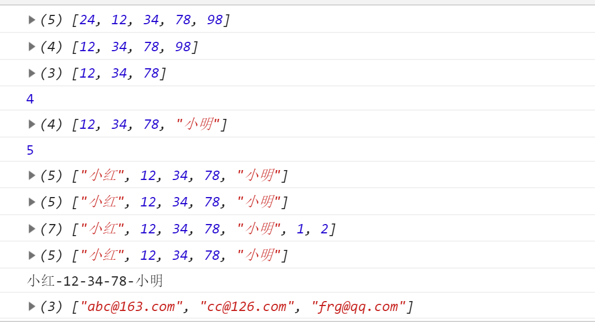
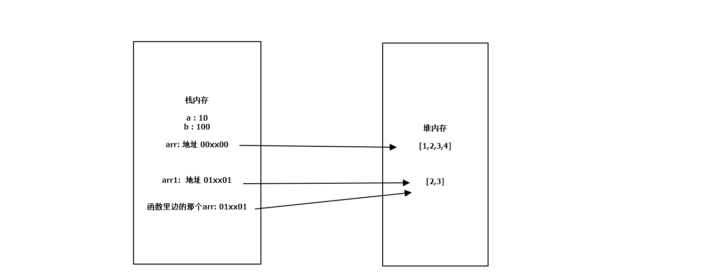

`1）变量和数据类型，类型转换 2）Date 和 Math 对象 3）流程控制语句，逻辑运算符，for 循环while循环等嵌套 4)数组，排序（冒泡排序，选择排序，插入排序）5)函数`

### 变量

- `变量名命名规则`

  1. 只能使用 字母,数字,下划线\\\\\\\\\\\\\\\\\\\\\\\\\\\\\\\\\\\\\\\\\\\\\\\\\\\\\\\\\\\\\\\\\_\$
  2. 严格区分大小写 变量 a 和 变量 A 不一样
  3. 不能以数字开头 2a 错误
  4. 不能使用 js 当中的 关键字和保留字 (具有特殊功能的短语)
  5. 驼峰命名 firstName navItem
  6. 语义化 见名知意

- `数据类型`:分为 两类 基本数据类型(原始数据类型) ;引用数据类型(复杂数据类型)

  - 基本数据类型 包括六种

    1. 字符串 string 类型

       - 字符串类型 用引号引起来 引号不能嵌套(单引号里边不能嵌套单引号),但是单引号可以嵌套双引号，双引号里面可以嵌套单引号。

    2. 数字 number 类型

       - Infinity(这个数据表示无穷大)
       - Infinity(这个数据表示无穷小)

    3. 布尔值 boolean 类型
       - true false 主要用于做 逻辑判断
    4. undefined
       - 声明了一个变量，但是没有赋值（例如：var a;），此时它的值就是 undefined。
    5. null
       - null 表示 空 什么都没有,通常用来表示一个空对象
    6. symbol

    `1)ps:NaN 是算不出来数值的一个结果:比如 var c = "abc" / 18;console.log(c); ///NaN`
    `2)isNaN() 用来判断括号里边的 变量 是不是 NaN`
    `3)typeof 运算符 用来判断数据的类型console.log(typeof str); //string 字符串类型`

- `引用数据类型`

  1. 数组 Array 类型 var arr=[];
  2. 函数

  - function 关键字 声明函数(定义) 函数名(函数的参数) {执行的代码}
  - function say() {
    // 这个函数调用时,执行的代码
    alert("你好");
    }
  - 函数 不调用 是 不会执行的
  - say(); // 调用

  3. 对象 Object 类型(数组 和 函数 都是 对象)

  - 我们把 任何东西 抽象成 对象 的 思想(意识)
    大括号
    这个对象 在 描述一个人
    对象的作用 描述事物
    key:value
    属性:属性值
    属性之间 用逗号隔开
    ```html
    var user = { name: "小明", age: 24, sex: "男", height: 172, weight: 56,
    children: { name: "小红", age: 2, }, cj: [90, 92, 100], say: function () {},
    };
    ```

  ```

  ```

- `类型转换`
  var a = 123;
  var b = true;
  var c;
  var d = null;
  var e = '你好';
  - 其他===> 字符串
    1)+ 拼接字符串与 string()函数结果一样
    ps:console.log(a + '');
    2)string()函数 js 当中的隐式转换(转成字符串)
    console.log(String(a)); // '123'
    console.log(String(b)); // 'true'
    console.log(String(c)); // 'undefined'
    console.log(String(d)); // 'null'
  - 其他===> 布尔值
    Boolean()函数 隐式转换(转换成布尔值) 采用的就是这个规则
    变成 false 的五种情况 0 ,"",NaN,null,undefined
  - 其他==>number 类型
    Number()函数 隐式转换(转成数字) 用的是这个规则 1.如果字符串中是纯数字， 则直接将其转换为数字。 2.如果字符串中有非数字的内容， 则转换为 NaN。（ 此处可以看到 Number() 函数的局限性） 3.如果字符串是一个空串或者是一个全是空格的字符串， 则转换为 0
- `算术运算符`

  1. 当对非 Number 类型的值进行运算（包括+、-、\*、/）时，会将这些值转换为 Number 然后再运算。
  2. 规律 : NaN 参与的的运算 结果都是 NaN
  3. 任何的值和字符串做加法运算，都会先转换为字符串，然后再做拼串操作。
  4. 任何值做-、\*、/运算时都会自动转换为 Number。

- 赋值运算
  比较 num++ 和 ++num 区别
  1）共同点 : 两个都能实现 num 的 自增 1;
  2）不同点: 返回值不同(表达式计算结果不同) n++ (返回+1 之前的值) ++n(返回+1 之后的值)
  var num=10;

  - result1=num++;
    num:11;
    result1:10;

  - result2=++num;
    num:11;
    result2:11;

- 比较运算符

  - 通过比较运算符可以比较两个值之间的大小关系，如果关系成立它会返回 true，如果关系不成立则返回 false。
  - （1）对于非数值进行比较时，会将其转换为数字然后再比较。
  - (2) 特殊情况：如果符号两侧的值都是字符串时，不会将其转换为数字进行比较
    比较两个字符串时，比较的是字符串的 Unicode 编码
  - （3）任何值和 NaN 做任何比较都是 false。
  - (4)// undefined 衍生自 null，所以这两个值做相等判断时，会返回 true。
    console.log(undefined == null); //打印结果：true。

- parseInt 和 parseFloat
  - parseInt()的作用是将字符串中的有效的整数内容转为数字
    - 转换规则: 从第一个非空白字符（空格、换行、tab）开始转换，直到遇到一个非数字字符为止。
    - 如果对非 String 使用 parseInt()或 parseFloat()，它会先将其转换为 String 然后再操作
    - console.log(parseInt(true)); // NaN
  - parseFloat()的作用是：将字符串转换为浮点数
    - 自动带有截断小数的功能：取整，不四舍五入
    - 遇到 第二个小数点 也会停止

### Date 和 Math 对象

#### Date 对象的用法

- Date 对象 js 内置对象；Date 构造函数 首字母大写 用来造(创建)对象；Date 对象 就是 内置的 时间对象 模板；构造函数 创建对象 需要用 new 这个关键词

```html
<script>
    //  写法一：表示的是当前代码执行的时间（也可以理解成是获取当前时间对象）
    var date1 = new Date();
    console.log(date1);
    // 写法二：在参数中传递一个表示时间的字符串（兼容性最强）
    var date2 = new Date("2019/9/25 19:04:00");
    console.log(date2);

    //   获取日期和时间
    // Date 对象 有如下方法，可以获取日期和时间：
    //   当前时间 2019 9月25日 19：10
    var currentDate = new Date();
    console.log(currentDate); //Wed Sep 25 2019 19:09:23 GMT+0800 (中国标准时间)
    console.log(currentDate.getDate()); //得到日期 1-31              25
    console.log(currentDate.getDay()); // 获取星期几 0-6               3
    console.log(currentDate.getMonth()); // 获取月 0-11（0 代表一月）   8
    console.log(currentDate.getFullYear()); //获取年份               2019
    console.log(currentDate.getHours()); //获取小时 0-23            19
    console.log(currentDate.getMinutes()); //获取分钟                    20
    console.log(currentDate.getSeconds()); //获取分钟                   15
    //   getTime()：获取时间戳:距离 1970年 0时0分0秒  的  毫秒数
    console.log(currentDate.getTime());
    console.log(new Date(1569479335949));
    //可以把时间戳用new Date函数转化为一个标准事件
  - 拼接字符串 常规操作
    2019 年 9 月 26 日 14 时 26 分 30 秒;
    var str = year + '年' + (month + 1) + '月' + day + '日 ' + hour + '时' + min + '分' + second + '秒';
  - 拼接字符串 第二种操作
  方法   把其中的 变量干掉 改成  '+变量名+'
  2019 年 9 月 26 日 14 时 26 分 30 秒
  str=''+year+'年 '+(month+1)+' 月 '+day+' 日 '+hours+' 时 '+min+' 分 '+second+' 秒'
</script>
```

#### Math 对象

- js 当中内置的对象 这个对象里边包含了 很多数学上常用的方法
  

#### 流程控制语句

- if 语句

  - 条件分支语句
    格式 1： if (条件表达式) { // 条件为真时，做的事情 } else { //
    条件为假时，做的事情 } 格式
    2：（多分支的 if 语句） if (cj >= 90) {
    alert('优秀') } else if (cj >= 80) { alert('良好'); } else if (cj >= 60) {
    alert('及格'); } else { alert('不及格') } // 每一个 else 都暗含了
    之上的条件不满足

- 三元运算符:结果为真 走冒号前边的代码 为假 走冒号后边的代码
- 代码调试
  
  第三步设置两个段点，表示需要调试的代码段
  
  刷新页面
- switch 语句（条件分支语句）

```html
<script>
  var num = 4;

  //switch判断语句
  switch (num) {
    case 1:
      console.log("星期一");
      break;
    case 2:
      console.log("星期二");
      break;
    case 3:
      console.log("星期三");
      break;
    case 4:
      console.log("星期四");
      break;
    case 5:
      console.log("星期五");
      break;
    case 6:
      console.log("星期六");
      break;
    case 7:
      console.log("星期日");
      break;
    default:
      console.log("你输入的数据有误");
      break;
  }
</script>
```

    - switch 语句的执行流程
    首先，计算出表达式的值，和 case 依次比较，一旦有对应的值，就会执行相应的语句，在执行的过程中，遇到 break 就会结束。
    然后，如果所有的 case 都和表达式的值不匹配，就会执行 default 语句体部分，然后程序结束掉

- for 循环

```html
<script>
  for (var i = 1; i < 13; i = i + 4) {
    console.log(i);
    //     程序一运行，将执行var i = 1;这条语句， 所以i的值是1。
    // 然后程序会验证一下i < 13是否满足，1<13是真，所以执行一次循环体（就是大括号里面的语句）。
    // 执行完循环体之后，会执行i=i+4这条语句，所以i的值，是5。

    // 程序会会验证一下i < 13是否满足，5<13是真，所以执行一次循环体（就是大括号里面的语句）。
    // 执行完循环体之后，会执行i=i+4这条语句，所以i的值，是9。

    // 程序会会验证一下i < 13是否满足，9<13是真，所以执行一次循环体（就是大括号里面的语句）。
    // 执行完循环体之后，会执行i=i+4这条语句，所以i的值，是13。

    // 程序会会验证一下i < 13是否满足，13<13是假，所以不执行循环体了，将退出循环。

    // 最终输出输出结果为：1、5、9
  }
</script>
```

- while 循环和 do while 循环

```html
<script>
  //while 循环
  var i = 1;
  while (i <= 10) {
    console.log(i);
    i++;
  }
  //do...while 循环
  var n = 1;
  do {
    console.log(n);
    n++;
  } while (n <= 10);
</script>
```

    - while 循环和 do...while 循环的区别：
    - while 是先判断后执行，而 do...while 是先执行后判断。也就是说，do...while 可以保证循环体至少执行一次，而 while 不能。

- break 和 continue

  - `break 可以用来退出 switch 语句或整个循环语句（循环语句包括 for、while）。ontinue 可以用来跳过当次循环。continue,break 会立即终止离它最近的那个循环语句`

  ```html
  <script>
    //举例 1：通过 break 终止循环语句
    for (var i = 0; i < 5; i++) {
      console.log("i的值:" + i);
      if (i == 2) {
        break; // 注意，虽然在 if 里 使用了 break，但这里的 break 是服务于外面的 for 循环。
      }
    }
    //打印结果：i的值:0
    //i的值: 1;
    //i的值: 2;
    //举例 2：通过 continue 用来跳出当次循环
    // 只打印 偶数
    for (var i = 1; i <= 10; i++) {
      // if (i % 2 === 0) {
      //     console.log(i);
      // }
      if (i % 2 === 1) {
        continue;
      }
      console.log(i);
    }
  </script>
  ```

  ### 数组

1. 创建数组的两种方式

- 对象定义（数组的构造函数）
  `var arr = new Array();`
  如果参数为空，则表示创建一个空数组；参数位置是一个数值时，表示数组长度；参数位置是多个数值时，表示数组中的元素。
- 字面量定义
  `var arr = [1, 2, 3];`

2. 数组元素的增删改查

- 使用索引 查找元素
  arr[index] 如果读取不存在的索引（比如元素没那么多），系统不会报错，而是返回 undefined。
- 删除数组第一个元素 shift(); 改变原数组的值，返回删除的那个数据
- 删除数组最后一个元素 pop();改变原数组的值，返回删除的那个数据
- 从数组前面增加第一个元素 unshift();从前添加元素 返回值 ,添加之后新数组的长度,修改原数组
- 从数组后面增加最后一个元素 push();添加一个元素(从后添加),修改了原数组,返回值 push 完之后 数组的长度
- concat:连接多个数组返回值为新的数组（不改变原数组）
- join()：将数组转换为字符串，返回结果为转换后的字符串（不会改变原来的数组）。
  join()方法可以指定一个字符串作为参数，这个字符串将会成为数组中元素的连接符；如果不指定连接符，则默认使用 , 作为连接符
- split()： 通过指定分隔符， 如果省略， 默认以逗号分隔， 将字符串分割为字符串数组。第二个参数，制定返回数组的最大长度。

```html
<script>
  // 学习方法的 步骤
  // 1. 知道方法的作用(干什么)
  // 2. 关注 方法的  参数
  // 3. 关注 返回值

  var arr = [24, 12, 34, 78, 98];
  // shift() 从前删除 ,删除第一个元素,返回值 是 删除的 那个元素,修改了原数组.arr.shift();
  var a = arr.shift();
  console.log(arr);

  // pop(); 删除  最后一个元素 ,返回值 删除的那个元素 ,修改了原数组
  arr.pop();
  console.log(arr);

  // push() 添加一个元素(从后添加),修改了原数组,返回值  push完之后 数组的长度
  var b = arr.push("小明");
  console.log(b); //  push完之后  数组的长度 4
  console.log(arr);

  // unshift() 从前添加元素  返回值 ,添加之后新数组的长度,修改原数组
  var c = arr.unshift("小红");
  console.log(c); // 5
  console.log(arr);

  // concat()：连接两个或多个数组，返回结果为新的数组。（不会改变原数组）
  var arr1 = [1, 2];
  var newArr = arr.concat(arr1);
  console.log(arr);
  console.log(newArr); // 拼接之后的数组

  // join()：将数组转换为字符串，返回结果为转换后的字符串（不会改变原来的数组）。
  // join()方法可以指定一个字符串作为参数，这个字符串将会成为数组中元素的连接符；如果不指定连接符，则默认使用 , 作为连接符
  var strArr = arr.join("-");
  console.log(arr);
  console.log(strArr);

  var email = "abc@163.com;cc@126.com;frg@qq.com";
  var emailArr = email.split(";");
  console.log(emailArr);
</script>
```

结果


3. 排序

- 冒泡排序

  - 比较相邻的元素。 如果第一个比第二个大， 就交换他们两个。
  - 对每一对相邻元素作同样的工作， 从开始第一对到结尾的最后一对。 在这一点， 最后的元素应该会是最大的数。
  - 针对所有的元素重复以上的步骤， 除了最后一个。
  - 持续每次对越来越少的元素重复上面的步骤， 直到没有任何一对数字需要比较。
  - 之所以叫冒泡排序， 每一轮两两比较之后， 都会冒出一个本轮最大的数， 将其移动到本轮尾部。

  ```html
  <script>
    var arr = [122, 44, 22, 66, 4, 22, 76, 89];
    //外轮控制比较的轮数
    for (var i = 0; i < arr.length - 1; i++) {
      //控制比较次数
      for (var j = 0; j < arr.length - 1 - i; j++) {
        if (arr[j] > arr[j + 1]) {
          var temp = arr[j];
          arr[j] = arr[j + 1];
          arr[j + 1] = temp;
        }
      }
    }
    console.log(arr);
  </script>
  ```

- 选择排序
  - 选择排序是一种简单直观的排序算法。
    它的工作原理是每一次从待排序的数据元素中选出最小（或最大）的一个元素，存放在序列的起始位置，
    然后，再从剩余未排序元素中继续寻找最小（大）元素，然后放到已排序序列的末尾。
    以此类推，直到全部待排序的数据元素排完。
    选择排序是不稳定的排序方法。
  ```html
  <script>
    var arr = [41, 32, 1, 40, 12, 5];
    for (var j = 0; j < arr.length - 1; j++) {
      var minIndex = j;
      for (var i = j + 1; i < arr.length; i++) {
        if (arr[minIndex] > arr[i]) {
          minIndex = i;
        }
      }
      if (minIndex !== j) {
        temp = arr[j];
        arr[j] = arr[minIndex];
        arr[minIndex] = temp;
      }
    }
    console.log(arr);
  </script>
  ```
- `插入排序`
  - 插入排序，模板摸牌，拿到牌和前面的牌一一比较。比它大就换位置；最小的放在前面

```html
<script>
  var arr = [42, 21, 1, 5, 6];
  for (var i = 1; i < arr.length; i++) {
    var j = i - 1;
    var temp = arr[i];
    while (j >= 0 && arr[j] > temp) {
      arr[j + 1] = arr[j]; //[42, 42, 1, 5, 6];
      j--;
    }
    arr[j + 1] = temp; //[21, 42, 1, 5, 6];
  }
  console.log(arr);
</script>
```

- 注意
  typeof arr：typeof 判断引用数据类型时，都是 objict,那如果想得到 array 的数组类型时，可以用`instanceof`
  用法： console.log(arr instanceof Array); //true arr 是数组

### 函数

1. 函数的定义与创建

- 函数：就是将一些功能或语句进行封装，在需要的时候，通过调用的形式，执行这些语句。
- 创建函数的三种方式
- 1)具名函数
  function say() {
  alert('nihao');
  }
- 2)匿名函数表达式
  var foo = function () {
  alert('匿名函数');
  }
- 3. 自执行函数(立即执行函数)再创建函数的时候就执行
     (function () {
     alert('我是一个自执行函数');
     })()
- 4.  注意：函数 不调用 是不会 执行
  - 情况 1 实参 比形参要少 NaN
  - 情况 2 实参 比 形参 多,多于实参 不参与赋值
- 函数的一些特征

1. 1）函数的返回值，是函数执行的结果，默认的返回值 是 undefined，return 后边的 结果 就是 函数的返回值
   2）函数 return 后边的 语句代码 不再执行
2. 函数的作用域

- 作用域指一个变量的作用范围。 在 js 中， 一共有两种作用域： 1)全局作用域:创建的变量都会作为 window 对象的属性保存。创建的函数都会作为 window 对象的方法保存。全局变量 ,任何地方都可以使用他
- 局部变量:函数内部的变量属于局部变量

3.  变量的查找规则

- 当在函数作用域操作一个变量时，它会先在自身作用域中寻找，如果有就直接使用（就近原则）。如果没有则向上一级作用域中寻找，直到找到全局作用域；如果全局作用域中依然没有找到，则会报错 ReferenceError。

4. 声明提升

- 变量要想使用 必须先声明
  声明提升的两种
- var 有这个的，会提升

  - 会在所有的代码执行之前被声明（但是不会赋值）比如：
    console.log(a); // undefined
    var a = 1;
  - 声明变量时不是用 var 关键字（比如直接写 a = 1），则变量不会被声明提前。比如：b = 1; 这样声明变量 不报错, 声明的 永远是一个全局变量

- 函数声明提升（具名函数）

  - 使用函数声明的形式创建的函数 function foo(){}，会被声明提前。也就是说，整个函数会在所有的代码执行之前就被创建完成，所以我们可以在函数声明之前，调用函数。
  - 使用函数表达式创建的函数 var foo = function(){}，不会被声明提前，所以不能在声明前调用。很好理解，因为此时 foo 被声明了，且为 undefined，并没有把 function(){} 赋值给 foo。

- 函数参数的数据类型
  - 基本数据：所有的变量都保存在 栈内存
    基本数据类型作为参数传递,一切修改不会影响传进来的数据本身
  - 引用数据类型：实参赋值的时候 ,赋的是 变量保存的值(栈内存)
    示意图：
    

5. 递归

```html
<script>
  // 走台阶的问题   10个 台阶 ,每一 走 1节 或者 2节 ....有几种走法

  function foo(n) {
    if (n === 2) {
      return 2;
    }
    if (n === 1) {
      return 1;
    }
    return foo(n - 1) + foo(n - 2);
  }
  console.log(foo(3));
</script>
```
