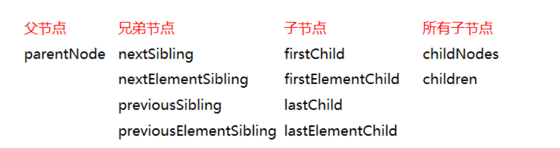
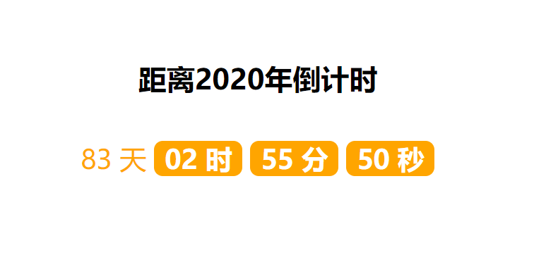

### js 中的 DOM 操作

#### 1. 都有哪些绑定事件

属性 当一下情况发生时,出现此事件

- onabort 图像加载被中断
- onblur 元素失去焦点
- onchange 用户改变域的内容
- onclick 鼠标点击某个对象
- ondblclick 鼠标双击某个对象
- onerror 当加载文档或图像时发生某个错误 onfocus 元素获得焦点
- onkeydown 某个键盘的键被按下
- onkeypress 某个键盘的键被按下或按住 onkeyup 某个键盘的键被松开
- onload 某个页面或图像被完成加载 onmousedown 某个鼠标按键被按下 onmousemove 鼠标被移动
- onmouseout 鼠标从某元素移开
- onmouseover 鼠标被移到某元素之上
- `(onmouseenter：鼠标被移到某元素之上 onmouseleave: 鼠标从某元素移开 ) 和上面两句等价作用`
- onmouseup 某个鼠标按键被松开
- onreset 重置按钮被点击
- onresize 窗口或框架被调整尺寸
- onselect 文本被选定
- onsubmit 提交按钮被点击
- onunload 用户退出页面-

#### 1.1 获取事件源的三种方法

1)标签名 getElementByTagName()
2)id getElementById()
3)class getElementByClassName()
`其中，通过标签名和类名拿到的时类数组`

#### 1.2 绑定事件的两种方式

```html
<script>
  //1.绑定的第一种方式
  //获取p元素
  var pEl = document.getElementsByClassName("p1")[0];
  pEl.onclick = function() {
    pEl.style.backgroundColor = "green";
  };
  //2.绑定的第二种方式
  //获取box元素
  var box = document.getElementsByClassName("box")[0];
  function foo(el) {
    el.style.backgroundColor = "red";
  }
</script>
```

#### 1.3 样式修改

通过修改 dom 对象的 style(行内样式) 属性 来 改变样式
把原来的先保存 考虑作用域

#### 1.4 DOM 访问关系的获取



- nodeType 属性
  nodeType == 1 表示的是元素节点（标签） 。记住：元素就是标签。
  nodeType == 2 表示是属性节点。
  nodeType == 3 是文本节点。
  nodeType == 8 注释节点

- 获取除自己以外的所有兄弟节点

```html
<script>
  function siblings(el) {
    var pareNode = el.parentNode;
    var children = pareNode.children;
    var result = [];
    for (var i = 0; i < children.length; i++) {
      if (children[i] !== el) {
        result.push(children[i]);
      }
    }
    return result;
  }
</script>
```

#### 1.5 节点增删改查

- 创建节点
  新的标签(元素节点) = document.createElement("标签名");
  var el=document.creatElement('p');
- 插入节点
  - 父节点.appendChild(新的子节点);
    将 el 这个节点 座位 box 的 子节点 插入进去 从后添加
    box.appendChild(el);
  - 父节点.insertBefore(新的子节点, 作为参考的子节点);
    `多次插入同一个节点的时候 ,相当于剪切效果`
- 删除节点
  父节点.removeChild(子节点);
  解释：用父节点删除子节点。必须要指定是删除哪个子节点。
  box.removeChild(el);

- 要复制的节点
  要复制的节点.cloneNode();
  括号里不带参数和带参数 false，效果是一样的。

要复制的节点.cloneNode(true); // 深复制
var temp = box.cloneNode(true);
console.log(temp);

#### 1.6 节点属性操作

```html
<script>
  // 获取 设置   删除

  //1.1获取属性
  var box = document.getElementsByClassName("box")[0];
  console.log(box.id);
  //1.2 getAttribute('属性名')
  console.log(box.getAttribute("title"));

  //2.设置属性名
  //setAttribute("属性名", "属性值");
  box.setAttribute("title", "很好");

  //删除属性名
  //元素节点.removeAttribute(属性名);
  box.removeAttribute("id");
</script>
```

#### 1.7 类名操作

- 追加 active 类名
  box.classList.add('active);
- 删除 active 类名
  box.classList.remove('active);
- 判断类名是否存在 true 或者 false
  box.classList.contains('active')
- toggle 有则删除 无则添加
  pEl.classList.toggle('red');

#### 1.8 节点的内容操作

```html
<body>
  <div class="box">
    <!-- 注释 -->
    <p>天气</p>
    不凡学院
  </div>
  <script>
    var pEl = document.createElement("p");
    var div = document.createElement("div");
    // pEl.innerText = '今天天气很好';
    pEl.innerText = "<p>今天天气很好</p>"; // 会被当做文本来解析
    // div.innerHTML = '今天天气很好';
    div.innerHTML = "<p>今天天气很好</p>"; // 会被当做标签来解析
    // 通常用它 动态的  去 拼接(生成)页面
    box.innerHTML = "不凡";
  </script>
</body>
```

#### 1.9 表单内容操作

更改选中状态时
options[2].selected = true;

#### 2. JS 的 dom 扩展（比如选择器以及绑定事件的另一种方式）

#### 2.1 获取元素的另一种方法

- `document.querySelector('选择器')`html5 新选择器，参数是 css 选择器参数,选择选中的第一个
- `document.querySelectorAll('选择器')` 选择多个
- 自定义属性
  在 HTML5 中我们可以自定义属性，其格式如下 data-\*="" ，例如:
  data-info="我是自定义属性" ，通过 Node.dataset['info'] 我们便可以获取到自定义的属性值。
  Node.dataset 是以类对象形式存在的
  当我们如下格式设置时，则需要以小驼峰格式才能正确获取
  data-my-name="mm" ，获取 Node.dataset['myName']

  ```html
  <body>
    <div class="box">
      <div class="inner-box">
        不凡
      </div>
    </div>
    <div class="inner-box"></div>
    <ul class="nav">
      <!-- data-*  -->
      <li class="nav-item" data-info="red">1</li>
      <li class="nav-item" data-info="blue">2</li>
    <script>
      for (var i = 0; i < lis.length; i++) {
        lis[i].onmouseenter = function() {
          var color = this.dataset["info"];
          console.log(this.dataset);
          this.style.backgroundColor = color;
        };
      }
    </script>
  </body>
  ```

#### 2.2 事件监听器 (addEventListener)

- `addEventListener 使用`

  - 语法：target.addEventListener(type,listener,useCapture]);
  - target： 文档节点、document、window 或 XMLHttpRequest。 (事件源)
  - type： 字符串，事件名称，不含“on”，比如“click”、“mouseover”、“keydown”等。
  - listener ：实现了 EventListener 接口或者是 JavaScript 中的函数。
  - useCapture ：是否使用捕获，一般用 false。true 代表捕获，false 代表冒泡。
    d1.addEventListener('click',function(){
    alert('d1);
    },true)

  - 先 捕获 后冒泡;冒泡 就是 从里到外 触发 false;捕获 就是 从外到里 触发 true

- removeEventListener 移除绑定

#### 2.3 倒计时案例

```html
<body>
  <h1>距离2020年倒计时</h1>
  <div class="item">
    <span><span class="day">00</span> 天</span>
    <strong><span class="hour">00</span> 时</strong>
    <strong><span class="min">00</span> 分</strong>
    <strong><span class="second">00</span> 秒</strong>
  </div>
  <script>
    //获取元素
    var dayEl = document.querySelector(".day");
    var hourEl = document.querySelector(".hour");
    var minEl = document.querySelector(".min");
    var secondEl = document.querySelector(".second");

    //结束时间
    var endTime = new Date("2020/1/1");
    setInterval(function() {
      //当前时间
      var nowTime = new Date();
      var stamp = endTime - nowTime;
      console.log(stamp);
      // 转换成 天 时  分  秒
      var DAY_MS = 24 * 60 * 60 * 1000;
      var HOUR_MS = 60 * 60 * 1000;
      var MIN_MS = 60 * 1000;
      var day = Math.floor(stamp / DAY_MS);
      var hour = Math.floor((stamp % DAY_MS) / HOUR_MS);
      var min = Math.floor((stamp % HOUR_MS) / MIN_MS);
      var second = Math.floor((stamp % MIN_MS) / 1000);

      //替换元素
      dayEl.innerHTML = foo(day);
      hourEl.innerHTML = foo(hour);
      minEl.innerHTML = foo(min);
      secondEl.innerHTML = foo(second);
    }, 1000);

    function foo(num) {
      return num < 10 ? "0" + num : num;
    }
  </script>
</body>
```


