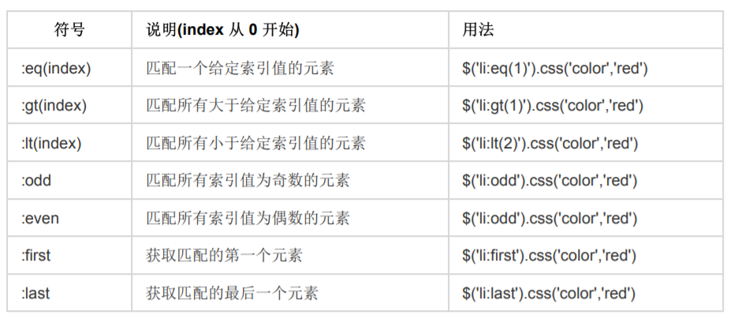

### JQUERY 的基础操作

#### 1. 认识 jquery 的基础语法

#### 1.1 jquery 是什么

- \$('.box') jq 对象 是 对 原生 dom 对象 进行了 包装之后的结果
  box 和 \$('.box')[0] 是一样的 指的是 原生 dom 元素对象

#### 1.2 jQuery 的基本使用

- jquery 的版本问题

  Jquery 主要版本
  1.xx 1 版本 支持 ie5678.。。
  2.xx 2 版本 放弃了对 ie5678 的支持
  3.xx 3 版本 没向前兼容
  这个版本并不是越新越好。根据项目需求。
  但是各个版本的基础功能都是一样的。常用 api 也是一样的。
  Jquery 的版本选择 需要看项目中依赖的或者使用的 jquery 插件来决定

- jquery 的使用
  下载源文件
  引入页面
- 入口函数

1. \$(document).ready(function(){})
2. \$(function(){})

- 事件处理程序
  js: .onclick=function(){};
  jquery: \$().click(function(){})
  `注意： jquery中 的事件处理都是方法 ，原生js的事件处理是属性`

#### 1.3 js 入口函数跟 jQuery 入口函数的区别

1. 执行时间
   window.onload 必须等到页面内包括图片的所有元素加载完毕后才能执行
   \$(document).ready()只加载了 dom 框架，对于大的图片需要时间，这个不等

2. 编写个数不同
   window.onload 不能同时编写多个，如果有多个 window.onload 方法，只会执行一个
   \$(document).ready()可以同时编写多个，并且都可以得到执行
3. 简化写法
   window.onload 没有简化写法
   $(document).ready(function(){})可以简写成$(function(){});
   `jQuery能做的javascipt都能做到，而javascript能做的事情，jQuery不一定能做到。`

#### 1.4 jQuery 基本选择器

- css 选择器 id class 标签 后代 子代 并集 交集
- 层级选择器 + 紧邻 ~兄弟
- 属性选择器 a['href']
- 基本筛选选择器
  
- 其他选择器
  符号 说明(index 从 0 开始) 用法
  :empty 匹配所有不包含子元素或者文本的空元素 $('li:empty')
  :contains(text) 匹配包含给定文本的元素 $('li:contains('john')')
- mouseover 事件跟 mouseenter 事件的区别
  mouseover/mouseout 事件，鼠标经过的时候会触发多次，每遇到一个子元素就会触发一次。
  mouseenter/mouseleave 事件，鼠标经过的时候只会触发一次

#### 1.5 DOM 对象跟 jQuery 对象相互转换

jQuery 对象转换为 DOM 对象:对$对象取0号数组
\$('#btn')[0]
DOM 对象转换成 jQuery 对象：包着
var btn = document.getElementById('btn');
\$(btn)

#### 1.5 DOM 操作

- 样式操作 .css()
  获取样式 .css('title')
  设置单个属性样式.css('color','red')；
  设置多个属性样式.css({
  width：'100px',
  height:'20px';
  )；
- 属性操作 .attr()
  获取属性   $('img').attr('src')  获取 img 的 src 属性值
  设置属性   $('img').attr({src:'text.jpg',alt:'sorry'})
  removeAttr()   \$('img').removeAttr('src')   删除 src 属性
- html 代码/文本/值
  可以取值,设值
  html()   $('p').html()   $("p").html('html 代码')
  text()   $('p').text()   $('p').text('内容')

  #### 针对表单：

  val()   $('input').value()   $('input').value('姓名') `只能用来获取获取修改表单元素的 value 值`

  prop()   $('input').prop('checked')   $('input').prop('checked',false) `可以用来获取和设置表单的所有的属性`
  $('option:eq(1)').prop('value', '我最美'); 
 console.log($('option:eq(1)').prop('value'));

- 类名操作
  addClass(); 向被选元素添加一个或多个类
  removeClass(); 从被选元素删除一个或多个类
  toggleClass(); 对被选元素进行添加/删除类的切换操作
  hasClass(); 判断被选元素是否存在类
- dom 筛选过滤/查找
  eq(index);
  find(); 符合条件的后代节点
  siblings(); 除了自己以外的所有兄弟节点
  children(); 所有孩子节点
  next(); 下一个兄弟节点
  nextAll(); 后面的所有兄弟节点
  nextUntil();后面的兄弟节点,直到...
  prev();上一个兄弟节点
  prevAll();
  prevUntil();
  parent(); 父节点
  parents(); 所有父节点
  parentsUntil();

### jquery 动画以及 BOM 操作

#### 2.1 jquery 都有哪些动画

- 隐藏(hide)/显示动画(show)
  `hide(speed,callback);show(speed,callback) 显示和隐藏，默认是瞬间变化，里面要加slow/normal/fast 或者具体的speed值会缓慢变化`
  <!-- 以下使用默认值：400 毫秒 -->
- 滑入滑出动画（向上滑出）
  - silideDown(speed,callback) (从上向下)
  - silideUp(speed,callback) （从下向上）
- 淡入淡出动画
  - \$(selector).fadeIn(speed,callback);淡入
  - \$(selector).fadeOut(speed,callback); 淡出
  - \$(selector).fadeToggle(speed,callback) 切换;
  - \$(selector).fadeTo(speed,opacity); 调节透明度
- 自定义动画
  `$(selector).animate(styles,speed,ease,callback)`
  第一个参数表示：要执行动画的 CSS 属性（必选）
  第二个参数表示：执行动画时长（可选）
  第三个参数表示: 运动函数 'swing'和'linear'
  第四个参数表示：动画执行完后立即执行的回调函数
- stop(); 停止当前动画
  `stop(stopAll,goToEnd)`
  stopAll:是否全部停止动画(停止队列中所有动画),默认 false
  goToEnd: 是否将停止的动画,停在当前动画的最后一个状态

#### 2.2 jquery 插入节点

- append()
  - 参数 jq 对象 或 标签字符串 或 DOM 对象
  - 作用：在被选元素内部从后面插入。
  - 如果是页面中存在的元素，那么调用 append()后，会把这个元素放到相应的目标元素里面去；但是，原来的这个元素，就不存在了。(剪切)
  - 如果是给多个目标追加元素，那么方法的内部会复制多份这个元素，然后追加到多个目标里面
    去。
- appendTo()
  ：把 \$(selector) 追加到 node 中去\$(selector).appendTo(node);
- prepend()
  作用：在被选元素内部从前面追加内容或节点。
- after()
  作用：在被选元素之后，作为兄弟元素插入内容或节点
- before()
  作用：在被选元素之前，作为兄弟元素插入内容或节点
  \$(selector).before(node);
- 清空元素
  $(selector).empty();
$(selector).html('');
  \$(selector).remove(); //会把自己也删除
- 复制元素
  \$(selector).clone();

#### 2.3 jquery BOM 相关

- width(),height()直接获取调用者的宽度和高度
- offset() 作用： 获取或设置元素相对于文档的位置
- position()\$(selector).position();注意：只能获取，不能设置
- scrollTop()作用：获取或者设置元素垂直方向滚动的位置$(selector).scrollTop(); \$(selector).scrollTop(100)

```html
<script>
  $(".top").click(function() {
    // 获取网页此时卷进去的高度
    // 原生写法 获取卷进去高度
    // var scrollTop = document.documentElement.scrollTop || document.body.scrollTop;
    console.log($(document.documentElement).scrollTop());
    $(document.documentElement).animate({ scrollTop: 0 });
  });
</script>
```

### ON(OFF)绑定事件以及插件的使用

#### 3.1 on 方式绑定事件以及解绑

- `target.on(type,[selector],[data],fn); 在选择元素上绑定事件处理函数`
  target：选择元素（jq 对象）
  type：事件类型
  selector：一个选择器字符串,用来过滤选定的元素（target 的后代）,如果省略,则 target 所有后代元
  素都会触发事件
  data：当一个事件被触发时要传递 event.data 给事件处理函数。可以省略。
  fn：该事件被触发时执行的函数。
  - \$('.box').on('click', 'p', function () {
    console.log('不凡');
    })
- 事件委托
  使用 on 方式，将事件委托给父级元素代理 比如 ul 中新增，如果给 li 绑定事件，那么新增的 li 不会触发；所以给 ul 绑定事件，用 on 的方式绑定
- off 解绑事件
  `.off(); 解除所有绑定的事件`
  .off('click'); 解绑所有绑定的 click 事件，元素本身的事件不会被解绑
  off() 解绑所有绑定的事件
  $('button').click(function () {
   $('.box').off();
  $('.box').off('click');
$('.box').off('click', 'p');)}

- 事件对象 Event

  - event.data 传递给事件处理程序的额外数据
  - event.currentTarget 事件绑定的对象(事件源), 和 this 相同
  - event.pageX 鼠标相对于文档左部边缘的位置
  - event.target 实际触发事件的对象， 不一定 === this
  - event.type 事件类型： click， mouseover…
  - event.which 鼠标的按键类型： 左 1 中 2 右 3
  - event.keyCode 键盘按键 -

- 阻止事件的冒泡和默认
  - event.stopPropagation()；阻止捕获和冒泡阶段中当前事件的进一步传播。
  - event.preventDefault();阻止默认行为（比如 a 连接跳转）
- 链式编程

  - 链式调用的原理 方法 返回 \$(this)
  - 通常情况下， 只有设置操作才能把链式编程延续下去。 因为获取操作的时候， 会返回获取到的相应的值， 无法返回 this。
  - $(".inner-box").click(function () {
            $(this)
    .css("width", "80px")
    .css("font-size", "40px")
    .parent()
    .css("width", "200px")
    .end() // 结束当前链最近的一次过滤操作，并且返回匹配元素之前的状态。
    .css("background-color", "black");

    });

- each 遍历
  \$(selector).each(function(index,element){});
  Element 是一个 js 对象，需要转换成 jquery 对象

```html
<script>
  $("li").each(function(index, ele) {
    console.log("ele=====>", ele); // dom 对象
    console.log("index===>", index);
    if (index == 3) {
      $(ele).click(function() {
        console.log($(this).css("color"));
      });
    } else {
      $(ele).click(function() {
        console.log($(this).css("height"));
      });
    }
  });
</script>
```
