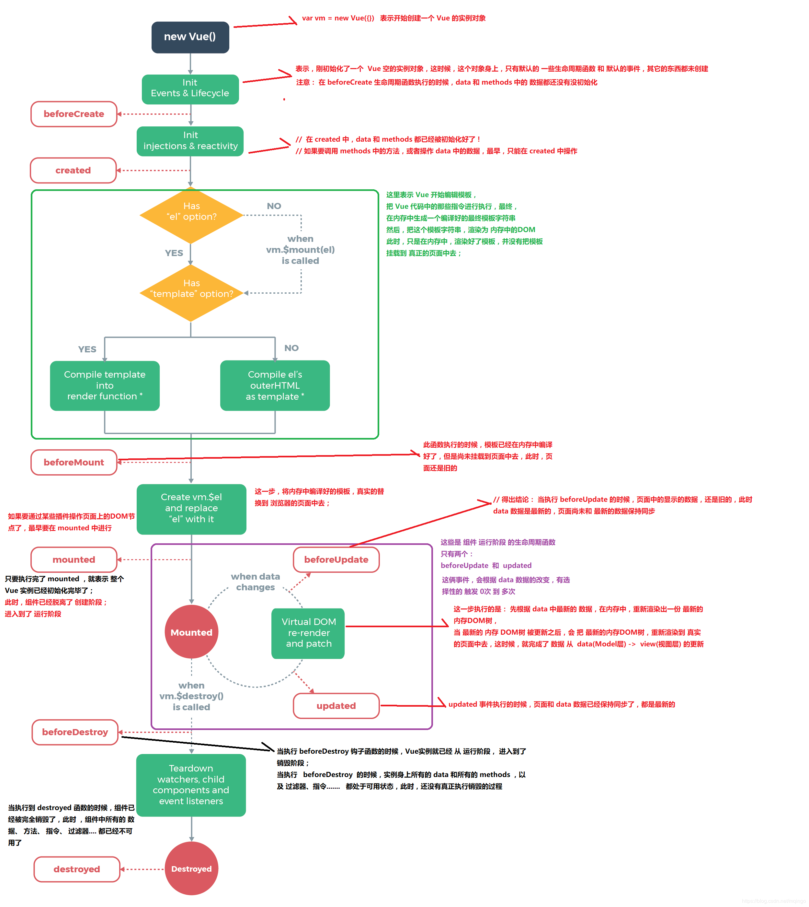

VUE

### 一：vue 第一天

> Vue.js 是一套构建用户界面的 渐进式框架。

#### 1.1 插入的三种方式

##### 1.1.1 {{}}

```html
<!-- 双大括号插值法 Mustache -->
<div id="app">
  {{name}} {{age}} {{tagname}}
</div>
<script>
  var vm = new Vue({
    el: "#app", // element(根标签)    绑定el之后 我们可以操纵这个div里面的所有元素
    data() {
      // 数据仓库  页面所有的数据都写在data里面
      return {
        name: "小明",
        age: 24,
        tagname: "<div>我最美<div>"
      };
    }
  });
</script>
<!-- 页面内容：小明 24 <div>我最美<div> -->
```

##### 1.1.2 v-text

```html
 <div id="app">
      <!-- v-text 用于渲染文本内容相当于 innerText -->
      <div v-text="name"></div>
      <div v-text="tagnamex"></div>
    </div>
    <script>
      var vm = new Vue({
        el: "#app",
        data() {
          return {
            name: "小明",
            age: 24,
            tagname: "<div>我最美<div>"
          };
        }
      });
      // 页面内容  小明 <div>我最美<div>
```

##### 1.1.3 v-html

```html
<div id="app">
  <!-- v-html 用于渲染标签相当于 innerHtml -->
  <div v-html="tagname"></div>
</div>
<script>
  var vm = new Vue({
    el: "#app",
    data() {
      return {
        name: "小明",
        age: 24,
        tagname: "<div>我最美</div>"
      };
    }
  });
  //  我最美
</script>
```

##### 1.1.4 三种渲染方式的区别

- {{}}插入法，可以在一个标签里面渲染多个属性.{{}}会出现闪烁的问题(用户有可能以为页面乱码行内插入不会出现这种问题)
- v-text 在一个标签里面只能渲染一个属性
- {{}} v-text 只能渲染文本 v-html 可以渲染标签

##### 1.1.5 解决{{}}闪烁问题

```html
<style>
  [v-cloak] {
    display: none;
  }
</style>
<div id="app" v-cloak>
  <div>
    {{name}}{{age}}
  </div>
</div>
```

#### 1.2 显示隐藏的 4 种方式

##### 1.2.1 v-show

<!-- v-show 控制元素的显示(true)和隐藏(false) 通过css样式控制  -->

```html
<div v-show="isShow">
  {{ name }}
</div>
<script>
  data () { // 数据仓库 页面所有的数据都写在data里面 return { isShow:false,
  name:"张三",
   age : 40 ,
   div:"<div>123</div>"
    }
</script>
```

##### 1.2.2 v-if v-else-if v-else

- 指令 v-show 控制元素的显示和隐藏 特点是 vue 在渲染有 v-show 的节点时这个节点的样式为 display:none
  -v-if v-else-if v-else 也是控制元素的显示和隐藏 如果隐藏的话在页面里面这个节点是不会渲染的,通过销毁标签的形式

```js
<div id="app" v-cloak>
      <!-- v-show 控制元素的显示(true)和隐藏(false) 通过css样式控制  -->
      <div v-show="!isShow">
        {{name}}
      </div>
      <div v-if="isShow">
        {{name}}
      </div>
    </div>
    <script src="../vue.js"></script>
    <script>
      var vm = new Vue({
        el: "#app",
        data() {
          return {
            isShow: false,
            name: "小明",
            age: 24,
            tagname: "<div>我最美</div>"
          };
        }
      });
      //小明
    </script>
```

- v-if v-else-if v-else vue 的条件语句
  - v-if 控制元素的显示和隐藏
  - v-else-if 前一兄弟元素必须有 v-if 或 v-else-if。
  - v-else 前一兄弟元素必须有 v-if 或 v-else-if。

```html
<div id="app" v-cloak>
  <!-- v-show 控制元素的显示(true)和隐藏(false) 通过css样式控制  -->
  <div v-if="isShow">
    {{name}}
  </div>
  <!-- <div v-else="!isShow">
        {{age}}
      </div> //24-->
  <div v-else-if="!isShow">
    {{age}}
  </div>
  <!-- //24 -->
</div>
<script src="../vue.js"></script>
<script>
  var vm = new Vue({
    el: "#app",
    data() {
      return {
        isShow: false,
        name: "小明",
        age: 24,
        tagname: "<div>我最美</div>"
      };
    }
  });
  //24
</script>
```

##### 1.3 v-for

```html
<div id="app" v-cloak>
  <ul>
    <!-- 1.遍历数组 v-for="(item,index) in list"" 第1条数据 姓名：张三 年龄：24-->
    <!-- <li v-for="(item ,index) in list">
          第{{++index}}条数据 姓名：{{item.name}} 年龄：{{item.age}}
        </li> -->
    <!-- 2.遍历对象 -->
    <!-- <li v-for="(item ,key,index) in list"> -->
    <!-- 第{{++index}}条数据 {{key}}{{item.name}} {{key}}{{item.age}} -->
    <!-- {{key}} {{item}} {{index}} -->
    <!-- </li> -->
    <!-- 3.遍历数字 1 0 2 1-->
    <!-- <li v-for="(item ,index) in name"> -->
    <!-- 第{{++index}}条数据 {item.name}} {{key}}{{item.age}} -->
    <!-- {{item}} {{index}} -->
    <!-- </li> -->
    <!-- 3.字符串 b 0 u 1-->
    <li v-for="(item ,index) in str">
      <!-- 第{{++index}}条数据 {{key}}{{item.name}} {{key}}{{item.age}} -->
      {{item}} {{index}}
    </li>
  </ul>
</div>

<script>
  var vm = new Vue({
    el: "#app",
    data() {
      return {
        //   4.字符串
        str: "bufanxueyuan"
        //   3.数组
        // number: 10
        //   2.对象
        // list: {
        //   name: "张三",
        //   age: 24
        // }
        //   1.数组
        // list: [
        //   {
        //     name: "张三",
        //     age: 24
        //   },
        //   {
        //     name: "小明",
        //     age: 23
        //   }
        // ]
      };
    }
  });
</script>
```

##### 1.4 v-bind，v-pre v-once

```html
<div id="app" v-cloak>
  <!-- 如果使用变量，可以直接在双引号里面，否则要加单引号"'不凡学院'" -->
  <div :title="'不凡学院'">不凡学院</div>
  
  <!--简写 -->
  <!--  -->
  <div v-pre>
    <!-- v-pre 跳过当前节点的编译 很少用 -->
    {{name}}
  </div>
  <!-- v-once 控制标签指令只渲染一次, 如果从新改变变量则无效 -->
  <div>{{age}}</div>
</div>

<script>
  var vm = new Vue({
    el: "#app",
    data() {
      return {
        imgSrc: "logo.png",
        isShow: false,
        name: "小明",
        age: 24,
        tagname: "<div>我最美</div>"
      };
    }
  });
</script>
```

### 二：vue 第二天

#### 2.1 事件(绑定，鼠标进入等)

##### 2.1.1 v-on 指令

- v-on:click 可以简写为@click

```html
<div id="app" v-cloak>
  {{age}}
  <button @click="alert">点击弹出提示</button>
  <button @click="alert1('您好')">函数传值</button>
  <button @dblclick="age++">点击年龄+1</button>
  <button @mouseenter="age++">鼠标进入+1</button>
  <button @mouseenter="age--">鼠标离开-1</button>
  <!-- 里面加$event可以输出事件函数而且没有顺序 -->
  <button @click="changeColor($event, '60')">点击变色</button>
</div>

<script>
  var vm = new Vue({
    el: "#app",
    data() {
      return {
        name: "小明",
        age: 24
      };
    },
    //专门放事件处理函数和data同级
    methods: {
      changeColor(event, val) {
        event.target.style.color = "red";
        this.age = val;
        console.log(event, val);
      },
      alert() {
        alert("不凡学院");
      },
      alert1(val) {
        alert(val + "不凡学院");
      }
    }
  });
</script>
```

- 事件对象
  > 在监听原生 DOM 事件时，方法以事件为唯一的参数。如果使用内联语句，语句可以访问一个 $event **属性： **v-on:click="handle('ok', $event)"。
  > 有时也需要在内联语句处理器中访问原始的 DOM 事件。可以用特殊变量 \$event 把它传入方法：

##### 2.1.2 事件修饰符

```html
 <style>
      [v-cloak] {
        display: none;
      }
      .box {
        width: 400px;
        height: 400px;
        background-color: green;
      }
      .innerbox {
        width: 200px;
        height: 200px;
        background-color: red;
      }
    </style>
    <title>Document</title>
  </head>
  <body>
    <div id="app" v-cloak>
      <!--5.once修饰符  事件仅仅触发一次 -->
      <!-- <div class="box" @click.once="boxalert"></div> -->
      <!--4. .self 加到谁身上，谁不触发-->
    <div class="outbox" @click="outbox">
      <div class="box" @click.self="boxalert">
        <div class="innerbox" @click="innerboxalert"></div>
      </div>
    </div>
      
      <!--3. 触发事件捕获.capture 加到父类元素上-->
      <!-- <div class="box" @click.capture="boxalert">
        <div class="innerbox" @click="innerboxalert"></div>
      </div> -->
      <!--2. 阻止事件冒泡.stop -->
      <!-- <div class="box" @click="boxalert">
        <div class="innerbox" @click.stop="innerboxalert"></div>
      </div> -->
      <!--1. 阻止默认事件.prevent -->
      <a href="http://www.baidu.com" @click.prevent="">百度</a>
    </div>

    <script>
      var vm = new Vue({
        el: "#app",
        data() {
          return {
            name: "小明",
            age: 24
          };
        },
        //专门放事件处理函数和data同级
        methods: {
          boxalert() {
            alert("我是box大盒子");
          },
          innerboxalert() {
            alert("我是box里面的小盒子");
          },
          outbox(){
            alert("我是box外面的大盒子outbox")
          }
        }
      });
    </script>
  </body>
```

##### 2.1.3 事件修饰符连用

```html
<div id="app" v-cloak>
  <!-- 要阻止冒泡和默认跳转 @click.prevent.stop可以连用 -->
  <div class="box" @click.once="boxalert">
    <a href="http://www.baidu.com" @click.prevent.stop="">百度</a>
  </div>
</div>
```

#### 2.2 V-MODEL(双向绑定以及 v-model 修饰符)

> Vue 的核心特性之一是双向绑定，vue 的响应式原理是实现了数据－>视图，接下来我们要学习 视图－>数据的原理。v-model

##### 2.2.1 V-MODEL 用法

- 用法：
  v-model 指令用来在 input、select、textarea、checkbox、radio 等表单控件或者组件上创建双向绑定。
  可以用 v-model 指令在表单控件元素上创建双向数据绑定。<font color="red">它会根据控件类型自动选取正确的方法来更新元素</font>
  尽管有些神奇，但 v-model 本质上不过是语法糖，它负责监听用户的输入事件以更新数据，并特别处理一些极端的例子。
- 文本框和多行文本框响应

```html
<div id="app">
  {{val}}
  <!-- <input type="text" v-model="val" /> -->
  <textarea name="" id="" cols="30" rows="10" v-model="val"></textarea>
  <!-- bind:value="val"方式可以实现数据视图的变化，不能实现视图到数据的变化-->
  <!-- <input type="text" :value="val" /> -->
</div>
<script>
  var vm = new Vue({
    el: "#app",
    data() {
      return {
        val: "不凡学院"
      };
    },
    //专门放事件处理函数和data同级
    methods: {}
  });
</script>
```

- 下拉框和单选框

```html
<!-- 单选框 -->
<!-- <div id="app">
  {{list}}
  <hr />
  {{params}}
  <div v-for="item in list">
    {{item.val}}
    <input type="radio" v-model="params" :value="item.val" name="city" id="" />
  </div> -->
  <!-- 下拉框 -->
  <div id="app">
    {{params}}
    <select name="" id="" v-model="params">
      <option v-for="item in list" :value="item.val">{{item.val}}</option>
    </select>
  </div>
  <script>
    var vm = new Vue({
      el: "#app",
      data() {
        return {
          params: "",
          list: [
            {
              val: "郑州",
              id: "003"
            },
            {
              val: "北京",
              id: "001"
            },
            {
              val: "上海",
              id: "002"
            }
          ]
        };
      },
      //专门放事件处理函数和data同级
      methods: {}
    });
  </script>
</div>
```

- 复选框

```html
<div id="app">
  <!-- 复选框和下拉框，v-model 里面是一个变量，显示的值都是：value:item.val绑定的val值 -->
  {{list}}
  <div v-for="item in list">
    {{item.val}}
    <input type="checkbox" v-model="item.isChecked" name="" id="" />
  </div>
</div>
<script>
  var vm = new Vue({
    el: "#app",
    data() {
      return {
        params: "",
        list: [
          {
            val: "郑州",
            id: "003",
            isChecked: false
          },
          {
            val: "北京",
            id: "001",
            isChecked: false
          },
          {
            val: "上海",
            id: "002",
            isChecked: false
          }
        ]
      };
    },
    //专门放事件处理函数和data同级
    methods: {}
  });
</script>
```

- v-for 的 key 值

```html
<div id="app">
        <!-- for循环后面一定要跟key值，且是唯一值 -->
        <div>
            <input type="text" v-model="username">
            <button @click="add">添加</button>
        </div>
     <ul>
        <li v-for="item in list" :key="item.id">
            <input type="checkbox" name="" id="">
            {{item.val}}
        </li>
     </ul>
      </div>
    </div>
```

##### 2.2.2 V-MODEL 修饰符

- .lazy

在默认情况下， v-model 在 input 事件中同步输入框的值与数据 ，但可以添加一个修饰符 lazy ，从而转变为在 change 事件中同步：
<font color="red">输入框失去焦点的时候，与外面数据同步变化</font>

- .number
  如果想自动将用户的输入值转为 Number 类型，可以添加一个修饰符 number 给 v-model 来处理输入值：
  必须一开始就要输入数字，否则和不加没有区别
  然后数字后面如果是非数字再写数字都不会出现
- .trim
  如果要自动过滤用户输入的`首尾空格`，可以添加 trim 修饰符到 v-model 上过滤输入：

#### 2.3 计算属性 computed

> computed 在`vue中一些数据经常依赖于别的数据做出改变`，且改变的逻辑也较复杂，这个时候就需要用到计算属性 computed 通俗来说就是当前数据不是确定的，要经常做出改变，而这个`改变是其他数据改变导致的`。只要在计算属性函数里引用了 data 中的某个属性，当这个属性发生变化时，函数就可以嗅探到这个变化，并且执行某些操作。

```html
 <div id="app">
    <input type="text" v-model.number="num1">+
    <input type="text"  v-model.number="num2">=
    <input type="text"  v-model="total" >
    </div>
  </body>
    </div>
    <script>
      var vm = new Vue({
        el: "#app",
        data() {
          return {
          num1:"",
          num2:""

        }
        },
        //  computed作为属性挂载在Vue实例上
        computed:{
            total(){
                console.log("222")
                return this.num1 + this.num2
            }
        },
        //专门放事件处理函数和data同级
        methods: {

        }

      });
    </script>
```

- 计算属性特点

  - 计算属性本质是一个方法 但调用的时候不加括号

  * 计算属性所依赖的数据变化必然会触发计算属性的重新求值

  * 计算属性的值会缓存(当多次访问计算过的结果 那么返回的将是计算过的结果)；

#### 2.4 侦听器

使用侦听器 可以监听 data 中数据的变化 然后触发 watch 中的函数变化

```html
  <div id="app">
            <input type="text" v-model.number="num1">+
            <input type="text"  v-model.number="num2">=
            <input type="text"  v-model="total" >
    </div>
  </body>
    </div>
    <script>
      var vm = new Vue({
        el: "#app",
        data() {
          return {
          num1:"",
          num2:"",
          total:""

        }
        },
        // 与data 同级，检测数据变化
        watch:{
            // 要检测的数据(newVal,oldVal){}
            num1(newVal,oldVal) {
                this.total=newVal+this.num2
         },
            num2(newVal,oldVal) {
            this.total=newVal+this.num1
         },
        },
        //  computed作为属性挂载在Vue实例上
        computed:{
            change(){
               return this.num1/7.0253
            },
            total(){
                console.log("222")
                return this.num1 + this.num2
            }
        },
        //专门放事件处理函数和data同级
        methods: {

        }

      });
    </script>
```

- 侦听器与计算属性的不同

1.  计算属性一进入页面 就会执行 侦听器 只有当数据更改的时候才会执行
2.  侦听器监听的数据不能更改 计算属性当依赖的属性更改的时候会自动执行
3.  计算属性会缓存结果
4.  计算属性必须 return 一个值 而 watch 不需要

#### 2.5 筛选案例

```html
<div id="app">
        {{val}}
        <input type="text" v-model="serchVal">
        <ul>
            <li v-for="item in val" :key="item.name">{{item.name}}</li>
        </ul>
    </div>
  </body>
    </div>
    <script>
      var vm = new Vue({
        el: "#app",
        data() {
          return {
            serchVal:"",
            list:[
                {
                    name:"张三112345"
                },
                {
                    name:"李四1234"
                },
                {
                    name:"王五561"
                }
            ]

        }
        },
        //  computed作为属性挂载在Vue实例上
        computed:{
          //要遍历list 数组然后和输入内容相比较如果有，则有对应的列显示出阿来
            val(){
                // filter返回一个新的数组
                var vall=this.list.filter(ele=>{
                    // 这里的this,指的是父元素的this,是VUE的实例
                    //includes用于判断是否包含某个元素 返回的是布尔值也可以用于字符串
                    return ele.name.includes(this.serchVal)
                })
                return vall;

            }
        },
      });
    </script>
```

综合：请看 vue 第二天综合属性结合

### 三：vue 第三天 class,style 和生命周期

#### 3.1 Class 与 Style 绑定

> 操作元素的 class 类样式和内联样式 style,用 v-bind 处理它们,Vue.js 表达式结果的类型除了字符串之外，还可以是对象或数组。

##### 3.1.1 Class

```html
 <style>
      .red {
        color: red;
      }
      .green {
        color: green;
      }
      .f20 {
        font-size: 20px;
      }
    </style>
  </head>
  <body>
    <div id="app">
      <div :class="['red','f20']">中国</div>
      <div :class="[{red:isAddClass,f20:true}]">我们</div>
      <button @click="isAddClass=!isAddClass">点击切换颜色</button>
    </div>
    <script>
      var vm = new Vue({
        el: "#app",
        data() {
          return {
            isAddClass: false
          };
        }
      });
    </script>
  </body>
```

##### 3.1.2 Style

> CSS 属性名可以用驼峰式 (camelCase) 或短横线分隔 (kebab-case，记得用引号括起来) 来命名：

```html
<div id="app">
  <!-- 1.绑定style:对象语法 -->
  <!-- <div :style="{color:className,fontSize:fontSize+'px'}">中国</div> -->
  <!--2. 数组语法 -->
  <div :style="[a]">我们</div>
  <button @click="isAddClass=!isAddClass">点击切换颜色</button>
</div>
<script>
  var vm = new Vue({
    el: "#app",
    data() {
      return {
        isAddClass: false,
        className: "orange",
        a: {
          fontSize: 30 + "px"
        }
      };
    }
  });
</script>
```

#### 3.2 生命周期

- 生命周期

> 从 Vue 实例创建、运行、到销毁期间，总是伴随着各种各样的事件，这些事件，统称为生命周期(生命周期钩子)！

- 生命周期钩子
  
  > 生命周期钩子就是生命周期事件的别名；常用两个 created mounted 带 before 的钩子都没啥用 created mounted 用作获取数据

* 销毁期间的生命周期函数：
  - beforeDestroy：实例销毁之前调用。在这一步，实例仍然完全可用。
  - destroyed：Vue 实例销毁后调用。调用后，Vue 实例指示的所有东西都会解绑定，所有的事件监听器会被移除，所有的子实例也会被销毁。

```html
<div id="app">
  {{num}}
  <button @click="num=100">改变num</button>
</div>

<script>
  var vm = new Vue({
    el: "#app",
    data() {
      return {
        num: 10
      };
    },
    //创建期间的生命周期函数
    beforeCreate() {
      this.num = 5;
      console.log(this);
      //能获取this.还没有初始化好 data 和 methods 属性在这个钩子里面不做什么操作
    },
    created() {
      // data 和 methods 已经创建OK，页面展示的数据不是最新的  虚拟dom树还没有生成
      //这一步用于初始化页面的数据ajax;
      this.num = 15;
    },
    beforeMount() {
      //  生成虚拟dom  但是没有把虚拟dom渲染成真实dom
      this.num = 20;
    },
    mounted() {
      this.num = 30;
    },
    // 运行期间的生命周期函数(数据改变的时候执行)
    beforeUpdate() {
      // 在数据更改的时候执行的钩子函数 虚拟dom是最新的 但页面展示的数据是旧的
      console.log("运行钩子执行了", this);
    },
    update() {
      // 页面展示的数据是最新的
      console.log("运行钩子执行了", this);
    }
  });
</script>
```



#### 3.3 组件

##### 3.3.1 组件简介

> 组件（Component）是 Vue.js 最强大的功能之一。组件可以扩展 HTML 元素，封装可重用的代码，减少项目的代码量。
> 组件系统让我们可以用独立可复用的小组件来构建大型应用，几乎任意类型的应用的界面都可以抽象为一个组件树：
>  -

##### 3.3.2 组件类型

- 组件注册类型
  全局注册 全局注册的组件可以用在其被注册之后的任何 (通过 new Vue) 新创建的 Vue 根实例，也包括其组件树中的所有子组件的模板中。
```html
<div id="app">
      <com></com>
      <com1></com1>
    </div>
    <script>
      //7. 当使用组件的时候  data必须是个函数
      //6.组件密封 组件内部的属性或者方法 只能组件自己调用
      //5.组件封装的时候必须有一个根元素比如template h1和p标签必须用div包裹` <div><h1>不凡</h1><p>哈哈哈</p></div>`
      //4.组件标签名注意事项如"Com" 1)首字母不能大写2)如果命名是驼峰命名 
      //在渲染组件的时候需把驼峰命名改成连字符连接
      //3.区别 局部注册组件只能在#app里面用全局注册组件因为一个项目里面不可能只有一个vm实例，
      //所以如果有多个就都可以用
      // 1.全局注册组件因为一个项目里面不可能只有一个vm实例，所以如果有多个就都可以用
      Vue.component("com", {
        data() {
          return {
            num:10
          };
        },
        template: `<h2>这是一个全局组件{{num}}</h2>`
      });
      var vm = new Vue({
        el: "#app",
        data() {
          return {};
        },
        // 2.局部注册组件
        components:{
          com1:{
            template: `<h2>这是一个局部组件</h2>`
          }
        }
      });
    </script>
```
##### 3.3.3 组件传值

- 全局变量父传子传值
```html
 <div id="app">
      <com :agess="age"></com>
      <com1 :surname="name"></com1>
    </div>
    <script>
      //全局变量父传子传值 组件标签名 <com :自定义属性="vue实例中data数据"></com>
      // 组件props:["自定义属性"]里面接收且是一个数组
      Vue.component("com", {
        data() {
          return {
            num:10,
          };
        },
        props:["agess"],
        template: `<h2>这是一个{{agess}}全局组件{{num}}</h2>`
      });
      var vm = new Vue({
        el: "#app",
        data() {
          return {
            age:24,
            name:"张三"
          };
        },
        // 2.局部注册组件
        components:{
//data 以及methods都要写在组件com1里面
          com1:{
          props:["surname"],
          data(){
            return{}
          },
            template: `<h2>告诉{{surname}}这是一个局部组件</h2>`
          }
        }
      });
    </script>
```
-  子传父
```html
<div id="app">
        {{abc}}
        <!-- 子传父的值怎么用 -->=================================================
            <!-- 当组件传值的时候 最好使用小写 -->
            <!-- 子传父 自定义事件传值比如点击，鼠标进入。。。。 -->
        <!-- 响应自定义事件 后面的值就是定义在父级上面的方法 -->
        <!-- 3. -->
      <com :agess="age" @eventchild="getval"></com>
      <!-- 3.接受传递的事件 -->
      <com1 :surname="name" @childevent="get"></com1>
    </div>
    <script>
      Vue.component("com", {
        data() {
          return {
            num:10,
          };
        },
        methods:{
            event(){
                  //2.
                this.$emit("eventchild",this.num)
            }
        },
        props:["agess"],
        //1.
        template: `<h2 @click="event">这是一个{{agess}}全局组件{{num}}</h2>`
      });
      var vm = new Vue({
        el: "#app",
        data() {
          return {
            age:24,
            name:"张三",
            abc:""
          };
        },
        methods:{
            getval(val1){
              this.abc=val1
                console.log(val1)
            },
            get(val){
                console.log(val)
            }
        },
        // 局部注册组件
        components:{
        //data 以及methods都要写在组件com1里面
          com1:{
          props:["surname"],
          data(){
            return{
                number:66
            }
          },
          methods:{
            //   2.要执行的函数
            postMessage(){
                //emit  自定义事件
                //传递自定义事件 传递参数 this：该组件实例
                this.$emit("childevent",this.number)
            }
          },
        //   1.注册事件
            template: `<h2 @click="postMessage">告诉{{surname}}这是一个局部组件</h2>`
          }
        }
      });
    </script>
```
### 四：vue 第四天 组件传值补充
#### 4.1 组件属性
##### 4.1.1大小写
- 组件属性默认不能使用驼峰命名法 如果需要多个字符需要用"-"连接
- 在组件接收的时候需要把多个字符转换成驼峰命名
##### 4.1.2 单向数据流
```html
 <div id="app" >
        <!-- 1.组件属性大小写问题  
            (1)组件属性默认不能传入驼峰命名的属性 (2)如果需要传入多个字符多个字符用-连接
            (3)在组件接收的时候把多个字符转换成驼峰命名
            2.组件传值遵循单向数据流原则:外面的vue实例传值到子组件里面
            (1)传递的值在子组件里面是不能修改的(2)父元素值的改变会向下流动到子组件中
            (3)在子组件中不能直接修改这个值(4)传递数据的时候传递非引用类型的数据(string number 布尔值 )

        -->
        <com :company-address="area" @changeval="changes"></com>
    </div>

    <script>
      var vm=new Vue({
          el:"#app",
          data(){return{
              area:"郑州"
          }},
          methods:{
            changes(val){
                console.log(val ,this.area)
                this.area=val
            }
          },
          components:{
              com:{
                  props:["companyAddress"],
                  data(){return{
                    //   只有第一次传值的时候有值，且不会随着变量的改变，areas改变
                      areas:this.companyAddress
                  }},
                  methods:{
                    change(){
                        // 1.直接修改会报错，而是使用基于属性值的数据或计算属性。
                        // this.companyAddress="河南"
                        // 2.使用基于属性值的数据或计算属性 页面上修改成了河南但是vue实力上仍然是郑州
                        //   this.areas="河南"
                        // 3.想要修成成河南，需要传值
                        this.$emit("changeval","河南")

                    }
                  },
                  template:"<h2 @click='change'>不凡学院位于{{companyAddress}}</h2>"
              }
          }
      })
    </script>
```
##### 4.1.3 传递非引用数据类型的数据
```html
 <div id="app" >
        <com :company-address="area" :num="num" ></com>
    </div>
    <!-- 3.template模板应用 -->
    <template id="com">
        <h2 >{{num}}不凡学院位于{{companyAddress}}</h2>
    </template>
   
    <script>
        // 1.传递引用数据类型可以同时改变父组件里面的数据，但是违背了但数据流原则
      var vm=new Vue({
          el:"#app",
          data(){return{
            num:5,
            area:"河南"
          }},
          methods:{
    
          },
          components:{
              com:{
                //   props:["companyAddress","num"],
                //2. props验证
                props:{
                    num:Number,
                    companyAddress:String
                },
                  data(){return{
                    //   只有第一次传值的时候有值，且不会随着变量的改变，areas改变
                      areas:this.companyAddress
                  }},
                  methods:{
                  },
                  template:"#com"
              }
          }
      })
    </script>
```

#### 4.2 bus传值
```html
 <div id="app" >
        <com></com>
        <com1></com1>
    </div>
    <template id="com">
        <h2 @click="transfer">不凡学院{{num}}</h2>
    </template>
    <template id="com1">
            <h2>接收到的传值{{nums}}</h2>
        </template>
    <script>
        var bus=new Vue();      
        var vm=new Vue({
          el:"#app",
          data(){return{
            number:""
          }},
          methods:{
          },
          components:{
              com:{
                  data(){return{
                   num:6
                  }},
                  methods:{
                    transfer(){
                       bus.$emit("transmit",this.num)
                    }
                  },
                  template:"#com"
              },
              com1:{
                  props:["digital"],
                  data(){return{
                      nums:""
                  }},
                // 生长周期初始化阶段
                  created(){
                    bus.$on("transmit",(val)=>{
                        console.log(val)
                        this.nums=val
                    })
                  },
                  template:"#com1"
              }
          }
      })
    </script>
```
#### 4.3 sync 修饰符
>对我们传入的数据进行更改.用法：给组件传递的数据加一个.sync在更改的时候传一个 this.$emit("update:+我们接收的属性");
```deephtml
  <div id="app">
          <!-- 1. 在需要更改的属性后面加上.sync修饰符 -->
        <com :message.sync= "mes"></com>
    </div>
    <script>
        var vm = new Vue({
            el : "#app",
            methods: {             
            },
            data(){
                return {
                    mes : "父元素里面的值"
                }
            },
            components: {
                "com":{
                    props: ["message"],
                    template:"<h3 @click='changeProp'>子组件 {{message}}</h3>",
                    methods:{
                        changeProp(){
                             // 2. $emit传递需要更改的属性
                            this.$emit('update:message', "改变之后的")
                        }
                    }
                }
            }
            
        })
    </script>
```