### Vue 高阶 脚手架 淘宝镜像等

### 第三天

#### 3.1 安装软件

##### 3.1.1 安装 node.js

> 使用 vue 开发大型项目时，需要考虑到目录结构、项目构建以及部署、热加载、代码单元化测试等事情，如果手动完成这些，效率非常低，一般情况下我们使用脚手架完成这样的工作。在 vuejs 的生态中，我们可以使用 vue-cli 来快速的构建项目。

- 1. 下载 nodejs https://nodejs.org/en/
     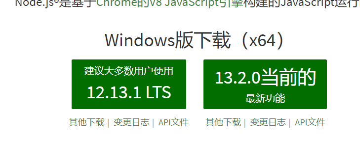
- 2 安装 同意 node 的协议
  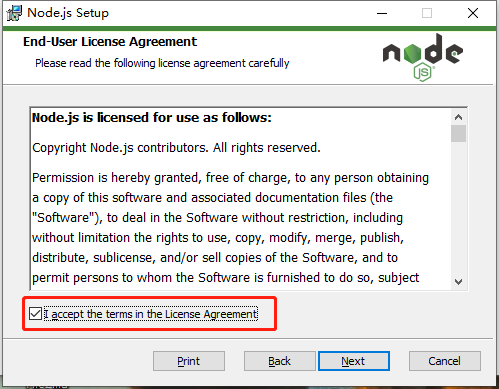
- 3 选择 online documentation shortcuts
  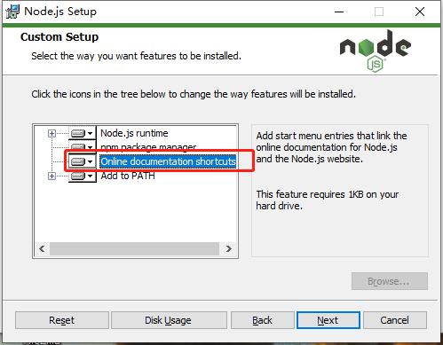
- 4 检查是否安装完成
  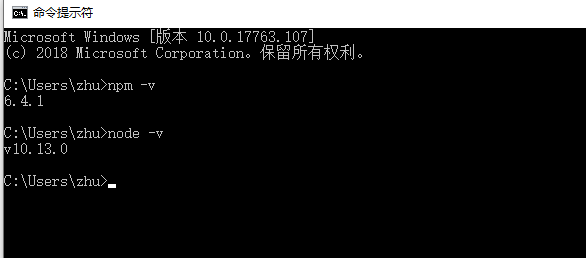

##### 3.1.2  (由于被墙的缘故，所以安装依赖较慢，设置镜像之后就没有这个问题)

把下面代码复制到命令行里面

- npm install -g cnpm --registry=https://registry.npm.taobao.org
  只要不报错不出现红色的就安装完成

cnpm -v 可以查看安装的版本号

如果输入cnpm -v 报错解决方法 1）重新安装node.js  2)用cmd管理员模式，安装淘宝镜像

##### 3.1.3 安装脚手架 vue-cli

- cnpm install -g @vue/cli@3.12.0
- 判断是否安装成功 在命令行工具里面输入 vue -V 敲回车会出现 vue 的版本 如果出现版本就代表安装成功
- 创建 vue 的项目 vue create (项目名称不能大写 ps: domo) 1)用上下键选中 Manually select features 回车
  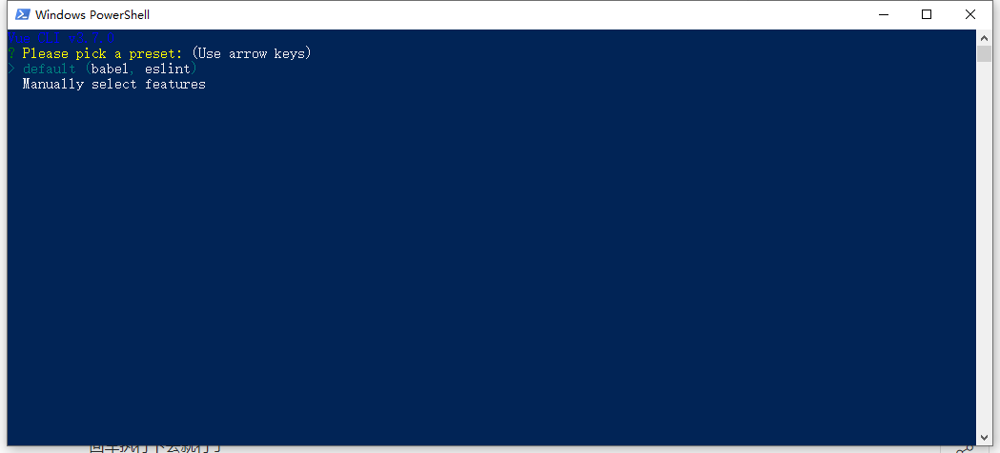 2)用上下键控制用空格选中 4 个然后回车
  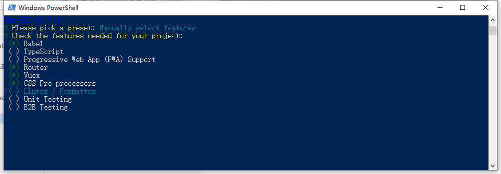 3)输入 y
  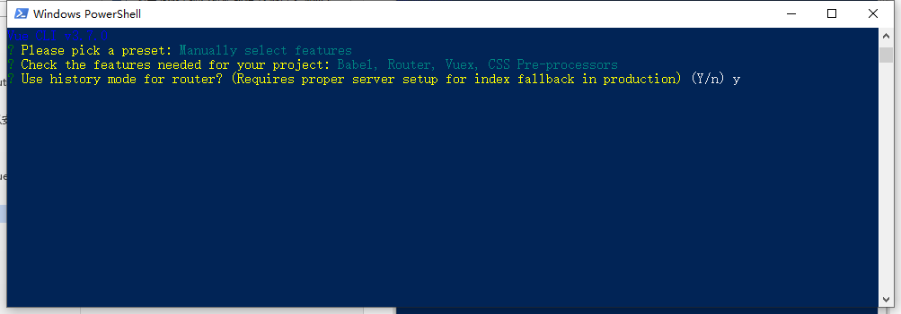 4)选中 Sass/SCSS(with node-sass)
  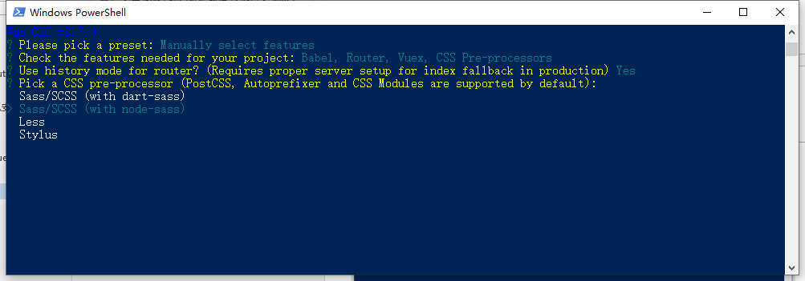 5)保存配置文件到 package.json
  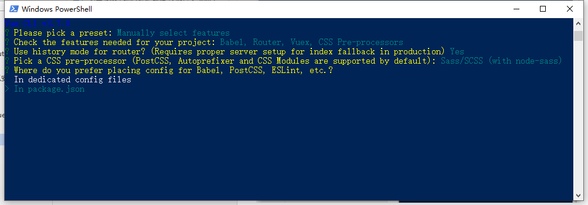 6)这表示安装成功 然后把这两行输入 cd
  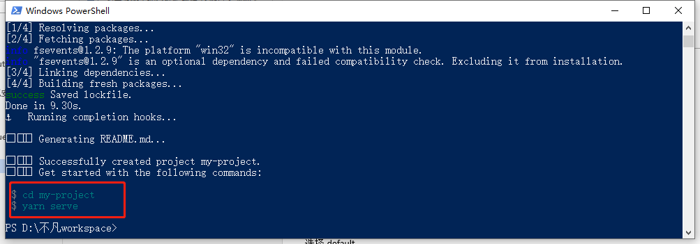 7)直接在游览器输入 localhost:8080 就可以访问刚刚建的页面

- npm run serve 运行项目
- vue 不支持 ie8 等低版本浏览器
  <font color="red">目录结构</font>

| 目录文件 | 说明                                                                                   |
| -------- | -------------------------------------------------------------------------------------- |
| npm      | 是安装 nodejs 附带的包管理工具 安装依赖(插件) 通过这个 npm 进行安装 install:安装的意思 |

|
|-g|代表全局安装 安装之后在电脑的任何地方都可以进行使用|
|cnpm |安装的插件|
| public | 项目 index.html 所存放的目录 |
|config|配置目录，包括端口号等|
|node_modules| npm 加载的项目依赖模块|
|src|这里是我们要开发的目录，基本上要做的事情都在这个目录里。里面包含了几个目录及文件：assets: 放置一些图片，如 logo 等；components: 目录里面放了一个组件文件，可以不用；App.vue: 项目入口文件，我们也可以直接将组件写这里，而不使用 components 目录； main.js: 项目的核心文件， 导入依赖没加./默认查找 node-modules|
|assets|存放静态资源的目录(图片、视频、js、css、、)|
|components|存放的是项目公共的组件(参考前面封装的头部导航)|
|router|路由 定义页面访问地址的配置文件|
|store ||
|views|存放单个页面的地方|
|App.vue|根组件|
|main.js|项目的配置文件|
|.gitignore|上传的时候忽略的配置文件|
|babel.config.js|把 es6 代码转换成 es5 代码的 babel 配置文件|
|package.json|项目的配置文件|
|redirect| 定向到每个页面|
在脚手架中 .vue .js 结尾的文件引入对的时候可以去掉后缀名

#### 3.2 export 和 import(vue 脚本家中不能用 script:src 绑定的方式) 必须在本地服务器打开

- export
  在 js 中 export 用于暴露所需要的变量
- 和 import
  于导入所需要的变量 1)第一种情况

// html 里面的 script

```html
<script type="module">
  // 1. ==================================
  // Cannot use import statement outside a module 无法在模块外部使用import语句
  //所以script type= "module"加了这句
  // 同级必须加./ 可以用多个import接受
  //    import{ num,name,fn} from "./index.js";
  //     console.log(num,name,fn(1,2));//10 "张三" 3
  // import{fn} from "./index.js";
  // console.log(fn(1,2));//3
  // 2.============================== 导入变量的同时给变量起名
  // import{age as a} from "./index.js"; //a就代表 age
  // console.log(a)//66
  //3.===================================一次性的导入暴露的全部变量
  // import * as all from "./index.js"; //
  // console.log(all)//Module {Symbol(Symbol.toStringTag): "Module"} age: 66 name: "张三"......

  // 4.================================配套使用export defauct
  import alls from "./index.js"; //不需要加括号
  console.log(alls); //{age: 66, fn: ƒ}
</script>
```

// js 里面的内容

```js
var num = 10;
var name = "张三";
var age = 66;
var fn = function(a, b) {
  return a + b;
};
// export{
//     num,
//     name,
//     age
// };
// 可以写多个export
// export{fn}
// 2.====================== export第二种使用方式
// 用于暴露变量  一个js文件里面只能写一个export default
export default {
  age,
  fn
};
```

#### 3.3 text 项目中引用案例

<font color="red">有页面中有 script 一定先写上 export default{}</font>
只
怎么引用 hello word 里面公共的组件
在 about 页面里面，helloword 里面不用改变

```html
<script>
  import helloword from "../components/HelloWorld";
  import texts from "../components/text";
  export default {
    components: {
      helloword,
      texts
    }
  };
</script>
```

STYLE 里面定义的样式如果不加`scoped`属性就是全局属性，如果加就是当前组件的属性

```js
style lang="scss">
    h3 {
    color:red;
}
```

#### 3.4 如何使用 swiper 插件

第一种下载插件

1. 进入 https://www.swiper.com.cn/ swiper 官网 2)获取 swiper---下载 swiper 里面有 `$ npm install` swiper
   
   第二种下载插件
   
1. 官网 https://www.npmjs.com/package/npm 2)搜索 swiper-----> vue-awesome-swiper--把 npm 换成 cnpm--->在 text 项目内打开新的窗口，输入
   `cnpm install vue-awesome-swiper --save`
   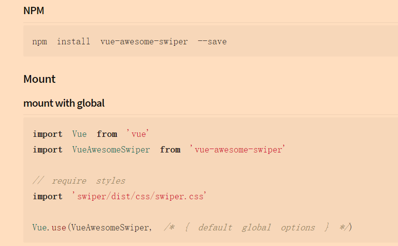 3)安装后可以看 package.json 中有 swiper---->min.js 需要引用把下面放入 min.js 中

```js
import VueAwesomeSwiper from "vue-awesome-swiper";

// require styles
import "swiper/dist/css/swiper.css";

Vue.use(VueAwesomeSwiper /* { default global options } */);
```

4）复制代码，初始化

#### 3.5 单页面优点

- 用户体验好，快，内容的改变不需要重新加载整个页面，基于这一点 spa 对服务器压力较小

- 前后端分离

- 页面效果会比较炫酷（比如切换页面内容时的专场动画）transition

#### 3.6 单页面缺点

- 不利于 seo vue 的项目首先不考虑 seo vue react angular 创建的项目对 seo 都是不友好的

- 初次加载时耗时多(在一进入页面的是就加载了项目的所有文件 ，在后面可以优化)

- 页面复杂度提高很多

#### 3.7 dependencies 和 devDependencies

dependencies 项目开发和打包的时候都需要用到的依赖 npm install 依赖 --save
devDependencies 是项目开发的时候需要用到的依赖 打包的时候就没有了 npm install 依赖 --save-dev

- 其他注意事项 @ scoped
  推荐使用@ @ 以 src 目录为根目录
  scoped 使样式只作用域当前的组件

### 4 弹窗以及路由

#### 4.1 如何新建页面弹窗案例

- 在组件中使用图片首先需要将图片引进来 import imgs from "@/assets/logo.png";
- 在组件中使用背景图片 background: url(~@/assets/logo.png) no-repeat center;
- 在组件中导入 css 文件有两种方式
  - 直接在 js 区域内导入 import "@/assets/css/style.css"
  - 在样式区域内到样式文件 @import "../assets/css/style.css";
- 打包 cnpm run build 会生成 dist 目录 这个 dist 目录是供用户访问的项目

### 下载课件时不用选 node_modules 源文件打开后用

cnpm install 可以安装项目所有的插件

### 第四天

#### 4.1 引入 mock.js

下载在 package-json 里面 dependencies 有

- cnpm install mockjs --save

##### 插件引用不需要路径只需在 package-json 里面看下名字

引入

- 在 mask.vue 里面接收
  import Mock from "mockjs";;//引入 mockjs
  在store中使用
  
  ```js
  export default new Vuex.Store({
    state:{
        list:[
            {
                id:Mock.Random.guid()
            }
        ]
    },
  ```
第二种
  
  ```js
import Mock from 'mockjs'
Vue.use(Vuex)
  var Random=Mock.Random();
  ```
- router-index.js 里面配置


```js
// 配置mask页面路由
  {
    path: '/mask',//路径http://localhost:8080/mask 就可以访问mask页面 名称自定义
    component:mask  //组件
  }
```

## 设置vue的用户代码片段，打出vue，可以快速生成vue的结构


#### 4.2 路由简介

##### 4.2.1 路由定义

> 路由简单的理解 可以理解为浏览器地址栏的变化过程

##### 路由简介

`传统的路由`:用户访问 url 时,服务器接收请求,后解析 url 中的路径,执行对应的处理逻辑。这就完成了一次路由分发
`通俗理解`：向浏览器地址栏输入地址对应服务器根据这个地址返回返回数据(html css js 等) 输入地址就是请求服务器的资源 这一输入地址返回对应数据叫做传统路由
传统路由向服务器请求数据 请求数据需要刷新页面 ajax 局部刷新

##### 单页面路由

- `前端路由`不涉及服务器,利用 hash 或者 HTML5 的 history,API 来模拟实现,一般用于不同内容的展示和切换(利用 ajax 来实现资源的更新)。
  <font color="red">前端路由请求页面的时候不会向服务器请求数据 页面是由 js 创建完成的 router.js</font>
- 目前 Vue 推荐单页面应用 SPA 开发模式，大型单页应用最显著特点之一就是采用前端路由系统，通过改变 URL，在不重新请求页面的情况下，更新页面视图。Vue 中的路由解决方案为 vue-router。
- 前端路由页面间的切换是组件之间的切换 不涉及服务器
- Vue Router 是 Vue.js 官方的路由管理器。它和 Vue.js 的核心深度集成，让构建单页面应用变得易如反掌。我们用 vue-cli 开发的项目就是单页面应用。

##### vue 路由能实现哪些功能

- 嵌套的路由/视图表
- 模块化的、基于组件的路由配置
- 路由参数、查询、通配符
- 基于 Vue.js 过渡系统的视图过渡效果

- 细粒度的导航控制
- 带有自动激活的 CSS class 的链接
- HTML5 历史模式或 hash 模式，在 IE9 中自动降级
- 自定义的滚动条行为

##### 路由安装 (我们在 vue-cli 创建项目的时候就默认安装路由)

#### 4.3 路由相关配置属性

##### router-view

存放路由对应组件的容器

##### router-link

用于单页面之间的跳转

- 在页面渲染的时候默认渲染为 a 标签
- router-link 可以`指定渲染标签 tag属性`
- 自动激活的 class 名称 可以自定义 class 名称 linkActiveClass 这个属性定于在 router/index.js linkActiveClass 与 routes 平级`linkActiveClass:"r-active"`

##### hash 与 history

router/index.js mode 属性与 routes 同级
可以通过 mode 属性切换路由模式 hash 是默认的模式 特点带有#/  
history 不带#/ 页面切换路由比较美观

#### 4.4 单页面跳转传值

##### query 传值

获取 query 传值传递的参数 this.\$route.query + 传递的参数
<router-link v-for="item in list" :key="item.id" tag="li" :to='"/user?id=" + item.id'>{{ item.name }}</router-link>

##### 动态路由

获取动态路由传递的参数 通过 this.\$route.params + 传递的参数
在route-js里面配置

```js
{
    path: '/move/:ids',
    component:move 
  }
```
<router-link 
        v-for="item in list" 
        :key="item.id" 
        tag="li" 
        :to='"/info/"+item.id'>
{{ item.name }}</router-link>

#### 4.5 嵌套路由 

- 页面嵌套页面  
1. 在route-js中某个路由a当中添加children 子路由就写在children里面
2. 配置子路由  子路由的path不需要加/
3. 在这个a路由中添加router-view 用于存放子路由
- redirect   重定向
通过这个属性可以当前路由定向到某个路由
route-js中/表示已进入项目展示的页面
```js
{
    path: '/',
    name: 'home',
    component: Home
  },
```
- 编程式的导航
可以用js的方式进行页面间的跳转
  -  命名路由  
相当于给路由起名 
通过命名路由 可以给动态路由传递参数 
```js
{
    path:"/info/:ids",  // 定义的访问路径  // /info/1
    name:"info",
    component:info  // 路由对应的组件
},
```
+ 不带参数的写法 `this.$router.push("/home");`
+ query传值的写法 `this.$router.push("/user?id=4");`
   `this.$router.push({path:"/user",query:{id:5}})`
+ 动态路由传递参数
`this.$router.push("/info/5");`
`this.$router.push({name:"info",params:{ids:6}})`
- router-link 的几种写法
```html
// 1. 不带参数 
<router-link to="/other">other</router-link>
// 2. query传值
 <router-link :to="{path:'user' ,query:{
        id:5
      }}">user</router-link>
// 3. 动态路由传值 
<router-link :to="{name:'info' ,params:{
        ids:5
      }}">info</router-link>

```
- 前进一步，后退一步
```html
<!-- 执行点击事件的时候 -->
this.$router.go(1)前进就是正整数
this.$router.go(-1)后退就是负整数
```

### 第五天 路由高阶
>需求：比如在网页中 打开购物车页面 购物车页面只有登陆才能查看 但是呢 用户还没有登陆  没登陆直接访问登陆页面页面 登陆就直接访问购物车页面
#### 5.1 导航守卫
>vue-router官方解释 导航”表示路由正在发生改变。
vue-router 提供的导航守卫主要用来通过跳转或取消的方式守卫导航。
导航守卫的功能 根据判断条件处理地址栏的变化 
##### 5.1.1 全局守卫在main.js里面设置(只要加了全局守卫，每次路由的跳转都要经过全局守卫，一般是用的都是前置守卫)
全局前置守卫
注意
如果当跳转的地址带参数的时候(动态路由) 跳转的时候就会忽略后面传递的参数   
  如 next({path:"/user",params:{id:1}})  
   解决方法 换一种写法 
   next("/user/1") 或用命名路由的方式跳转next({name:"user",params:{id:1}})

```js
// 全局路由
router.beforeEach((to,from, next)=>{
  // console.log(to,from,next)
  // to  代表将要去的路由  
  // from 代表来自于哪个路由
  // 路由进入或者取消 通过next进行控制
  // next功能
  // 1. 跳转  next()
  // 2. 取消跳转 next(false)
  // 3. 重定向 next("/login")
  if(to.path=="/user"){
      if(localStorage.getItem("token")){
        next()
      }else{
        next("/login")
      }
  }else{
    next()
  }
  
})
```
- 应用前景
全局前置守卫应用场景(进入页面登录判断、管理员权限判断、浏览器判断等)
- 全局后置守卫(没啥用)
```js
router.afterEach((to, from) => {   
  
})
```
##### 5.1.2 路由守卫 下载router-index.js里面(相比上面的全局守卫 全局守卫是只要有跳转就会执行守卫函数 而路由守卫呢 是只有跳转到当前的守卫时才执行路由守卫函数) 用处做跳转判断
```js
{
    path: '/user',
    name: 'user',
    component: () => import('../views/user/user.vue'),
    //当进入到当前路由的时候执行的守卫函数
    beforeEnter(to,from,next){
      // console.log(to,from,next)
      if(localStorage.getItem("token")){
         next()
      }else{
        next("/login")
      }
     
    }
  },
```
##### 5.1.3 组件内的守卫写在判断的组件user内 (也可以理解为这个组件的生命周期 与全局守卫使用方法一致)一般不用这种方法判断
```js
// 组件内的守卫在user.vue内部与data平级
    //进入当前组件之前执行的守卫钩子函数获取不到this beforeRouteEnter
    beforeRouteEnter(to,from,next){
    if(localStorage.getItem("token")){
         next()
      }else{
        next("/login")
      }
    },
    //组件复用的时候执行的钩子函数
     beforeRouteUpdate(to,from,next){

     },
    //1.离开当前组件之前执行的钩子函数, 用于提示用户
     beforeRouteLeave(to,from,next){
    /*const answer = window.confirm('是否已经保存数据')
// confirm()方法用于显示一个带有指定消息和确认及取消按钮的对话框。

//如果访问者点击"确定"，此方法返回true，否则返回false。
        if (answer) {
            next()
        } else {
            next(false)
        }*/
        // 2)清除定时器
       clearInterval(this.timer)
         next();
     },
```

解决复用的两种方法
1.复用的组件detail内部
```js
beforeRouteUpdate(to, form, next) {
    next();
    this.id=to.params.id
  },
```
2.在APP.vue
 <router-view :key="$route.path"/>
 路由元信息 在路由列表中，每个路由都有一个 meta 元数据字段， 我们可以在这里设置一些`自定义信息`，供页面组件或者路由钩子函数中使用。（如设置网页标题,设置某个页面是否需要登陆才能进入）

 ##### 5.1.4 路由元信息 在路由列表中，每个路由都有一个 meta 元数据字段， 我们可以在这里设置一些`自定义信息`，供页面组件或者路由钩子函数中使用。（如设置网页标题,设置某个页面是否需要登陆才能进入)
  1)在route-index-js组件里面配置
  ```js
  {
    path: '/',
    name: 'home',
    component: Home,
    //meta 定义在路由上的自定义的信息
    meta:{
      title:"home页面"
    }
  },
  ```
  2)设置在main.js里面的router.beforeEach
  ```js
  // 全局路由
router.beforeEach((to,from, next)=>{
 console.log(to)
 document.title=to.meta.title;
  // to  代表将要去的路由  
  // from 代表来自于哪个路由
  // 路由进入或者取消 通过next进行控制
  // next功能
  // 1. 跳转  next()
  // 2. 取消跳转 next(false)
  // 3. 重定向 next("/login")
  if(to.path=="/user"){
      if(localStorage.getItem("token")){
        next()
      }else{
        next("/login")
      }
  }else{
    next()
  }
  
})
  ```
#### 5.2 过渡动效 通过transition组件实现路由切换效果
每次改变路由都是App.vue 中承载路由的 <router-view :key="$route.path"/>的改变，所以把transition包裹
``
<transition mode="out-in"
 enter-active-class="fadeIn animated" 
 leave-active-class="fadeOut animated">
       <router-view :key="$route.path"/>
</transition>

1)引入animata,官网打开animata.css-->查看网页源代码，在引入上面点开animate.min.css复制
在assets中新建css,建一个animate.css 
2)在min.js里面导入
3)可以使用

#### 5.3 滚动行为 （使用前端路由，当切换到新路由时，想要页面滚到顶部，或者是保持原先的滚动位置，这个时候就可以使用router的滚动行为）
>前端路由中,如果两个页面都有滚动条在其中一个滚动条下拉距离顶部的距离，此时点击第二个滚动条页面，滚动条距离顶部的距离和第一个一样没有改变
- 把下面这段代码放到route- index.js与routes 同级
```js
scrollBehavior (to, from, savedPosition) {
    return new Promise((resolve, reject) => {
        setTimeout(() => {
        resolve({ x: 0, y: 0 })
        })
    })
  }
```
#### 5.4 路由懒加载
>像vue这种单页面应用，如果没有应用懒加载，运用webpack打包后的文件将会异常的大，造成进入首页时，需要加载的内容过多，时间过长，会出现长时间的白屏，即使做了loading也是不利于用户体验，而运用懒加载则可以将页面进行划分，需要的时候加载页面，可以有效的分担首页所承担的加载压力，减少首页加载用时。简单的说就是：进入首页不用一次加载过多资源造成用时过长！！！
路由使用懒加载的时候 默认的会把懒加载的路由给他单独打包  这样就节省了 app.js文件的体积 那么页面首次进入的体积就不会很大 对项目加载耗时有很大的帮助
route-index.js中
```js
component:() => import( '@/view/mine/mine.vue')
```
#### 5.5 用vue框架不凡页面遇到的问题
1.在vue中建文件夹的时候里面的vue文件是否可以和文件名一样？
2.import headers from "@/components/header.vue" @后面要加/
3.重新刷新页面不显示class
4.成功案例 自定义小圆点式样不要加scoped否则无法改变样式
5.使用百度地图的用法
[vue-baidu-map中文文档](https://dafrok.github.io/vue-baidu-map/#/)
1)下载百度地图插件 
cnpm i --savec vue-baidu-map 查看package.json里面是否出现
2)在main.js里面注册插件
```js
//1.引入地图插件
import VueBaiduMap from  "vue-baidu-map"
//2.注册地图插件
Vue.use(VueBaiduMap, {ak:"X77rmaLXcGwBWlyhFsexelKeXg4PicfP"} ) //这个地方是官方提供的ak密钥
//3.
```
