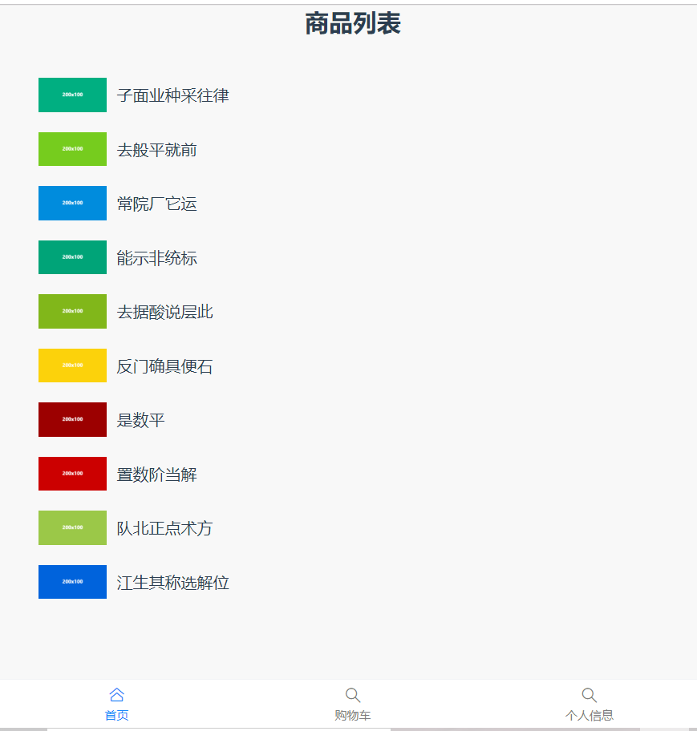

### 第一天：VUEX

#### 1.1 vuex 初始

- vuex 定义
  > vuex 是一个状态管理的插件，可以解决不同组件之间的数据共享和数据持久化。通俗点的说法就是全局的数据仓库，在组件里面的 data 是组件里的数据仓库也就是局部的数据仓库，全局数据仓库里面的数据可以在任意组件中共享。
  > vuex 是一个专门为 vue.js 设计的集中式状态管理架构。状态？我把它理解为在 data 中的属性需要共享给其他 vue 组件使用的部分，就叫做状态。简单的说就是 data 中需要共用的属性。

#### 1.2 Vuex 的基本结构

uex 是一个专为 vue.js 应用程序开发的状态管理模式。它采用集中式存储来管理应用
所有组件的状态，并以相应的规则来保证状态以一种可预测的方式发生变化。 Vuex 集成
到了 Vue 官方调试工具 devtools extension

- 安装 vue devtools 1)直接谷歌商店安装
  (1) 在 gitup 上下载 蓝灯，然后运行，右下角显示已连接就可以跨域去谷歌商店下载
   2)点开右上角谷歌设置-----左边扩展程序----点击最左边最上边扩展程序工具栏，下边有谷歌应用商店然后进入搜索 vue devtools 下载，后加到扩展程序里面就可以
- [参考](https://segmentfault.com/a/1190000009682735 "参考网址")

```js
git clone git@github.com:vuejs/vue-devtools.git
```

#### 1.3 安装 vuex(如果创建的时候没有选择 vuex,那么就需要手动安装)

1. `cnpm install vuex --save`
2. 在 main.js 的同级目录新建 store 文件夹 里面新建一个 index.js
3. 在 index.js 里面引入 vuex

```
import Vue from 'vue'
import Vuex from 'vuex'
Vue.use(Vuex)
```

4. 向外暴露 vuex 实例

```
export default new Vuex.Store({
  state:{},
  mutations:{},
  getters:{},
  actions:{},
  modules:{},
})
```

- state 一－ vuex store 实例的根状态对象，用于定义共享的状态变量，就像 Vue 实例中 data
  全局的数据仓库 定义在这里的属性可以被任意组件访问
  this.\$store.state + 访问的属性名称
- mutations 一 可以理解为 store 的 methods(同步操作 )里面存放的是修改数据仓库里面属性的方法
  调用的时候通过 this.\$store.commit("函数名称")
  - mutations 里面提交的参数 叫做载荷 提交载荷的时候只能提交一个
- getters 一 读取器，外部程序通过它获取变量的具体值，或者在取值前做一些计算（可以认为是 store 的计算属性）
  getters 相当与前面的计算属性 computed
  this.\$store.getters+"属性名称"
- actions 以理解为 store 的 methods(异步操作 如 ajax)
  this.\$store.dispatch("函数名称")
  - actions 里面函数的参数为对象 包含了 commit state
- modules 以模块化的方式写 vuex (如购物车对应一个 module 个人中心对应一个 module )

5. 挂载倒 vue 实例类上

```
import store from './store/store'

new Vue({
  router,
  store,
  render: h => h(App)
}).$mount('#app')
```

##### 1.3 store 中的四个函数如何使用

store-->index.js 中

```js
export default new Vuex.Store({
  //全局的数据仓库this.$store.state+访问器属相
  state: {
    name: "张三"
  },
  //以理解为 store的methods(同步操作 ) this$store.commit("函数名称")
  mutations: {
    //对名字进行修改
    chengeName(state, { num, nums }) {
      //有一个参数,state是上面的全局仓库
      //提交的参数，只能提交一个可以用数组或者对象
      state.name = "李四" + num + nums;
    }
  },
  //store的methods(异步操作 如ajax) this.$store.dispatch("函数名称")
  //actions 里面函数的参数为对象  包含了commit state
  actions: {
    //在异步函数里面更改数据仓库里面的属性有两种方式
    //1. context.commit  在actions 里面的函数 提交了mutations 里面的函数
    syncChangename(context) {
      context.commit("chengeName", { num: "小白", nums: "小黑" });
    }
    //2. 直接更改state里面的数据
    // syncChangename(context){
    //     context.state.name="孙明星"
    //     // console.log(context)

    // }
    //  syncChangename({state}){//可以用解构赋值
    //     state.name="孙明悦"
    //     // console.log(context)

    // }
  },
  //相当与前面的计算属性computed this.$store.getters+"函数名称"
  getters: {
    //有一个state参数
    //如果想要展示 张三 是一个好人
    names(state) {
      return state.name + "是一个好人";
    }
  },

  //以模块化的方式写vuex (如购物车对应一个module 个人中心对应一个module )
  modules: {}
});
```

About 页面

```html
<template>
  <div class="about">
    <h1>{{$store.state.name}}</h1>
    <h2>{{$store.getters.names}}</h2>
    <h1 @click="getname">This is an about page</h1>
    <h2 @click="changeName">同步改变姓名</h2>
    <h2 @click="syncchangeName">异步改变姓名</h2>
  </div>
</template>
<script>
  export default {
    methods: {
      getname() {
        console.log(this.$store.state.name); //张三
      },
      changeName() {
        this.$store.commit("chengeName", { num: "王五", nums: "小绿" });
        console.log(this.$store.state.name);
      },
      syncchangeName() {
        this.$store.dispatch("syncChangename");
        console.log(this.$store.state.name);
      }
    }
  };
</script>
```

- 购物车案例
  store--index.js

```js
export default new Vuex.Store({
  state: {
    catList: [],
    list: [
      {
        name: "白酒",
        price: 10,
        number: 20,
        id: Mock.Random.guid()
      },
      {
        name: "葡萄酒",
        price: 20,
        number: 30,
        id: Mock.Random.guid()
      },
      {
        name: "红酒",
        price: 30,
        number: 40,
        id: Mock.Random.guid()
      },
      {
        name: "啤酒",
        price: 40,
        number: 50,
        id: Mock.Random.guid()
      }
    ]
  },

  mutations: {
    add(state, id) {
      //把点击的商品根据id在list里面找到push进去
      var item = state.list.find(ele => ele.id == id);
      var cat = state.catList.find(ele => ele.id == id);
      var obj = {
        name: item.name,
        price: item.price,
        number: 1,
        id: item.id,
        isChecked: true
      };
      //判断当前购物车是否有这个商品，有直接数量加一，没有push
      if (cat) {
        cat.number++;
      } else {
        state.catList.push(obj);
      }
      item.number--;
    },
    //不能在循环里面判断，否则会全部加减
    reduce(state, id) {
      var cats = state.catList.find(ele => ele.id == id);
      var lists = state.list.find(ele => ele.id == id);
      if (cats.number >= 0) cats.number--;
      if (lists) lists.number++;
    },
    addnum(state, id) {
      var cats = state.catList.find(ele => ele.id == id);
      var lists = state.list.find(ele => ele.id == id);
      if (cats) cats.number++;
      if (lists.number >= 0) lists.number--;
    }
  },
  actions: {
    toggle({ getters, state }) {
      //想在这里判断isAllChecked是否全选或者没有选择
      //但是没办法得到这个所以在action中写这个方法
      if (getters.isAllChecked) {
        state.catList.forEach(ele => (ele.isChecked = false));
      } else {
        state.catList.forEach(ele => (ele.isChecked = true));
      }
      // console.log(getters,state)
    }
  },
  getters: {
    //对商品更改会触发计算属性
    isAllChecked(state) {
      if (state.catList.length == 0) {
        return false;
      }
      return state.catList.every(ele => ele.isChecked == true);
    },
    totalprice(state) {
      var total = state.catList.reduce((total, curret) => {
        if (curret.isChecked) {
          return (total += curret.price * curret.number);
        } else {
          return total;
        }
      }, 0);
      return total;
    }
  },
  modules: {}
});
```

购物车 Home 页面

```html
<template>
  <div class="home">
    <h1>购物车页面</h1>
    <ul>
      <li v-for="item in car" :key="item.id">
        <input type="checkbox" v-model="item.isChecked" />
        商品名称：{{ item.name }}, 商品数量：
        <button @click="reduce(item.id)">-</button>
        {{ item.number }}
        <button @click="addnum(item.id)">+</button>
        商品价格:{{ item.price }}
      </li>
    </ul>
    <div>
      <input type="checkbox" :checked="isAllChecked" @click="toggle" />
      <span>总价：{{ price }}元</span>
    </div>
  </div>
</template>

<script>
  export default {
    methods: {
      toggle() {
        this.$store.dispatch("toggle");
      },
      reduce(val) {
        return this.$store.commit("reduce", val);
      },
      addnum(val) {
        return this.$store.commit("addnum", val);
      }
    },
    //访问数据一般用计算属性接收vuex里面的数据
    computed: {
      car() {
        return this.$store.state.catList;
      },
      isAllChecked() {
        return this.$store.getters.isAllChecked; //双向绑定不可以修改
      },
      price() {
        return this.$store.getters.totalprice;
      }
    }
  };
</script>
```

商品页 About 页面

```html
<template>
  <div class="about">
    <h1>商品页</h1>
    <ul>
      <li v-for="item in list" :key="item.id">
        <div>商品名称:{{ item.name }}</div>
        <div>商品价格:{{ item.price }}</div>
        <div>商品数量:{{ item.number }}</div>
        <button @click="addCat(item.id)">添加到购物车</button>
      </li>
    </ul>
  </div>
</template>
<script>
  export default {
    methods: {
      addCat(val) {
        this.$store.commit("add", val);
      }
    },
    //访问数据一般用计算属性接收vuex里面的数据
    computed: {
      list() {
        return this.$store.state.list;
      }
    }
  };
</script>
```

### 第二天：作业遇到的问题

#### 2.1 filter 不可以改变原数组 find 可以改变原数组

- find 可以改变原数组，filter 是返回一个新数组

#### 2.2 MOck.js 在 vue 中使用步骤

- 在 store-->index.js 页面引入 mokejs
  1)cnpm install mockjs --save package-json 里面 dependencies 有相关信息 2)在 store 中 index.js 中的用法

```js
import Vue from "vue";
import Vuex from "vuex";
import Mock from "mockjs";
Vue.use(Vuex);
var Random = Mock.Random;
var list = [];
for (var i = 0; i < 5; i++) {
  var obj = {
    img: Random.dataImage("200x100"),
    title: Random.ctitle(),
    id: Random.id(),
    present: Random.cparagraph()
  };
  list.push(obj);
}
export default new Vuex.Store({
  state: {
    list: list
  }
});
```

#### 2.3 路由中嵌套路由的使用

```js
{
    path: '/about',
    name: 'about',
    redirect:"/about/addbookes",//重定向
    component: () => import('../views/About.vue'),
    children:[
      {
        path: 'addbookes',//不加/
        component: () => import('../views/addbooks.vue'),
      },
      {
        path: 'editbookes',
        component: () => import('../views/editbooks.vue'),
      }
    ]
  }
```

#### 2.4 弹窗里面的 input 框是 v-model 的值，

> 但在修改 input 框的时候点击提交的时候让 input 框在改变用到了深克隆，浅克隆

```js
 maskshow(val) {
      //val传过来的是是当前点击的行元素
      var obj=Object.assign({},val)//深克隆，也就是我改变obj里面的值不该改变val的值
    //浅克隆，我改变弹框里面的内容，obj发生改变，但表格的数据不会改变
    //且this.maskvalue里面的数据就是当前行的所有的数据
      this.maskvalue=obj;
      this.isMaskShow = !this.isMaskShow;
    },
```

### 第三天：赋值函数以及模块化

#### 3.1 vuex 辅助函数 帮助我们节省代码的语法糖

如果在 store---》index.js--》state 中定义了参数
在 about 页面如何使用 vuex 辅助函数

```html
<template>
  <div class="about">
    <h1>{{ages}}{{ num }}{{ name }}{{ age }}</h1>
    <h2 @click="changenum(6)">mutation方法改变num</h2>
    <h2 @click="syncage">actions方法改变age</h2>
  </div>
</template>

<script>
  import { mapState, mapMutations, mapActions, mapGetters } from "vuex";
  export default {
    computed: {
      //state里面的数据用计算属性接收
      ...mapState({
        //1)字符串
        num: "num",
        //2)函数
        name: function(state) {
          return state.name;
        },
        //箭头函数
        age: ele => ele.age
      }),
      ...mapGetters({
        ages: "ages"
      })
    },
    methods: {
      ...mapMutations({
        //只有一种字符串的形式
        changenum: "changenum"
      }),
      ...mapActions({
        //只有一种字符串的形式
        syncage: "syncage"
      })
    }
  };
</script>
```

mapState 和 mapGetters 放到 computed 里面 其中 mapState 有三种方式获取其他均有一种字符串获取方法
mapMutations,mapActions 同步或者异步方法放到 methods 里面

#### 3.2 模块化

》当我们写大型的项目的时候 我们所有的需要共享的信息或状态都写在同一个 state 里面 导致 state 或其他的操作比较臃肿 那么 为了解决这个问题 vuex 提出了模块化 module

##### 3.2.1 模块化的写法

1)在 store 文件夹建一个 index.js 里面写上以下内容

```js
mport Vue from "vue"
import Vuex from "vuex"
import Mock from "mockjs";
Vue.use(Vuex)
export default new Vuex.Store({
    modules:{
        car:a,
        home:b,
    }

})
```

2)建一个 modules 文件夹 --》里面新建 car.js;home.js 比如 home.js 里面内容

```js
export default {
  state: {},
  mutations: {},
  actions: {},
  getters: {}
};
```

3)第 1 步接收一下 home.js

```js
import home from "./modules/home";
// a的位置换成 home
```

##### 3.2.2 模块化总结

- 如果想要获取到模块化里面的属性或者方法
  state 默认是模块化的 其他的 mutations actions getters 不是模块化的
  如果多个模块化之间有多个相同的函数名 那么调用的时候会执行多次
- state
  获取 state 里面的属性 需要加上模块名称 this.\$store.state.home.list
- mutations
  获取 mutations 里面的方法 不需要加上模块名称 this.\$store.commit("add")
  如果多个模块化之间有多个相同的函数名 那么调用的时候会执行多次
  <font color="red"> 怎么解决模块化之间有相同的函数名，调用执行多次?</font>
- namespaced:true 命名空间 写在每一个模块化下面的 js 中与 state 平级

###### mutations actions getters 就会变成模块话

- mutations this.\$store.commit("home/add")
- actions this.\$store.dispatch("home/add")
- getters this.\$store.getters["home/add"]

#### 3.3 使用模块化之后辅助函数的写法

- state 只能通过函数的方式进行获取
- mutations  
  获取模块里面的同步方法的时候需要加上模块名称
- actions
  获取模块里面的异步方法的时候需要加上模块名称
- getters  
  获取模块里面的 getters 属性的时候需要加上模块名称
  modules 中定义了一个 a.js
  然后 index.js 中引入模块

```js
import a from "./modules/a";
Vue.use(Vuex);
export default new Vuex.Store({
  modules: {
    a: a
  }
});
```

如何在 about 页面使用这个 a 定义的变量 10？

```js
  computed: {
    //在辅助函数里面字符串的形式获取不了state里面的数据 函数和箭头函数都可以获取到数据
        ...mapState({
            // num:"a/num
            //1) num:function(state){
            //     // console.log(state)
            //     return state.a.num
            // }
            num:ele=>ele.a.num//2)
        }),
        //接收num正常用法
        // num(){
        //     return this.$store.state.a.num;
        // }
    ...mapGetters({
        ages:"a/ages"
    })
    },
    methods: {
      ...mapMutations({
          changenum:"a/changenum"
      }),
      ...mapActions({
         syncnum:"a/syncnum"
      })
    },
};
</script>
```

#### 3.4 监听路由变化执行动画效果

1)在 src-->assets 里面新建一个 css 文件夹---》animate.css 2)在 main.js 里面引入`import "@/assets/css/animate.css"` 3)给 router-view 外面加 transition 加类型

```html
<template>
  <div id="app">
    <transition :enter-active-class="currentstyle">
      <router-view />
    </transition>
    <footers v-if="infohide"></footers>
  </div>
</template>
<script>
  import footers from "@/components/footer";
  export default {
    watch: {
      $route: function(to, from) {
        // console.log(to,from)
        var old = from.path.split("/").length;
        var now = to.path.split("/").length;
        if (old >= now) {
          this.currentstyle = "fadeInRight animated";
        } else if (old < now) {
          this.currentstyle = "fadeInLeft animated";
        }
        if (
          to.path.split("/").includes("info") &
          to.path.split("/").includes("index")
        ) {
          this.infohide = false;
        } else {
          this.infohide = true;
        }
      }
    },
    data() {
      return {
        infohide: true,
        currentstyle: ""
      };
    },
    components: {
      footers
    }
  };
</script>
```

### 第四天 项目 购物车小案例

#### 4.1 购物车中有一个公共的组件，首页，购物车，登录页面都有， 但是详情页不显示下面这个组件，这种情况可以用路由原信息


在 router--->index.js 里面

```js
const routes = [
  {
    path: "/",
    name: "home",
    component: Home,
    meta: {
      isFootShow: true
    }
  },
  {
    path: "/about",
    name: "about",
    meta: {
      isFootShow: true
    },
    component: () => import("../views/About.vue")
  },
  {
    path: "/car",
    name: "car",
    component: () => import("../views/car/index.vue"),
    meta: {
      isFootShow: true
    },
    beforeEnter(to, from, next) {
      if (localStorage.getItem("user")) {
        next();
      } else {
        alert("没有登陆");
        next("/about");
      }
    }
  },
  {
    path: "/info/:id",
    name: "info",
    component: () => import("../views/info/index.vue"),
    meta: {
      isFootShow: false
    }
  }
];
```

在 App.vue 里面加上 v-if="\$route.meta.isFootShow"

```js
<div id="nav" v-if="$route.meta.isFootShow">
  <router-link to="/">Home </router-link>
  <router-link to="/car">购物车</router-link>
  <router-link to="/about">About</router-link>
</div>
```

#### 4.2 有关 flex 布局 css 样式

position：fixd;这种布局当定位到底部的时候，如果底部里面有输入框，就会有问题，所以左后用 flex 布局；

- 如果有上中下三块内容，上下高 50 固定高度，中间自适应，如何 flex 实现这种布局方式?

```css
body,
html {
  width: 100%;
  height: 100%;
}
.box {
  width: 100%;
  height: 100%;
  display: flex;
  /* 默认方向行布局 */
  flex-direction: column;
  /* justify-content: space-between; */
}
.top {
  width: 100%;
  height: 50px;
  background-color: green;
}
.center {
  /* 默认充满剩下的区域 */
  flex: 1;
  width: 100%;
  background-color: red;
}
.bot {
  width: 100%;
  height: 50px;
  background-color: orange;
}
```

### 第五天 vue 对应的 element 组件

pc 端`element iview`
移动端 `vant cube`

- pc 端 ui 框架 element

#### 5.1 下载引入

- 全局方式

1. cnpm i element-ui -S; i 是 install 的简写， -S 是--save 的简写
2. 把一下代码放入 main.js 里面

```js
import ElementUI from "element-ui";
import "element-ui/lib/theme-chalk/index.css";

Vue.use(ElementUI);
```

3. 在页面就可以使用响应代码了

- 按需引入

1. cnpm i element-ui -S; i 是 install 的简写， -S 是--save 的简写
2. cnpm install babel-plugin-component -D 完成后会出现与 src 同级的文件 babel.config.js
3. 在 babel.config.js 里面加下面一段

```js
module.exports = {
  presets: ["@vue/cli-plugin-babel/preset"],
  plugins: [
    [
      "component",
      {
        libraryName: "element-ui",
        styleLibraryName: "theme-chalk"
      }
    ]
  ]
};
```

4. 在 main.js 里面注册

```js

```

#### 5.2 如何在 vue 中使用图表

1. cnpm install echarts -S
2. 全局引入在 main.js 中

```js
import echarts from "echarts";
Vue.prototype.$echarts = echarts;
```
3.官网  https://www.echartsjs.com/zh/index.html
