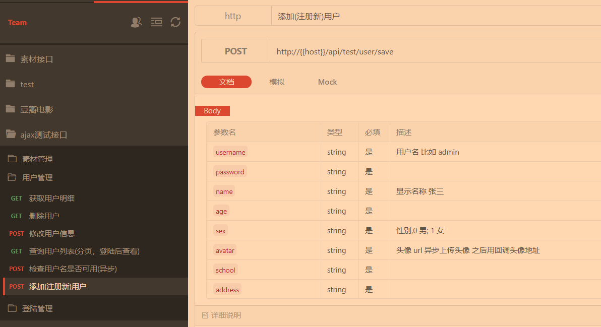

### 第一天 vant axios
#### 1.1 移动端框架 vant

> 别用mint 几年没更新了 从网上找插件时千万别找那种几年没更新的项目轻量、可靠的移动端 Vue 组件库 vant的开发团队是 `有赞`

- vant安装
[vant安装](https://youzan.github.io/vant/#/zh-CN/quickstart "vant安装")
##### 1.1.1 全局引用
1. cnpm i vant -S
2. 在min.js里面写上
```js
import Vant from 'vant';
import 'vant/lib/index.css';

Vue.use(Vant);
```
##### 1.1.2 按需引用
1. cnpm i vant -S
2. 安装babel插件
cnpm i babel-plugin-import -D 
`注意：配置 babel-plugin-import 插件后，将不允许以这种方式导入组件`
3. 在src同级有babel.config.js载里面匹配值一下代码
```js
module.exports = {
  presets: [
    '@vue/cli-plugin-babel/preset'
  ],
  plugins: [
    ['import', {
      libraryName: 'vant',
      libraryDirectory: 'es',
      style: true
    }, 'vant']
  ]
}
```
4. 在main.js 配置
```js
import { Button } from 'vant';
Vue.use(Button)
```
##### 1.1.3 vant rem适配
vant的px尺寸转rem参考以下网址
[vant的px尺寸转rem](https://www.cnblogs.com/lml2017/p/9953429.html "vant的px尺寸转rem");

1. 安装这两个包
- flexible会为页面根据屏幕自动添加<meta name='viewport' >标签，动态控制initial-scale，maximum-scale，minimum-scale等属性的值。
`cnpm install lib-flexible --save`
- postcss-px2rem会将px转换为rem，rem单位用于适配不同宽度的屏幕，根据<html>标签的font-size值来计算出结果，1rem=html标签的font-size值。
`cnpm install postcss-px2rem --save`

合并安装:cnpm install lib-flexible postcss-px2rem --save
2. main.js 中引入lib-flexible
import 'lib-flexible'
3. 配置postcss-px2rem
1)找到vue.config.js 
2) 找不到？可能你是一个新构建的项目，需要手动在项目根目录创建与src 同级的vue.config.js 把下面代码赋值到里面
```js
module.exports = {
    css: {
        loaderOptions: {
          css: {},
          postcss: {
            plugins: [
              require('postcss-px2rem')({
                remUnit: 37.5
              })
            ]
          }
        }
    },
}
```
4)重启项目 npm run serve

#### 1.2 vant重构 购物车

1)购物车页面步进器如何同步首页数据?
1. 步进器加一个 @change="changes" 当绑定值变化时触发的事件不能传参,为了得到对应的id所以在父级元素li标签上写一个点击函数因为change触发的时候还没有传id所以用捕获,先传id在触发change事件@click.capture="upt(item.id)",把id赋值给data里面的currentId
2. 
```js
//步进器改变事件
 
    // li点击事件
    upt(val){ 
      this.currentId=val;
      console.log(this.currentId)
    },
    //把uptss传到当前页面
    ...mapMutations({
      uptss:"uptss",
      inputchecked: "inputchecked"
    }),
```
```html
<!-- 购物车页面标签 -->
 <li v-for="item in carList" :key="item.id" @click.capture="upt(item.id)">
          <van-cell>
            <!-- 使用 title 插槽来自定义标题 -->
            <template slot="title">
              <span class="custom-title">
                <van-checkbox v-model="item.isChecked" shape="square"
                  >{{ item.title }}单价：{{ item.price }}</van-checkbox
                >
              </span>
              <!-- <van-tag type="danger">标签</van-tag> -->
            </template>
            <van-stepper @change="changes" v-model="item.number" min="0" :max="item.oldNum" />
          </van-cell>
        </li>
```

2)全选,反选按钮的时候,点击父级事件,不触发子元素的事件
父级点击事件加上`.capture`,且父级点击事件里面写上
```js
   event.stopImmediatePropagation();
```
```html
 <div class="footer">
        <!--  :checked="isAllChecked" 复选框不能选中 van-cell标签没有单向绑定的方法 
              用v-model 报错,isAllChecked不能设置,解决,点击事件加到父级上-->
        <van-cell title="单元格" value="内容">
          <template slot="title">
            <div @click.capture="allselected" class="all">
              <van-checkbox
                v-model="isAllChecked"
                shape="square"
              ></van-checkbox>
            </div>
          </template>
          总价:{{ total }}元
        </van-cell>
      </div>
```

#### 1.3 axiors
>Axios 是一个基于 promise 的 HTTP 库，可以用在浏览器和 node.js 中。 类似jq的$.ajax
axios是一个已经封装好的ajax 的一个库
##### 1.3.1 axios特性
+ 从浏览器中创建 `XMLHttpRequests`
+ 从 `node.js` 创建 `http` 请求
+ 支持 `Promise` API
+ 拦截请求和响应
+ 转换请求数据和响应数据
+ 取消请求
+ 自动转换 JSON 数据
+ 客户端支持防御 `XSRF`(跨站请求伪造)
##### 1.3.2 axios安装  vue-resource 尤雨溪 不再维护  推荐使用axios
- axios中文文档(非官方)
https://www.kancloud.cn/yunye/axios/234845

- 服务器地址 

http://59.110.138.169

http://114.55.243.6:8080

+ 豆瓣电影接口
https://apizza.net/pro/#/project/219bd7da9f36824337b05a33e9e08c51/browse?pass=a511db3cf920386c952dd6bdfbcf42fd
- 安装
cnpm install axios --save
- 在使用页面进行引用
import axios from "axios"

 ##### 1.3.3  常用get/post请求
[不凡电影接口]("http://www.bufanui.com/designInfo/detail/6fd1d4a4ccb44c878ae72273bd3dca08" "不凡电影接口")
一般正规请求方法卸载methods里面,created里面初始化
1. get/post请求 豆瓣电影接口
<font color="red">
post请求表单数据,需要将数据转化为qs
且直接引入当前文件就可以
</font>
```html
<template>
  <div class="about">
    <ul>
      <li v-for="item in list" :key="item.id">
        <h1>{{item.title}}</h1>
        
      </li>
    </ul>
    <!-- post请求 -->
    <button @click="postMes">post提交</button>
  </div>
</template>

<script>
import axios from "axios"
export default {
    data() {
        return {
          list:"",
          start:1,
          limit:2
        };
    },
    created() {
      this.init();
    },
    methods: {

      //一: get请求
      init(){
        //1.axiosget请求 带参数 写在params里面
      // axios.get("http://59.110.138.169/api/douban/movie/in_theaters",{
      //   params:{
      //     start:1,
      //      limit:5
      //   }
      // })
      //2.axiosget请求 带参数直接拼接在后面 如果start不是死的,可以动态改变this.limit
      axios.get(`http://59.110.138.169/api/douban/movie/in_theaters?start=${this.start}&limit=${this.limit}`)
      .then(res=>{
        console.log(res)
        this.list=res.data.data;
      })
      },
      // //一: post请求  带参数不需要写在params里面
     postMes(){  
        var obj={
          username:"张三",
          password:"1234",
          name:"孙明",
          age:18,
          sex:1,
          avatar:"",
          school:"郑州大学",
          address:"郑州"
        }
        axios.post("http://59.110.138.169/api/test/user/save",obj)
        .then(res=>{
            console.log(res)
        })
      }
    },
};
</script>
```

<font color="red">如果后端要求请求头类型是application/x-www-form-urlencoded 需要转换以下 如果是application/json 不需要用qs模块
</font>
不凡电影接口  豆瓣电影图片做防盗链处理 需要在src同级的public--->index.html加上这个index.html
<meta name="referrer" content="never">

#### 1.4 axios执行多个并发请求

>一次执行多次ajax请求
promise.all
执行多个并发请求是通过`axios.all`完成  
`axios.all([function , function , ...])`
请求完成之后 会以数组的形式返回全部的请求数据

```js
import axios from "axios";
axios.defaults.baseURL = 'http://localhost:3000';
import qs from "qs";
let datas = {
        Mob:18311111111,
        validcode:"815961",
        use:"regiVali"
      };
let params = qs.stringify(datas)
export default {
  methods: {
    init(){
      return axios.get('http://localhost:3000/')
     
    },
    getUserInfo(){
       return axios.post('http://localhost:3000/user',params )
      
    }
  },
  created () {
    axios.all([this.init(), this.getUserInfo()])
    .then((val)=>{  // val返回的是全部的请求
        console.log(val)
    });
  }
}
```
### 第二天

#### 2.1 全局的 axios 默认值

##### 1. `axios.defaults.baseURL` 设置默认公共请求地址baseURL
例如 开发环境访问的是开发时的数据库 生产环境访问的是线上数据库 开发和生产访问的不是一个地址
在请求的时候自动的在地址前面加上设置的baseUrl
(开发环境是本地开发时的环境 生产环境是打包之后的环境)
```js
if(process.env.NODE_ENV == "development"){
    axios.defaults.baseURL = 'http://localhost:3000';
}else{
    axios.defaults.baseURL = 'http://localhost:3001';
}
```
##### 2. `axios.defaults.timeout = 2500`; 设置超时
当后端返回数据过慢时设置了超时就会自动断开请求
##### 3.  `axios.defaults.headers.common['token'] = token`;
token是登陆的时候返回的token 如果后端让在别的页面请求数据的是附带token 
一般用户判断用户是否登陆是根据token 进行判断的  一般把这个token存在session里面
只要把toke写在请求头里面 后端就知道我们登陆 
###### 3.1 `axios.defaults.headers.common['token'] = localStorage["token"]  `
- 登陆的时候保存sessionkey  然后在请求其他接口的时候带上这个sessionkey  sessionkey  代表用户的身份 当我们请求数据的时候带上这个sessionkey  那么后端就知道现在是谁在请求数据 
还有些特殊的情况 登陆的时候后端会在本地设置cookie token 他会根据cookie里面的值token来判断用户是否登陆

- axios.defaults.headers.common['sessionKey'] = 登陆时后端返回的sessionKey
如果你每次请求接口需要验证，就加这个，不需要验证那就不用加

``` html

<template>
  <div class="home">
    <button @click="getUserInfo">获取个人信息</button>
  </div>
</template>

<script>


import axios from "axios";
// axios.defaults.baseURL = "https:bufantest.com";
axios.defaults.timeout = 3000;
export default {
  data () {
    return {
      key:""
    }
  },
  methods: {
    getUserInfo(){
      if(localStorage.getItem("sessionKey")){
        var key = JSON.parse(localStorage.getItem("sessionKey"));
        axios.defaults.headers.common['user-session'] = key
      }
      axios.post("http://114.55.243.6:8080/user/getInfo")
      .then(res =>{
        console.log(res)
      })
    }
  },
  created () {
    // 登陆
    axios.post("http://114.55.243.6:8080/user/login",{
      loginType:0,
      mobile:18311111111,
      pwd:1,
      verifyCode:"",
    })
    .then(res =>{
      localStorage.setItem("sessionKey",JSON.stringify(res.data.data.sessionKey))
    })
  }
}
</script>
```
##### 4. axios拦截器 interceptors
>前端请求接口时首先向服务端发送请求的接口加参数 这个步骤称之为request
API：拦截器。拦截器分为 请求（request）拦截器和 响应（response）拦截器。
request 对象代表了一个HTTP请求，其具有一些属性来保存请求中的一些数据，比如params string，body，HTTP headers等等。
+ params get请求附带的参数
+ body post请求附带的参数
+ HTTP headers 提交数据类型
>服务端接收到请求之后响应数据 这个步骤称之为response
response里面存放的就是服务端返回给我们的数据，包括状态码，返回的数据格式等等

axios拦截器就是对这请求前和返回数据后的这两个过程执行操作
###### 请求拦截器
>- config里面包含请求的参数 如请求地址 请求参数等
在请求的时候执行一些操作 比如开启loading弹窗 可以想象成router的导航守卫

```js
// 为了下面关闭弹窗,随意定义一个变量
var loadings;
axios.interceptors.request.use(function (config) {
    // 在发起请求请做一些业务处理  
    // 如开启loading  对请求的参数做处理 添加token等
    // 例  在请求的时候开启elementui的loading
  loadings = Loading.service({ fullscreen: true });
  if(config.method == "post"){
      config.data = qs.stringify(config.data);
  }
  console.log(config)
    return config;
}, function (error) {
    // 对请求失败做处理
    return Promise.reject(error);
});
```
###### 响应拦截器
比如响应数据之后关闭loading弹窗 
```js
axios.interceptors.response.use(function (config) {
    // 在请求之后做处理 如关闭loading
  loadings.close();
  // 对返回过来的数据进行过滤操作
    return config.data;
}, function (error) {
    // 对请求失败做处理
    loadings.close();
    return Promise.reject(error);
});
```
#### 2.2  封装 全局的 axios
1) 在src目录下新建文件夹api与assets同级
2) 在api文件夹新建index.js
3)把下面代码粘到里面
```js
import axios from "axios"
import qs from "qs"
import { Loading } from 'element-ui'
axios.defaults.baseURL="http://59.110.138.169";
axios.defaults.timeout=5000;
// axios.defaults.headers.common['token'] = token
if(process.env.NODE_ENV == "development"){
    axios.defaults.baseURL = 'http://localhost:3000';
}else{
    axios.defaults.baseURL = 'http://localhost:3001';
}

var loadings;
axios.interceptors.request.use(function (config) {
  loadings = Loading.service({ fullscreen: true });
  if(config.method.toLowerCase== "post"){
      config.data = qs.stringify(config.data);
  }
//   console.log(config)
    return config;
}, function (error) {
    // 对请求失败做处理
    return Promise.reject(error);
});

axios.interceptors.response.use(function (config) {
  loadings.close();
    return config.data;
}, function (error) {
    loadings.close();
    return Promise.reject(error);
});
export default axios;
```
4) 在min.js里面
```js
import axios from './api'
Vue.prototype.$ajax=axios
```
#### 2.3 接口豆瓣电影项目

##### 1.post请求数据时,如果后台需要传的参数我们传递过去的必须保持一致,类型可以不一样

```js
 // 弹框
    add(){      
      var obj={
        username: this.user.username,
        password: this.user.pass,
        name: this.user.name,
        age:this.user.age,
        sex:this.user.sex,
        avatar:"",
        school: this.user.school,
        address: this.user.address
      }
       this.$ajax.post("/api/test/user/save",obj)
       .then(res => {
         this.dialogFormVisible=false;
        console.log(res);
      });
    }
```
### 第三天 nuxt服务端渲染
#### 3.1 nuxt 的由来
> seo:利用搜索引擎的规则提高网站在有关搜索引擎内的自然排名。目的是让其在行业内占据领先地位，获得品牌收益。
- nuxt 的由来
vue脚手架生成的单页面项目不支持seo,一般公司的官网都需要seo来进行搜索排名，个时候vue的服务端渲染nuxt就出现。Nuxt.js简单的说是Vue.js的通用框架，最常用的就是用来作SSR（服务器端渲染）。再直白点说，就是Vue.js原来是开发SPA（单页应用）的，但是随着技术的普及，很多人想用Vue开发多页应用，并在服务端完成渲染。这时候就出现了Nuxt.js这个框架，她简化了SSR的开发难度。还可以直接用命令把我们制作的vue项目生成为静态html。
- 服务器端渲染到底有什么好处
新闻网站，流量的一个主要来源是通过百度、谷歌、bing这些搜索引擎，但是它们对SPA的抓取并不好，特别是百度根本没法抓取到SPA的内容页面，所以我们必须把我们的应用在服务端渲染成适合搜索引擎抓取的页面，再下载到客户端。那Nuxt.js适合作新闻、博客、电影、咨询这样的需要搜索引擎提供流量的项目。如果你要作移动端的项目，就没必要使用这个框架了。
#### 3.2 什么是SSR？
##### 3.2.1.1
SSR，即服务器渲染，就是在服务器端将对Vue页面进行渲染生成html文件，将html页面传递给浏览器。
- SSR两个优点：
  + SEO 不同于SPA的HTML只有一个无实际内容的HTML和一个app.js，SSR生成的HTML是有内容的，这让搜索引擎能够索引到页面内容。
  + 更快内容到达时间 传统的SPA应用是将bundle.js从服务器获取，然后在客户端解析并挂载到dom。而SSR直接将HTML字符串传递给浏览器。大大加快了首屏加载时间。
- Nuxt.js是特点（优点）
  + 基于 Vue.js
  + 自动代码分层
  + 服务端渲染
  + 强大的路由功能，支持异步数据
  + 静态文件服务
  + ES6/ES7 语法支持
  + 打包和压缩 JS 和 CSS
  + HTML头部标签管理
  + 本地开发支持热加载
  + 集成ESLint
  + 支持各种样式预处理器： SASS、LESS、   Stylus等等
 ###  第四天 
#### 4.1 Nuxt环境搭建
使用nuxt的前提必须已经安装了vue的脚手架,nuxt的项目通过脚手架来进行创建
`npm install vue-cli -g`
1. [初始化nuxt的项目](https://zh.nuxtjs.org/guide/installation "初始化nuxt的项目")
`npx create-nuxt-app <项目名>`
2. 启动服务  
`npm run dev`
3. 查看项目  
在浏览器输入 localhost:3000,可以看到结果
##### 4.2 Nuxt目录结构详讲
```js
|-- .nuxt  一般不做修改                          // Nuxt自动生成，临时的用于编辑的文件，build
|-- assets                            // 用于组织未编译的静态资源入LESS、SASS 或 JavaScript
|-- components    全局组件                   // 用于自己编写的Vue组件，比如滚动组件，日历组件，分页组件
|-- layouts        一般不做修改                     // 布局目录，用于组织应用的布局组件，不可更改。
|-- middleware                       // 用于存放中间件
|-- pages                            // 用于存放写的页面，我们主要的工作区域
|-- plugins                          // 用于存放JavaScript插件的地方
|-- static                           // 用于存放静态资源文件，比如图片
|-- store                            // 用于组织应用的Vuex 状态管理。
|-- .editorconfig                    // 开发工具格式配置
|-- .eslintrc.js                     // ESLint的配置文件，用于检查代码格式
|-- .gitignore                       // 配置git不上传的文件
|-- nuxt.config.json                 // 项目配置文件 用于组织Nuxt.js应用的个性化配置，已覆盖默认配置
|-- package-lock.json                // npm自动生成，用于帮助package的统一性设置的，yarn也有相同的操作
|-- package.json                     // npm包管理配置文件
```
- 修改启动端口  
找到package.json   
在package.json里面加上
```js
"config":{
  "nuxt":{
    "host":"127.0.0.1",
    "port":"1234"
  }
} // 项目就运行在localhost:1234 当然不修改也行  项目会运行在localhost:3000
```
#### 4.3 nuxt的有关路由等问题
##### 1.路由
  nuxt 没有路由，在page里面创建vue文件，默认在.nuxt--》router.js自动创建对应的路由
##### 2.默认展示的页面
  page/index.vue 在router.js path是"/"
##### 3.layouts 里面的default.vue
1）<nuxt />  容器组件相当于router-view
2）nuxt-link  跳转标签默认被渲染为a标签   tag属性用与指定渲染成为的标签
##### 4.样式
1）scoped 加上是当前组件样式不加就是全局样式
2) scss在nuxt里面不能直接使用，如果想要使用需要安装两个插件
`cnpm install --save-dev  node-sass sass-loader`  
 安装这两个插件之后就可以在项目里面使用scss 
 如果安装之后还是不可以用，重新启动或者把node_modules删除用 cnpm install重新安装依赖
3）如果引入一个重置样式，怎么样使用呢
在assets ---》中建一个css文件夹----》reset.css文件里面----》找到 nuxt.config.js里面的css: [],是专门存放公共样式里面写上"@/assets/css/reset.css"  这里的@是项目名称的根路径
4)如果要建一个公共的scss文件？
在assets ---》中建一个css文件夹----》style.scss文件里面----》找到 nuxt.config.js里面的css: [],是专门存放公共样式里面写上"@/assets/css/reset.css"  这里的@是项目名称的根路径

##### 5.动态路由
1）在pages里面新建一个info文件夹，里面建一个 —id.vue
在.nuxt--》router.js中的配置为 - 后面的id就是动态路由绑定的名字
```js
{
    path: "/info/:id?",
    component: _62008a56,
    name: "info-id"
  }
```
当在页面localhost:3000/info/111 就可以访问动态路由页面，在—id.vue页面created生命周期函数里面输出this
this.$route.params.id就可以拿到传递的动态id

##### 6.query传值
比如在localhost:3000/info/111?id=666
this.$route.query.id就可以拿到666

##### 7.嵌套路由  
如果想要在first.vue页面嵌套路由
1新建文件夹名称要与first一样 比如里面新建一个first1.vue 在.nuxt--》router.js中的配置为
```js
routes: [{
    path: "/first",
    component: _1c4005ba,
    name: "first",
    children: [{
      path: "first1",
      component: _03f16b8a,
      name: "first-first1"
    }]
  }
```
嵌套路由需要有承载组件的标签在first.vue页面放上
 <nuxt-child></nuxt-child>

##### 8.安装 swiper插件
swiper安装网址 https://github.com/surmon-china/vue-awesome-swiper
1）cnpm install vue-awesome-swiper --save
2)在plugins文件夹下创建一个swiper的js  swiper.js
3）上面网址mount with ssr 里面的代码粘贴到plugins文件夹下swiper.js
```js
// If used in nuxt.js/ssr, you should keep it only in browser build environment
if (process.browser) {
  const VueAwesomeSwiper = require('vue-awesome-swiper/dist/ssr')
  Vue.use(VueAwesomeSwiper)
}
```
4）所以swiper.js中的内容为
```js
import Vue from "vue"
if (process.browser) {
    const VueAwesomeSwiper = require('vue-awesome-swiper/dist/ssr')
    Vue.use(VueAwesomeSwiper)
  }
```
5)上面网址 mount with component里面的 swiper的css样式`import 'swiper/dist/css/swiper.css`把`"swiper/dist/css/swiper.css"`粘贴到nuxt.config.js里面的css: [],
6)把plugins文件夹下创建的swiper.js挂载到nuxt.config.js里面的plugins: [ ],
```js

plugins: [
    "@/plugins/swiper.js"
  ],
// 因为上面要求安装保持游览器环境
plugins: [

  {
    src:"@/plugins/swiper.js",
    ssr:false
  }
    
  ],
```
7)上面网址SSR的swiper案例

##### 9.安装element-ui
1)cnpm install element-ui --save
2)在plugins文件夹下创建ele.js
```js
import Vue from 'vue';
import ElementUI from 'element-ui';
import 'element-ui/lib/theme-chalk/index.css';

Vue.use(ElementUI);
```
在ele.js放入
```js
import Vue from 'vue';
import ElementUI from 'element-ui';

Vue.use(ElementUI);
```
在nuxt.config.js里面的css: []放入
`"element-ui/lib/theme-chalk/index.css"`
3)在nuxt.config.js里面plugins: [ ]引入element

##### 10,安装 axios
1)cnpm install axios --save
2) 
  (1)在当前页面引用 import axios from "axios"
  (2)封装axios
  plugins文件夹---》新建axios.js文件夹把封装的代码放里面加上Vue.prototype.$ajax=axios; 删除暴露的export.....
3)在nuxt.config.js里面plugins: [ ]引入

#### 4.4 导航守卫
1)没有在login页面登录用户民和密码不能进入user页面
2)在login页面点击登录localStorage存储用户名，由于没有路由所以需要使用，路由每次跳转的中间件 `middleware `
`服务器渲染不能获取document,window,localStorage所以需要用Cookie`
1)本地安装Cookie
  (1)cnpm install js-cookie --save
  2)在登录页面引入cookie 
  `import Cookie from 'js-cookie' `
  点击登录执行事件的代码
  `Cookie.set("token",this.username)`
2)在middleware文件夹新建requireAuth.js 用于登陆权限判断requireAuth.js中的代码
```js
import Cookie from 'js-cookie'
export default function(val){//暴露一个函数，val是上下文对象
    if(val.route.path== "/user"){
            if(Cookie.get("token")){
              //登录什么操作都不做
            }else{
                val.redirect("/login")
            }
        }
}
```
3)在nuxt.config.js,router:[]，如果没找到，手动添加一个进行注册 `requireAuth.js`
<script>
  router:{  // 路由配置
    middleware:"requireAuth" // 当每次路由跳转时都使用requireAuth文件
  }
</script>
#### 4.5 Nuxt的路由动画效果
Nuxt.js提供两种方法为路由提供动画效果，一种是全局的，一种是针对单独页面制作。
- 全局路由动画
1) assets/css下建立一个main.css文件里面的代码
```js
.page-enter-active, .page-leave-active {
    transition: opacity 2s;
}
.page-enter, .page-leave-active {
    opacity: 0;
}
```
2）nuxt.config.js里在css引入
- 单独设置页面动效
改变默认的page，然后在页面组件的配置中加入transition字段即可
在全局样式assets/main.css 中添加以下内容。
```js
.test-enter-active, .test-leave-active {
    transition: all 2s;
    font-size:12px;
    
}
.test-enter, .test-leave-active {
    opacity: 0;
    font-size:40px;
}
```
然后在about/index.vue组件中设置  
```js
export default {
  transition:"animat",
    data() {
        return {

        };
    },
```
这时候就有了页面的切换独特动效了。

#### 4.6 Nuxt的错误页面和个性meta设置
当用户输入路由错误的时候我们需要给他一个明确的指引，所以说在应用程序开发中404页面是必不可少的。Nuxt.js支持直接在默认布局文件夹里建立错误页面。 
在根目录下的layouts文件夹下建立一个error.vue文件，它相当于一个显示应用错误的组件。
不需要配置，当用户输入路由错误的时候,直接定位到这个组件
```html
<template>
  <div>
      <h2 v-if="error.statusCode==404">404页面不存在</h2>
      <h2 v-else>500服务器错误</h2>
      <ul>
          <li><nuxt-link to="/">HOME</nuxt-link></li>
      </ul>
  </div>
</template>
 
<script>
export default {
  props:['error'],
}
</script>
```
代码用v-if进行判断错误类型，需要注意的是这个错误是你需要在`<script>`里进行声明的，如果不声明程序是找不到`error.statusCode`的。
#### 4.7 个性meta设置
页面的Meta对于SEO的设置非常重要，比如你现在要作个新闻页面，那为了搜索引擎对新闻的收录，需要每个页面对新闻都有不同的title和meta设置。直接使用head方法来设置当前页面的头部信息就可以了。
在每个页面都可以加上描述信息与data同级
```js
 head(){
      return{
        title:this.title,
        meta:[
          {hid:'description',name:'news',content:'This is news page'}
        ]
      }
    }
```
注意：为了避免子组件中的meta标签不能正确覆盖父组件中相同的标签而产生重复的现象，建议利用 hid 键为meta标签配一个唯一的标识编号。
#### 4.8 asyncData方法在服务端获取数据
asyncData方法会在组件（限于页面组件）每次加载之前被调用。它可以在服务端或路由更新之前被调用。 在这个方法被调用的时候，第一个参数被设定为当前页面的上下文对象，你可以利用 asyncData方法来获取数据，Nuxt.js 会将 asyncData 返回的数据融合组件 data 方法返回的数据一并返回给当前组件。  
***注意：由于asyncData方法是在组件 初始化 前被调用的，所以在方法内是没有办法通过 this 来引用组件的实例对象。***
asyncData：在服务器调取数据，服务器访问的时候是已经请求好的
created：在游览器环境请求环境，访问的时候同时请求ajax加载数据
##### 使用Axios 
在动态路由里面与data同级获取不到this
  asyncData(val){
        console.log(val,val.params.id)
    },
所以使用的时候需要引入axios
<script>
import axios from "axios"
export default {
    async asyncData(val){//获取不到this,输出为undefined
        console.log(val,val.params.id)

     var datas = await axios.get(`http://59.110.138.169/api/douban/movie/subject/1275934`)
           console.log(datas,1111)
        return {
            list: datas
        }
       
    },
    data() {
        return {
        };
    },
    created() {
        // console.log(this)
    },
    methods: {
    
    },
};
</script>
##### 打包及预览
+ 静态服务部署(用的多)
Nuxt.js 可依据路由配置将应用静态化，使得我们可以将应用部署至任何一个静态站点主机服务商。
`服务端渲染应用部署`:是每次请求经过服务器，查询数据库或接口，渲染模板后返回html，算是动态渲染的；
`静态部署`: 是预先将所有路由页面处理后，生成静态的html，是一个完全不需要服务器的静态网站了。
+ 服务端渲染
1. 对应用进行打包 执行`npm run build`命令
2. 复制项目目录里面的.nuxt文件夹、static文件夹、nuxt.config.js、package.json到服务器中  
3. 安装项目依赖 npm install 
4. 运行 npm run start 项目就运行成功

+ 静态部署 (用的少) 
静态部署直接执行一个命令 `npm run generate`
*注意*  
在 Nuxt.js 执行 generate 命令时，动态路由 会被忽略。 也就是说项目里面如果有动态路由 那么打包的时候就会忽略动态路由   
[解决静态部署动态路由问题](https://zh.nuxtjs.org/api/configuration-generate#routes)
1)nuxt.config.js复制需要引入axios不能用this.$ajax
```js
generate: {
  routes () {
    return axios.get('https://my-api/users')
      .then((res) => {
        return res.data.data.map((user) => {
          return '/users/' + user.id
        })
      })
  }
}
```
### 第五天 博客项目

#### 1. 如果后端返回的数据很多而且非常乱
运行蓝灯，右下角显示已连接，可以在谷歌商店下载JSON Viewer把数据地址复制到这里面就可以查看返回数据的结构
#### 2.可以把后台拿到的创建时间转化为距离当前的时间
1. 第一种方法时间格式化官网 官网 http://momentjs.cn/)
1) cnpm install moment --save
2) 引入使用的当前页面
import moment from "moment"
3)设置中文 与import同级 https://www.jianshu.com/p/5715f4bad95c
```js
// 里面的字符可以根据自己的需要进行调整
moment.locale('zh-cn', {
    months: '一月_二月_三月_四月_五月_六月_七月_八月_九月_十月_十一月_十二月'.split('_'),
    monthsShort: '1月_2月_3月_4月_5月_6月_7月_8月_9月_10月_11月_12月'.split('_'),
    weekdays: '星期日_星期一_星期二_星期三_星期四_星期五_星期六'.split('_'),
    weekdaysShort: '周日_周一_周二_周三_周四_周五_周六'.split('_'),
    weekdaysMin: '日_一_二_三_四_五_六'.split('_'),
    longDateFormat: {
        LT: 'HH:mm',
        LTS: 'HH:mm:ss',
        L: 'YYYY-MM-DD',
        LL: 'YYYY年MM月DD日',
        LLL: 'YYYY年MM月DD日Ah点mm分',
        LLLL: 'YYYY年MM月DD日ddddAh点mm分',
        l: 'YYYY-M-D',
        ll: 'YYYY年M月D日',
        lll: 'YYYY年M月D日 HH:mm',
        llll: 'YYYY年M月D日dddd HH:mm'
    },
    meridiemParse: /凌晨|早上|上午|中午|下午|晚上/,
    meridiemHour: function (hour, meridiem) {
        if (hour === 12) {
            hour = 0;
        }
        if (meridiem === '凌晨' || meridiem === '早上' ||
            meridiem === '上午') {
            return hour;
        } else if (meridiem === '下午' || meridiem === '晚上') {
            return hour + 12;
        } else {
            // '中午'
            return hour >= 11 ? hour : hour + 12;
        }
    },
    meridiem: function (hour, minute, isLower) {
        const hm = hour * 100 + minute;
        if (hm < 600) {
            return '凌晨';
        } else if (hm < 900) {
            return '早上';
        } else if (hm < 1130) {
            return '上午';
        } else if (hm < 1230) {
            return '中午';
        } else if (hm < 1800) {
            return '下午';
        } else {
            return '晚上';
        }
    },
    calendar: {
        sameDay: '[今天]LT',
        nextDay: '[明天]LT',
        nextWeek: '[下]ddddLT',
        lastDay: '[昨天]LT',
        lastWeek: '[上]ddddLT',
        sameElse: 'L'
    },
    dayOfMonthOrdinalParse: /\d{1,2}(日|月|周)/,
    ordinal: function (number, period) {
        switch (period) {
            case 'd':
            case 'D':
            case 'DDD':
                return number + '日';
            case 'M':
                return number + '月';
            case 'w':
            case 'W':
                return number + '周';
            default:
                return number;
        }
    },
    relativeTime: {
        future: '%s内',
        past: '%s前',
        s: '几秒',
        ss: '%d秒',
        m: '1分钟',
        mm: '%d分钟',
        h: '1小时',
        hh: '%d小时',
        d: '1天',
        dd: '%d天',
        M: '1个月',
        MM: '%d个月',
        y: '1年',
        yy: '%d年'
    },
    week: {
        // GB/T 7408-1994《数据元和交换格式·信息交换·日期和时间表示法》与ISO 8601:1988等效
        dow: 1, // Monday is the first day of the week.
        doy: 4  // The week that contains Jan 4th is the first week of the year.
    }
})
```
4）用法
```js
  <p>{{item.last_reply_at | timeers}}</p>
  // filters与data同级
  filters:{
    timeers(val){
      return moment(val).fromNow();
    }
  },
// 5分钟前
```
2. 第二种方法
methods里面的方法，用的时候
` <p>注册时间：{{time(list.create_at)}}</p>`
```js
     //接收一个时间,返回与当前时间的差值
    time(val) {
      let date = new Date(val) //date日期类型

      let dateStr = date.getTime() //获取val时间戳
      return this.afterTime(dateStr) //返回差值计算结果
	    },
	    //计算差值函数
	    afterTime(time) {
	      let mius = Date.now() - time
	      if (mius < 1000 * 60) {
	        // console.log(Math.floor(mius / 1000) + '秒前')
	        return Math.floor(mius / 1000) + '秒前'
	      } else if (mius < 1000 * 60 * 60) {
	        // console.log(Math.floor(mius / (1000 * 60)) + '分钟前')
	        return Math.floor(mius / (1000 * 60)) + '分钟前'
	      } else if (mius < 1000 * 60 * 60 * 24) {
	        // console.log(Math.floor(mius / (1000 * 60 * 60)) + '小时前')
	        return Math.floor(mius / (1000 * 60 * 60)) + '小时前'
	      } else if (mius < 1000 * 60 * 60 * 24 * 30) {
	        // console.log(Math.floor(mius / (1000 * 60 * 60 * 24)) + '天前')
	        return Math.floor(mius / (1000 * 60 * 60 * 24)) + '天前'
	      } else if (mius < 1000 * 60 * 60 * 24 * 30 * 12) {
	        // console.log(Math.floor(mius / (1000 * 60 * 60 * 24 * 30)) + '个月前')
	        return Math.floor(mius / (1000 * 60 * 60 * 24 * 30)) + '个月前'
	      } else {
	        // console.log(
	        //   Math.floor(mius / (1000 * 60 * 60 * 24 * 30 * 12)) + '年前'
	        // )
	        return      Math.ceil(mius / (1000 * 60 * 60 * 24 * 30 * 12))  + '年前'
	      }
	    }

```
#### 3.nuxt拦截路由的用法
 nuxt拦截路由有关信息网址`https://blog.csdn.net/umufeng/article/details/80524766`
```js
//1.在根目录下与store同级新建一个utils文件夹----》utils.js
import Cookie from 'js-cookie'
export default {
  //获取服务端cookie
  getcookiesInServer:function (req) {
    let service_cookie = {};
    req && req.headers.cookie && req.headers.cookie.split(';').forEach(function (val) {
      let parts = val.split('=');
      service_cookie[parts[0].trim()] = (parts[1] || '').trim();
    });
    return service_cookie;
  },
  //获取客户端cookie
  getcookiesInClient:function (key) {
    return Cookie.get(key) ? Cookie.get(key) : ''
  }
}
//2.nuxt中间件middleware--》requireAuth.js
import utils from '~/utils/utils' //~与@一样的作用
//{route, req, res, redirect}上下文对象
export default function ({route, req, res, redirect}) {
  let isClient = process.client;
  let isServer = process.server;
  let redirectURL = '/';
  var token, path
  //在服务端
  if (isServer) {
    let cookies = utils.getcookiesInServer(req)
    token = cookies.token ? cookies.token : ''
  }
  //在客户端判读是否需要登陆
  if (isClient) {
    token = utils.getcookiesInClient('token')
  }
  //需要进行权限判断的页面开头
  if (!token) {
       redirect(redirectURL)
  }
}
//3.在nuxt.config.js,router:[]，如果没找到，手动添加一个进行注册
  router:{  // 路由配置
    middleware:"requireAuth" // 当每次路由跳转时都使用requireAuth文件
  }
```
#### 4.store的用法 
1) 安装vuex(相当于一个插件，不需要暴露)
cnpm install vuex --save
2)在plugins下面建一个store.js
```js
Vue.use(Vuex)
import Cookie from 'js-cookie'
Vue.prototype.$store = new Vuex.Store({
  state: {
    Email: Cookie.get('token') ? JSON.parse(Cookie.get('token')).email : '',
    emailShow:Cookie.get('token') ?true:false,
  },
  mutations: {
    setEmail(state, val) {
      state.Email = val
    },
    emailShows(state){
        state.emailShow=true;
    },
    emailHide(state){
        state.emailShow=false;
    }
  },
  actions: {},
  modules: {}
})

```
3)在nuxt.config.js,plugins: [],引用
4) 其他组件引用
```js
import { mapState ,mapMutations } from "vuex"
  ...mapMutations({
      setEmail:"setEmail",
      emailShows:"emailShows"
    }),
 login() {
      this.$ajax
        .post('https://api.apiopen.top/developerLogin', this.form)
        .then(res => {
          console.log(res)
          if (res.code == 400) {
            alert(res.message)
          } else if (res.code == 200) {
            alert('登陆成功 1秒后跳转到首页!')
            //js方法跳转路由
            this.$router.push('/list')
            Cookie.set('token',JSON.stringify(res.result))
            //登录成功把emil存到store.js里面
            this.setEmail(res.result.email) 
            this.emailShows()   
          }
        })
    },
```
#### 5.js方式跳转路由
` this.$router.push('/list')`
#### 6.cookie的设置，获取，清除的使用方法
```js
import Cookie from 'js-cookie'
//设置
   Cookie.set('token',JSON.stringify(res.result))
 //获取 在mounted生命周期里面获取，否则报错
 JSON.parse(Cookie.get("token")).email
```
### 第六天 难点汇总
#### 6.1 nuxt 问题
#####  nuxt服务端渲染与客户端渲染
1）传统的web开发：客户端向服务端发送请求，服务端查询数据库，拼接`HTML`字符串（模板），通过一系列的数据处理之后，把整理好的`HTML`返回给客户端,浏览器相当于打开了一个页面。这种比如我们经常听说过的`jsp`,`PHP`,`aspx`也就是传统的`MVC`的开发。

2）`SPA`应用，到了`Vue`、`React`，单页面应用优秀的用户体验，逐渐成为了主流，页面整体式`javaScript`渲染出来的，称之为客户端渲染`CSR`。`SPA`渲染过程。由客户端访问`URL`发送请求到服务端，返回`HTML`结构（但是`SPA`的返回的`HTML`结构是非常的小的，只有一个基本的结构，如第一段代码所示）。客户端接收到返回结果之后，在客户端开始渲染`HTML`，渲染时执行对应`javaScript`，最后渲染`template`，渲染完成之后，再次向服务端发送数据请求，注意这里时数据请求，服务端返回`json`格式数据。客户端接收数据，然后完成最终渲染。

`SPA`虽然给服务器减轻了压力，但是也是有缺点的：
1. 首屏渲染时间比较长：必须等待`JavaScript`加载完毕，并且执行完毕，才能渲染出首屏。
2. `SEO`不友好：爬虫只能拿到一个`div`元素，认为页面是空的，不利于`SEO`。
3) 为了解决如上两个问题，出现了`SSR`解决方案，后端渲染出首屏的`DOM`结构返回，前端拿到内容带上首屏，后续的页面操作，再用单页面路由和渲染，称之为服务端渲染(`SSR`)。


我的npx create-nuxt-app <项目名> 安装出现乱码问题，解决办法？