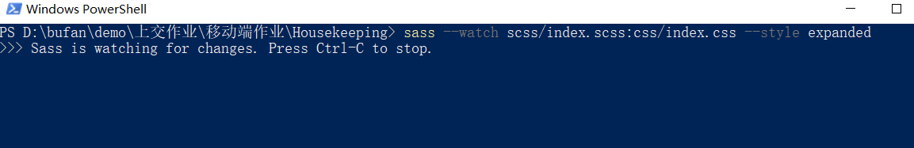

### window 方法，新动画，移动端

#### 1. window 方法

#### 1.1 window.open

- 使用 `window.open()` 方法既可以导航到一个特定的 URL，也可以打开一个新的浏览器窗口。
- 参数:这个方法可以接收 4 个参数：
  1. 要加载的 URL
  2. 窗口目标，相当于 a 标签的 target 属性
  3. 一个特性字符串
  4. 一个表示新页面是否取代浏览器历史记录中当前加载页面的布尔值。
  ```js
  <iframe src="" width="400" height="400" name="ifr"></iframe>;
  window.open("https://www.baidu.com", "ifr");
  window.open("https://www.baidu.com", "_self");
  newW = window.open(
    "https://www.baidu.com/",
    "_blank",
    "height=400,width=400,top=10,left=10,resizable=yes"
  );
  `调整大小`
  win.resizeTo(500,500);
  `移动位置`
  win.moveTo(100,100);
  `关闭新打开的窗口`
  window.close();
  `网站名解析`: https://www.baidu.com https 协议 www 服务器(可有可无) baidu.com 域名
  ```

#### 1.2 history 对象

- 保存从窗口打开后，成功访问过的 url 的历史记录栈。
- 属性
  `length` ：保存着历史记录的数量。这个数量包括所有历史记录，即所有向后和向前的记录。对于加载到窗口、标签页或框架中的第一个页面而言，`history.length` 等于 1。
- 方法
  语法：`history.go(n)`
  参数：n 表示向后或向前跳转的页面数的一个整数值。负数表示向后跳转（类似于单击浏览器的“后退”按钮），正数表示向前跳转（类似于单击浏览器的“前进”按钮）。
  ```js
  history.go(2); // 前进两页
  history.go(-1); // 后退一页
  history.go(0); // 刷新
  ```
- location 对象
  保存当前窗口正在打开的 url 的对象，它既是 `window` 对象的属性，也是 `document` 对象的属性（`window.location` === `document.location`）

### 属性

| 属性名   | 例子                         | 说明                                                                             |
| -------- | ---------------------------- | -------------------------------------------------------------------------------- |
| hash     | "#contents"                  | 返回 URL 中的 hash（#号后跟零或多个字符），如果 URL 中不包含散列，则返回空字符串 |
| host     | "www.zhihu.com:80"           | 返回服务器名称和端口号（如果有）                                                 |
| hostname | "www.zhihu.com"              | 返回不带端口号的服务器名称                                                       |
| href     | "http://www.ceshi.com/index" | 返回当前加载页面的完整 URL。而 `location` 对象的 `toString()` 方法也返回这个值   |
| pathname | "/search"                    | 返回 URL 中的目录和（或）文件名                                                  |
| port     | "8080"                       | 返回 URL 中指定的端口号。如果 URL 中不包含端口号，则这个属性返回空字符串         |
| protocol | "http:"                      | 返回页面使用的协议。通常是 http: 或 https:                                       |
| search   | "?q=javascript"              | 返回 URL 的查询字符串。这个字符串以问号开头                                      |
| origin   | "http://www.ceshi.com/index" | 返回页面使用协议+网站名                                                          |

- 方法

1. 在当前窗口打开，可后退
   location.assign(url) => location.href=url => location=url
2. 在当前窗口打开，不会生成历史记录，即替换当前页面的地址
   location.replace(url)
3. 重新加载页面
   1. 普通刷新
      优先从浏览器本地缓冲获取资源
      F5
      history.go(0)
      location.reload(/_false_/)
   2. 强制刷新
      无论本地是否有缓存，总是强制从服务器获取资源
      location.reload(true)

- navigator 对象
  包含有关访问者浏览器的信息
  `navigator.language`：浏览器设置的语言；

`navigator.appCodeName`（不准确）：属性是一个只读字符串，声明了浏览器的代码名。

在所有以 Netscape 代码为基础的浏览器中，它的值是 "Mozilla"。为了兼容起见，在 Microsoft 的浏览器中，它的值也是 "Mozilla"，同时在 safari 在浏览器的 console 里运行 navigator.appCodeName 得出的结果还是"Mozilla"，所以这个看起来并不实用，因为 IE、chrome、safari 返回的都是“Mozilla”。

`navigator.appName`（不准确）：返回所使用浏览器的名称。由于兼容性问题，HTML5 规范允许该属性返回 "Netscape"。该属性并不一定能返回正确的浏览器名称。在基于 Gecko 的浏览器 （例如 Firefox）和基于 WebKit 的浏览器（例如 Chrome 和 Safari）中，返回的浏览器名称都是 "Netscape"。

`navigator.appVersion`（已废弃）：属性可返回浏览器的平台和版本信息。该属性是一个只读的字符串。该特性已经从 Web 标准中删除，虽然一些浏览器目前仍然支持它，但也许会在未来的某个时间停止支持，请尽量不要使用该特性。

`navigator.platform`：是一个只读的字符串，声明了运行浏览器的操作系统和（或）硬件平台。可能的值有: "Win32", "Linux i686", "MacPPC", "MacIntel"等。

`navigator.userAgent`（用的最多，也可以说相对更准确）：是一个只读的字符串，声明了浏览器用于 HTTP 请求的用户代理头的值。主要是各家浏览器厂商都想要自己的浏览器被其他的兼容，所以都会或多或少的加上一些其他的信息在里面。
代码：

```js
var browserName = navigator.userAgent.toLowerCase();
//区分手机端还是PC端
isMobile = /android|webos|iphone|ipad|ipod|blackberry|iemobile|opera mini/i.test(
  browserName
);
//判断浏览器
isIE = /msie/i.test(browserName) && !/opera/.test(browserName);
isIE6 = /msie 6.0/i.test(browserName);
isIE7 = /msie 7.0/i.test(browserName);
isIE8 = /msie 8.0/i.test(browserName);
isFirefox = /firefox/i.test(browserName);
isChrome =
  /chrome/i.test(browserName) &&
  /webkit/i.test(browserName) &&
  /mozilla/i.test(browserName);
isOpera = /opera/i.test(browserName);
isSafari =
  /webkit/i.test(browserName) &&
  !(
    /chrome/i.test(browserName) &&
    /webkit/i.test(browserName) &&
    /mozilla/i.test(browserName)
  );
//判断微信
isWeixin = /micromessenger/i.test(browserName);
```

`navigator.onLine`：属性是一个只读的布尔值，声明了系统是否处于脱机模式。

```js
window.addEventListener("offline", function(e) {
  alert("offline");
});
window.addEventListener("online", function(e) {
  alert("online");
});
```

`navigator.cookieEnabled`：属性可返回一个布尔值，如果浏览器启用了 cookie，该属性值为 true。如果禁用了 cookie，则值为 false。

## window 的其它方法

- **resizeBy(w, h)：根据指定的像素来调整窗口的大小。**

  该方法定义指定窗口的右下角移动的像素，左上角将不会被移动(它停留在其原来的坐标)。有两个参数，第一个参数是必需的，指定窗口宽度增加的像素数。第二个参数可选，指定窗口高度增加的像素数。两个参数可为正数，也可为负数。

- **resizeTo(w, h)：用于把窗口大小调整为指定的宽度和高度。**

该方法两个参数都是必需的，用来指定设置窗口的宽度和高度，以像素计。

- **moveBy(xnum, ynum)：可相对窗口的当前坐标把它移动指定的像素。**

该方法有两个参数，第一个参数指定要把窗口右移的像素数，第二个参数指定要把窗口下移的像素数。

- **moveTo(x, y)：可把窗口的左上角移动到一个指定的坐标。**

该方法有两个参数，第一个参数指定窗口新位置的 x 坐标，第二个参数指定窗口新位置的 y 坐标。

- **scrollBy(xnum, ynum)：可把内容滚动指定的像素数。**

该方法有两个必需参数，第一个参数指定把文档向右滚动的像素数。第二个参数指定把文档向下滚动的像素数。

- **scrollTo(x, y)：可把内容滚动到指定的坐标。**

该方法有两个必需参数，第一个指定要在窗口文档显示区左上角显示的文档的 x 坐标。第二个参数指定要在窗口文档显示区左上角显示的文档的 y 坐标。

### 2.多媒体（新增 c3 和 H5 特性），存储

#### 2.1 html 新增元素

- HTML5 新增 audio 标签 和 video 标签来解决音视频的问题;语法:

```html
<!--
	附加属性可以更友好控制音频/视频的播放，如：
	autoplay 自动播放
	controls 是否显不默认播放控件
	loop 循环播放
	preload 预加载 同时设置autoplay时此属性失效
-->
<audio src="素材/小手拍拍.mp3" controls>不支持</audio>

<video src="素材/movie.ogg" width="400" height="300" controls></video>
<!--
	width 设置播放窗口宽度
	height 设置播放窗口的高度
-->
```

- 兼容问题
  由于版权等原因，不同的浏览器可支持播放的格式是不一样的:
  
- 多浏览器支持方案:

```html
<audio>
  <source src="素材/小手拍拍.mp3" />
  <source src="素材/小手拍拍.wav" />
  <source src="素材/小手拍拍.ogg" />
</audio>
```

- 通过 JS 控制(video 与 audio 相同)

* 属性

  - currentTime 视频播放的当前进度

  - duration 视频的总时间
  - paused 视频播放是否是暂停

* 方法

- `load()` 重新加载音频/视频元素
  - 语法: `audio|video.load()`
  - 用于在更改来源或其他设置后对音频/视频元素进行更新
- `play()` 播放
- `pause()` 暂停
- 更多精彩请自行查阅 [W3](http://www.w3school.com.cn/tags/html_ref_audio_video_dom.asp)

* 事件

- oncanplay: 事件在用户可以开始播放视频/音频（audio/video）时触发。
- ontimeupdate: 通过该事件来报告当前的播放进度.
- onended: 播放完时触发

* 全屏：video.webkitRequestFullScreen()

```js
vd.ontimeupdate = function() {
  // 视频播放时不断触发的函数
  console.log("当前播放进度: ", vd.currentTime);
  // 当前播放进度/总时长 = innerWidth/processWidth
  // inner.style.width = vd.currentTime / vd.duration * process.offsetWidth + "px";
  inner.style.width = (vd.currentTime / vd.duration) * 100 + "%";
};

// 拖拽进度条
process.onmousedown = function() {
  process.onmousemove = function() {
    // 获取鼠标距离process的左边距  就是inner的宽度   offsetX指鼠标距离触发事件的对象的左边距
    var left = event.offsetX;
    inner.style.width = left + "px";
    vd.currentTime = (left / process.offsetWidth) * vd.duration;
  };

  window.onmouseup = function() {
    process.onmousemove = null;
  };
};
```

#### 2.2 Web 存储

- 随着互联网发展，基于网页的应用越来越普遍，同时变的越来越复杂，为满足各种需求，会经常性在本地存储大量的数据，传统方式我们以 document.cookie 来进行存储的，但是由于其存储大小只有 4k 左右，并且解析也相当的复杂，给开发带来诸多不便，HTML5 规范则提出解决方案。

#### 2.2 sessionStorage/localStorage

1. `storage` 存储: `window.sessionStorage` `window.localStorage` (向本地保存数据,有可能在浏览器内存里面，有可能在硬盘上面)

2. 特性

   - 设置、读取方便
   - 容量较大，`sessionStorage` 约 5M、`localStorage` 约 20M 不同的浏览器大小可能有差异
   - 均只能存储字符串类型的对象（虽然规范中可以存储其他原生类型的对象，但是目前为止没有浏览器对其进行实现），可以将对象 `JSON.stringify()` 编码后存储

3. `window.sessionStorage`

   - 生命周期为当前窗口或标签页，一旦窗口或标签页被关闭了，那么所有通过 `sessionStorage` 存储的数据也就被清空了。

   - 在同一个窗口下数据可以共享

4. `window.localStorage`

- 永久生效，除非手动删除
- 可以多窗口共享
- IE8 以上的 IE 版本才支持 `localStorage` 这个属性

- `localStorage` 本质上是对字符串的读取，如果存储内容多的话会消耗内存空间，会导致页面变卡

5. 两者本质区别：不同浏览器无法共享 `localStorage` 或 `sessionStorage` 中的信息。相同浏览器的不同页面间可以共享相同的 `localStorage`（页面属于相同域名和端口），但是不同页面或标签页间无法共享 `sessionStorage` 的信息。
6. 方法详解

- `setItem(key, value)` 设置存储内容 同名替换原则
- `getItem(key)` 读取存储内容
- `removeItem(key)` 删除键值为 key 的存储内容
- `clear()` 清空所有存储内容
- `key(n)` 以索引值来获取对应的键

### 2.3 补充新增全局属性

- **contentEditable**属性 单独某一个标签的属性 可以使内容能被编辑
- **designMode**
  属性（这个在 js 中进行使用，让页面中所有的元素开启可编辑模式） 让页面所有的标签都可以被编辑 比如 div、p、h1 等等

      	window.onload = function() {
      		document.designMode = "on";
      	}

- **draggable** 拖拽属性
  拖拽元素: 页面中设置了 draggable="true"属性的元素，不能省略 = "true"
- 目标元素: 页面中任何一个元素都可以成为目标元素
- **拖拽元素**

  - ondrag 应用于拖拽元素，整个拖拽过程都会调用

  * ondragstart 应用于拖拽元素，当拖拽开始时调用

  - ondragleave 应用于拖拽元素，当鼠标离开拖拽元素时调用
  - ondragend 应用于拖拽元素，当拖拽结束时调用

- **目标元素**

  - ondragenter 应用于目标元素，当拖拽元素进入时调用

  * ondragover 应用于目标元素，当停留在目标元素上时调用
  * ondrop 应用于目标元素，当在目标元素上松开鼠标时调用，需要在 ondragover 上阻止浏览器的默认事件，因为浏览器默认是禁止元素堆叠的
  * ondragleave 应用于目标元素，当拖拽元素离开目标元素时调用

- **fullscreen** 全屏属性

* 开启全屏

  ```js
  if (E.requestFullscreen) {
    E.requestFullscreen();
  } else if (E.webkitRequestFullscreen) {
    E.webkitRequestFullscreen();
  } else if (E.mozRequestFullscreen) {
    E.mozRequestFullscreen();
  } else {
    alert("sorry,无法全屏");
  }
  ```

  - 退出全屏必须使用 document 的 api

  ```js
  if (document.exitFullscreen) {
    document.exitFullscreen();
  } else if (document.webkitCancelFullScreen) {
    document.webkitCancelFullScreen();
  } else if (document.mozCancelFullScreen) {
    document.mozCancelFullScreen();
  }
  ```

  **注意：给全屏状态下的元素添加全屏样式不起作用，给全屏状态下的元素的子类添加样式可用**

```css
.全屏状态下的元素:fullscreen 子类 {
  width: 500px;
  height: 100%;
}
```

- - 判断是否是全屏

```js
function ifFullscreen() {
  return (
    document.fullscreen ||
    document.webkitIsFullScreen ||
    document.mozFullScreen ||
    false
  );
}
```

### 3.新动画 Animation 及其属性

#### 3.1 动画必要元素

- a、通过@keyframes 指定动画序列
- b、通过百分比将动画序列分割成多个节点；亦可以使用 from/to 不推荐
- c、在各节点中分别定义各属性
- d、通过 animation 将动画应用于相应元素

#### 3.2 动画关键属性

- Animation-name 动画名称(必填)
- Animation-duration 动画持续时间(必填)
- animation-timing-function
  - linear/ease/ease-in/ease-out/ease-in-out/cubic-bezier(n,n,n,n)： 特定的贝塞尔曲线类型以及 step(数字))走多少步
- animation-delay 动画延迟（只是第一次）
- animation-iteration-count 重复次数 infinite 无限次
- animation-direction 动画是否重置后再开始播放
  - alternate 动画直接从上一次停止的位置开始执行，倒着来 +
  - normal 动画第二次直接跳到 0%的状态开始执行
- animation-fill-mode 动画执行完毕后状态
  - forwards 当动画完成后，保持最后一个属性值（在最后一个关键帧中定义）。
  - backwards 在 animation-delay 所指定的一段时间内，在动画显示之前，应用开始属性值（在第一个关键帧中定义）。
  - both 设置对象状态为动画结束或开始的状态，结束时状态优先
- 语法:`animation: name duration timing-function delay iteration-count direction fill-mode;`
- 动画状态 animation-play-state\*\* 动画状态（running 执行 和 paused 暂停）

#### 3.3 帧动画

- CSS3 动画控制时间的属性 timing-function 除了常用到的 贝塞尔曲线 以外，还可以是 **steps()** 函数
- steps(n,start/end)\*
  - 第一个参数 number 为指定的间隔数，即把动画分为 n 步阶段性展示
  - 第二个参数默认为 end，设置最后一步的状态，start 为结束时的状态，end 为开始时的状态(不用记,第二个参数不写就行)
  - 注意: n 必须是正整数\*\*

#### 3.4 监听事件

### 3.4.1 动画监听

- 动画的事件
  - `ele.addEventListener("animationend", myStartFunction);`
  - animationstart - CSS 动画开始后触发
  - animationiteration - CSS 动画重复播放时触发
  - animationend - CSS 动画完成后触发
    注意： 动画只能通过监听方法添加事件，on 方式无法绑定事件\*\*
- 过渡监听
  - 过渡只有监听结束的方法, start 和 run 的监听方法在开发状态
  ```js
  d2.addEventListener('transitionstart',function () {
  console.log('过渡开始...');
  })
  d2.addEventListener('transitionrun', function() {
  console.log("过渡执行中");
  });
  d2.addEventListener('transitionend',function () {
  console.log('过渡结束...');
  ```

`````

- 滚轮监听

```js
//正值为向上滚动，负值往下滚动
// 火狐监听的滚轮事件
window.addEventListener("DOMMouseScroll", function(event) {
  // 火狐
  // 方向: 3 往下; -3 往上
  console.log(event.detail);
});
window.onmousewheel = function(event) {
  // wheelDelta可以测试滚动
  // 可以判断滚动方向 但是无法判断滚动幅度.
  // 方向: -120 往下滚动  ; 120 往上滚动
  // 有兼容问题,也可能是 -150 150
  console.log(event.wheelDelta);
}; //IE  除了火狐之外 ，这种方式都能处理
```

### 4.flex 布局及其属性

#### 4.1 calc

- `calc(expression)` 函数用于动态计算长度值
- `expression` 必须，一个数学表达式 ，注意运算符前后都需要保留一个空格，例如：`width: calc(100% - 10px)`
- 任何长度值都可以使用`calc()`函数进行计算
- `calc()`函数支持 "+", "-", "\*", "/" 运算
- `calc()`函数使用标准的数学运算优先级规则

#### 4.2 FLEX

- display: flex
  
- 每个弹性容器都有两根轴：主轴（横轴）和交叉轴（侧轴、纵轴）`水平的不一定就是主轴`
- 每根轴都有起点和终点，对于元素对齐非常重要。
- 弹性容器中的所有子元素称为<弹性元素>，弹性元素永远沿主轴排列
- 弹性元素可通过 display:flex 设置为另一个弹性容器，形成嵌套关系。元素既可以是弹性容器也可以是弹性元素。

#### 4.2.1 flex 属性分类

- jusitify-content

```js
// justify-content:flex-start | flex-end | center | space-between | space-around | space-evenly(实验属性);
flex-start（默认值）：左对齐
flex-end：右对齐
center： 居中
space-between：两端对齐，项目之间的间隔都相等。
space-around：每个项目两侧的间隔相等。所以，项目之间的间隔比项目与边框的间隔大一倍。
space-evenly：均匀排列每个元素，每个元素之间的间隔相等
```

- align-items：交叉轴排列

```js
align-items: flex-start | flex-end | center | baseline | stretch;
}
```

- align-self 的作用
  - align-self 属性允许单个项目有与其他项目不一样的对齐方式覆盖 align-items 属性,默认值为 auto，表示继承父元素的 align-items 属性如果没有父元素，则等同于 stretch

```js
.item {
  align-self: auto | flex-start | flex-end | center | baseline | stretch;
}
```

- flex-wrap

```js
.box{
    flex-wrap: nowarp | wrap | wrap-reverse;
}
nowrap（默认值）：不换行
wrap：换行，第一行在上方
wrap-reverse：换行，第一行在下方
```

- align-content
  - align-content 属性定义了多根轴线的对齐方式。如果项目只有一根轴线，该属性不起作用
  - align-content: stretch | flex-start | flex-end | center | space-between | space-around | space-evenly

````js
```css
align-content: stretch | flex-start | flex-end | center | space-between | space-around | space-evenly
`````

#### 4.2.2 `flex-direction` 的使用 及 `align-items` 方向问题

```css
.box{
    flex-direction: row | row-reverse | column | column-reverse;
}
row（默认值）：主轴为水平方向，起点在左端。
row-reverse：主轴为水平方向，起点在右端。
column：主轴为垂直方向，起点在上沿。
column-reverse：主轴为垂直方向，起点在下沿。
注意： flex-direction 改为垂直方向时，jusitify控制垂直方向，align控制水平方向
```

- 复合属性: `flex-flow`
  语法：`flex-flow = flex-drection + flex-wrap`
  例如：`flex-flow: row nowrap;`

#### 4.3 加在子元素上面

- `order` 的使用
  - `order` 属性定义项目的排列顺序。数值越小，排列越靠前，默认为 0
  - flex-grow 属性
  - flex-grow 属性定义项目的放大比例，默认为 0，即如果存在剩余空间，也不放大。无多余宽度时，flex-grow 无效
- flex-shrink 属性
  - flex-shrink 属性定义了项目的缩小比例，默认为 1，即如果空间不足，该项目将缩小。如果一个项目的 flex-shrink 属性为 0，其他项目都为 1，则空间不足时，前者不缩小。负值对该属性无效
- flex-basis 属性
  - flex-basis 属性定义了在分配多余空间之前，项目占据的主轴空间。浏览器根据这个属性，计算主轴是否有多余空间。它的默认值为 auto，即项目的本来大小。
    `它可以设为跟width或height属性一样的值（比如350px），则项目将占据固定空间`
- flex 属性
  - 它是 flex-grow, flex-shrink 和 flex-basis 的简写，默认值为 0 1 auto。后两个属性可选
  - 属性有两个快捷值：auto (1 1 auto) 和 none (0 0 auto)。

#### 4.4 margin 在 flex 中的表现

- margin: auto:任何正处于空闲的空间都会分配到该方向的自动 margin 中去 。`注意:因为margin是将剩余空间分配给了元素，所以添加了margin后，justify-content 和 align-*属性就不能再被使用了。`

```html
<style>
  .box {
    display: flex;
  }
  .inner {
    margin: auto; /* 水平/垂直居中 */
    /* margin: auto 0; align-items: center */
    /* margin-top: auto; align-items: flex-end */
  }
</style>

<div class="box">
  <div class="inner"></div>
</div>
```

- 使用 margin 实现 space-\* 效果

```html
<style>
  .box {
    display: flex;
    width: 800px;
    margin: 30px auto;
    border: 1px solid red;
  }
  li {
    margin: auto;
    font-size: 18px;
    line-height: 100px;
  }
</style>

<ul class="box">
  <li>liA</li>
  <li>liB</li>
  <li>liC</li>
  <li>liD</li>
  <li>liE</li>
</ul>
```

### 5. SASS：

Sass/Less 是一门 CSS 预处理语言，它扩展了 CSS 语言，增加了变量，Mixin，函数等特性，使 CSS 更易维护和扩展

注意： 1)在项目文件内 shift +右键打开，输入

sass --watch scss/index.scss:css/index.css --style expanded

### 在移动端浏览写的页面

1)官网下载 node

### 5.1 安装 Ruby

sass`基于`Ruby`语言开发而成，因此安装`sass`前需要安装`Ruby`

注意：安装过程中请注意勾选`Add Ruby executables to your PATH`添加到系统环境变量

安装完成后需测试安装有没有成功，win+r 输入 cmd 打开命令窗口，输入以下命令：

```
ruby -v
//如安装成功会打印
ruby 2.2.2p95 (2015-04-13 revision 50295) [i386-mingw32]
```

如上已经安装成功。但因为国内网络的问题导致`gem`源间歇性中断因此我们需要更换`gem`源。（使用国内镜像的的 gem 源 https://gems.ruby-china.com/）如下：>

```
//1.删除原gem源
gem sources --remove https://rubygems.org/

//2.添加国内镜像
gem sources -a https://gems.ruby-china.com/

//3.打印是否替换成功
gem sources -l

//4.更换成功后打印如下
*** CURRENT SOURCES ***
https://gems.ruby-china.com/

// 简化命令
gem sources --add https://gems.ruby-china.com/ --remove https://rubygems.org/
gem sources -l
```

### 5.2 安装 安装 Sass

`Ruby`自带一个叫做`RubyGems`的系统，用来安装基于`Ruby`的软件。我们可以使用这个系统来轻松地安装`Sass`。要安装最新版本的`Sass`，你需要 win+r 输入 cmd 打开命令窗口，输入下面的命令：

```
//安装如下(如mac安装遇到权限问题需加 sudo gem install sass)
gem install sass
```

在每一个安装过程中，你都会看到如下输出：

```
Fetching: sass-3.x.x.gem (100%)
Successfully installed sass-3.x.x
Parsing documentation for sass-3.x.x
Installing ri documentation for sass-3.x.x
Done installing documentation for sass after 6 secon
1 gem installed
```

安装完成之后，你应该通过运行下面的命令来确认应用已经正确地安装到了电脑中：

```
sass -v
Sass 3.x.x (Selective Steve)
```

### 5.3 Sass 常用命令：

``
//更新 sass
gem update sass

//查看 sass 版本
sass -v

//查看 sass 帮助
sass -h

```

```

**如果安装报错含有 GBK 字符的，在 ruby 下搜索 filesystem.rb 文件，找到 7M 多的那个，在编辑器中打开，然后更改 87 行代码为：`if name.encode("utf-8", "gbk").index(@root + "/") == 0`**

**如果 sass 中写中文报错，进入 `C:\Ruby25-x64\lib\ruby\gems\2.5.0\gems\sass-3.7.3\lib\sass`这个地址，每个人安装的位置和 sass 版本不同可能位置有些许不同，自行调整，在这个地址下找到 engine.rb 这个文件：**

```
module Sass // 在这句话后面添加
	# 让Sass支持中文注释
	Encoding.default_external = Encoding.find('utf-8')
```

**如果安装不上，请使用 npm install -g sass 来使用 node 版本的 sass，node 版的 sass 只有 "expanded" and "compressed" 两种编译模式**

## Sass 的编译

### 5.4 命令行编译：

```
//单文件转换命令
sass input.scss output.css

//单文件监听命令
sass --watch input.scss:output.css

//如果你有很多的sass文件的目录，你也可以告诉sass监听整个目录：
sass --watch app/sass:public/stylesheets
```

#### 5.5 命令行编译配置选项：

命令行编译`sass`有配置选项，如编译过后 css 排版、生成调试 map、开启 debug 信息等，可通过使用命令`sass -v`查看详细。我们一般常用两种`--style` `--sourcemap`

```
//编译格式
sass --watch input.scss:output.css --style compact

//编译添加调试map
sass --watch input.scss:output.css --sourcemap

//选择编译格式并添加调试map
sass --watch input.scss:output.css --style expanded --sourcemap

//开启debug信息
sass --watch input.scss:output.css --debug-info
```

- `--style`表示解析后的`css`是什么排版格式
  sass 内置有四种编译格式:` nested``expanded``compact``compressed `
- `--sourcemap`表示开启`sourcemap`调试。开启`sourcemap`调试后，会生成一个后缀名为`.css.map`文件

#### 5.6 编译演示

```scss
//未编译样式
.box {
  width: 300px;
  height: 400px;
  &-title {
    height: 30px;
    line-height: 30px;
  }
}
```

- nested 嵌套格式

```scss
/*命令行内容*/
sass style.scss:style.css --style nested

/*编译过后样式*/
.box {
  width: 300px;
  height: 400px;
}
.box-title {
  height: 30px;
  line-height: 30px;
}
```

- expanded 扩展格式

```scss
/*命令行内容*/
sass style.scss:style.css --style expanded

/*编译过后样式*/
.box {
  width: 300px;
  height: 400px;
}
.box-title {
  height: 30px;
  line-height: 30px;
}
```

- compact 紧凑格式

```scss
/*命令行内容*/
sass style.scss:style.css --style compact

/*编译过后样式*/
.box {
  width: 300px;
  height: 400px;
}
.box-title {
  height: 30px;
  line-height: 30px;
}
```

- compressed 压缩格式

```scss
/*命令行内容*/
sass style.scss:style.css --style compressed

/*编译过后样式*/
.box {
  width: 300px;
  height: 400px;
}
.box-title {
  height: 30px;
  line-height: 30px;
}
```

#### 5.7 Sass 的使用

- 嵌套

```scss
// sass 允许样式可以和页面布局一样嵌套
ul {
  list-style: none;
  li {
    width: 200px;
    height: 40px;
    border: 1px solid red;
    span {
      color: red;
    }
    // sass 的嵌套格式中 & 表示父选择器
    &:hover {
      border-color: green;
    }
    &.act {
      text-align: center;
    }
  }
}
// sass 允许使用属性嵌套
.box {
  font: {
    family: "Arial, sans-serif";
    size: 18px;
    weight: border;
  }
  border: 5px solid red {
    left: 0;
    right: 0;
  }
}
```

- 变量

```scss
// sass允许声明一个变量
// 没有变量提升
$bgColor: #9000ff;
$border: 1px solid $bgColor;

.box {
  width: 300px;
  height: 300px;
  background-color: $baseSize;
}
.inner {
  border: $border;
}
```

- 混合

```scss
/* 语法
@mixin 名字(参数1,参数2...){
	...
}*/
@mixin base {
  width: 200px;
  height: 200px;
  color: green;
  // 可以在公共样式中使用嵌套
  a {
    color: #ccc;
  }
}
@mixin text($text-color, $font-size) {
  color: $text-color;
  font-size: $font-size;
}

.box {
  @include base;
}
.inner {
  @include text(red, 18px);
  // 有时候可能会很难区分每个参数是什么意思，参数之间是一个什么样的顺序,sass允许通过语法$name: value的形式指定每个参数的值
  // @include text($font-size: 18px,$text-color: red);
}

// 为了在@include混合器时不必传入所有的参数，我们可以给参数指定一个默认值
@mixin default($color, $hover: $color, $act: $color) {
  color: $color;
  &:hover {
    color: $hover;
  }
  &.act {
    color: $act;
  }
}
.use {
  @include default(red);
  // $hover 和 $act 也会被自动赋值为 red
}
```

- 继承

```scss
// sass 使用@extend 选择器 来继承样式，选择器相关的样式都会继承
.box {
  padding: 15px;
  span {
    color: green;
  }
}

.inner {
  @extend .box;
  background-color: red;
}
```

- 导入扩展

```scss
// css @import 引入其它css文件会让浏览器发出请求引入其它css文件。sass中的 @import 可以将其它scss文件中的样式导入到自身文件中
// 文件 init.scss
* {
  margin: 0;
  padding: 0;
}
// 文件 style.scss
@import "init";
.box {
  width: 200px;
}
```

- 注释

```scss
在sass中使用这样的多行注释会在压缩输出的css中被去掉
/**
 * 天街小雨润如酥
 * 草色遥看近却无
 */
 sass 编译的css中 单行注释不会显示
 在多行注释的开头加上！号表示强制注释，编译的时候不会被去掉 /*! */
```

- 颜色调整

```scss
// adjust-hue(要调整的颜色值,要调整的度数)
// lighten(要处理的颜色,要增加的亮度)  让一个颜色变亮
// darken(要处理的颜色,要减小的亮度)  让一个颜色变暗
// saturate(要处理的颜色,要增加的饱和度)
// desaturate(要处理的颜色,要减少的饱和度)
// opacify(要处理的颜色,要增加的不透明度)
// transparentize(要处理的颜色,要增加的透明度)
$base-color: #ff0000;
.box {
  color: lighten($base-color, 10%);
  background-color: adjust-hue($base-color, 137deg);
}
```

- map

```scss
// 语法： $map: (key1: value1, key2: value2, key3: value3 ...)
// map-keys($colors) 拿到所有的key值
// map-values($colors) 拿到所有的value值
// map-has-key($colors, light) 检测key值是否存在
// map-merge($colors. (grey: $eee)) 合并项目
// map-remove($colors, light) 删除其中的项
$colors: (
  light: #fff,
  dark: #000
);
.box {
  // map-get 获取map中的某个值
  color: map-get($colors, dark);
}
```

- 数值类型与运算

sass 支持的数据类型有:

- 数字，1, 2, 13, 10px
- 字符串，有引号字符串与无引号字符串，"foo", 'bar', baz
- 颜色，blue, #04a3f9, rgba(255,0,0,0.5)
- 布尔型，true, false
- 空值，null
- 数组 (list)，用空格或逗号作分隔符，1.5em 1em 0 2em, Helvetica, Arial, sans-serif
- maps, 相当于 JavaScript 的 object，(key1: value1, key2: value2)

```scss
/*
type-of()	可以判断类型
sass 支持布尔值运算 and or 以及 not 运算
sass 支持数学计算	2*8 2+8 除法要加() (8/4) 5px+5px 5px-2 5px*2 (5px*5px) (10px/2px) (40px/2)
sass 支持一些数学函数
	abs()	取绝对值
	round() 取四舍五入的值
	ceil()	向上取整
	floor() 向下取整
	percentage(650px / 1000)	取百分比
	min(8,5,3)	取最小数 废弃
	max(8,5,7)	取最大值 废弃
字符串 ni + "hao"   wid + th 不能使用*号
字符串函数：
	to-upper-case("width")变大写
	to-lower-case("Width")变小写
	str-length("hello") 求字符串长度
	str-index("hello","h") 求下标
	str-insert("hello","world", 2) 插入
list 列表 如： 1px solid red; 5px 25px 25px 15px;
	length(list) 求长度
	nth(list,1)	根据下标找列表相应位置的值
	index(1px solid red, solid)	根据值找下标
	append(5px 10px, 20px) 添加项
	join(20px 30px, 30px 20px) 合并
	join(20 15, 10 45, common)
*/
```

- 拼接、插入

```scss
$name: "info";
$attr: "border";

.alert-#{$name} {
  #{$attr}-color: #ccc;
}
```

- 控制指令

```scss
// 判断
/*
	@if 条件 {
		...
	} @else if 条件 {
		...
	} @else {
		...
	}
*/
$flag: true;
$width: 200;

.box {
  @if $flag {
    border-radius: 50%;
  } @else {
    border-radius: 10px;
  }
}
.inner {
  @if $width == 200 {
    height: 50px;
  }
}
// 循环 $var 表示变量
/*
	@for $var from <开始值> through/to <结束值> {
		...
		through $var可以等于 结束值，to 不会
	}
*/
$columns: 4;
@for $i from 1 through $columns {
  .col-#{$i} {
    width: 100% / $columns * $i;
  }
}

/*
	@while 条件 {
		...
	}
*/
$j: 6;
@while $j > 0 {
  .item-#{$j} {
    width: 5px * $j;
  }
  $j: $j - 2;
}
// 遍历
/*
	@each $var in $list {
		...
	}
*/
$icons: success error warning;
@each $icon in $icons {
  .icon-#{$icon} {
    background-image: url("../imgs/#{$icon}.png");
  }
}
```

- 函数

```scss
/*
	@function 名称 (参数1,参数2){
		...
	}
*/
$colors: (
  light: #fff,
  dark: #000
);
@function getColor($key) {
  @return map-get($colors, $key);
}

.box {
  color: getColor(light);
}
```

- 警告与错误

```scss
@warn "这是一个警告提示信息";
@error "这是一个错误提示信息";
```
