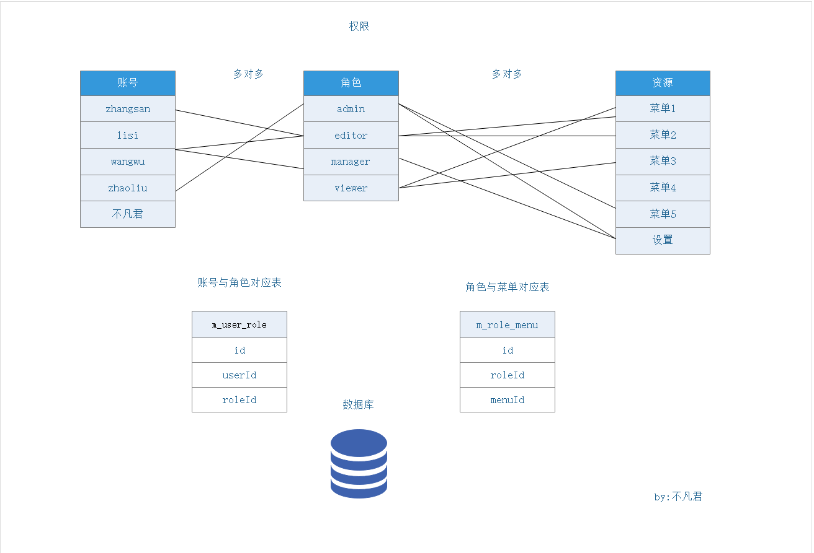

### 第一周

### 一：不凡官网（婚纱官网）

#### 1. swiper 的应用

(珠宝页面)


```js
if (window.innerWidth < 768) {
  new Swiper(".swiper-container", {
    slidesPerView: 1.5,
    spaceBetween: 5
  });
} else {
  new Swiper(".swiper-container", {
    autoplay: true,
    slidesPerView: 5,
    spaceBetween: 40,
    navigation: {
      nextEl: ".swiper-button-next",
      prevEl: ".swiper-button-prev"
    }
  });
}
```


-

swiper 文档：网格分布 https://www.swiper.com.cn/api/index.html

vue 中使用视屏 https://github.com/surmon-china/vue-video-player

#### 2. fullpage 滚屏插件

网址：http://fullpage.81hu.com/

### 二：电影（VUE 脚手架）

1. 在 public 里面的视口修改把下面的代码替换
   <meta name="viewport" content="width=device-width, initial-scale=1, maximum-scale=1, user-scalable=no">
2.

#### 1.1 git 使用

1. gitblit 地址
   https://192.160.0.100:8443
1. git 生成 SSH 秘钥

1) 进入 git bash , 输入 cd ~/.ssh/ ，没有的话，自己创建 mkdir ~/.ssh , 然后进入该文件夹完成生成秘钥步骤

2)配置全局的 name 和 email，这里是的你 github 或者 bitbucket 的 name 和 email

git config --global user.name “xkwg”

git config --global user.email “自己邮箱”

3)生成 key

ssh-keygen -t rsa -C “自己邮箱”

ssh-keygen -t rsa -C “1575287002@qq.com”

> 连续按三次回车，这里设置的密码就为空了，并且创建了 key。
> 

4. 进入文件 id_rsa.pub 复制 key
   vim id_rsa.pub

#### 1.2 把一个新的新建 push 进去 git 里面

1. git init
2. git add .
3. git commit -m"第一次提交"
4. git remote add origin "git 后台地址" 提交远程仓库关联
5. git push -u origin master //第一次打-u 是记住我，以后都不用打

#### 1.3 BetterScroll 的使用

BetterScroll 是作用在外层 wrapper 容器上的，滚动的部分是 content 元素。这里要注意的是，BetterScroll 只处理容器（wrapper）的第一个子元素（content）的滚动，其它的元素都会被忽略。
且，content 的高度只有大于 wrapper 的高度才会滚动

```html
<div class="wrapper" ref="wrapper">
  <ul class="content">
    <li>...</li>
    <li>...</li>
    ...
  </ul>
  <!-- 这里可以放一些其它的 DOM，但不会影响滚动 -->
</div>
```

1. cnpm install @better-scroll/core@next --save
2. 在需要的组件里面按需引入
   import BScroll from '@better-scroll/core'
3. 在需要的组件 mounted

```js
this.$nextTick(() => {
  this.$scroll = new BScroll(this.$refs["wrapper"], {
    click: true
  });
});
```

5. 如果 content 里面的事件需要滚动，那就需要配置 mounted 里面的配置像第三步

6. 如果头部固定，底部固定，中间部分实现滚动，则要给wrapper一个margin-top;content一个padding-bottom

7. ```
   git config --global user.name "1575287002@qq.com" smz606215
   ```

#### 1.4 视屏插件的使用

https://github.com/surmon-china/vue-video-player
的使用

1. cnpm install vue-video-player --save

#### 二：分支写完，怎末把分支上传到 gitblit

#### 1.1

1. git add .
2. git commit -m"孙明珠第一次提交"
3. git push origin master
4. 输入密码，虽然不显示，但是已经输上了
5. git pull
6. 输入密码，虽然不显示，但是已经输上了
7. 在 vc-code 里面 打开代码，紫色的是改动过的，改变冲突的地方
8. 重复上面的步骤

#### 1.2 怎么样备份第一次提交的

其他有关官网(https://blog.csdn.net/dataiyangu/article/details/98734176) 1.（在一个新文件里面进行后续会直接复制到这里面）
git clone ssh://孙明珠@192.160.0.100:29418/team123.git
(192.160.0.100.8443 里面的版本库地址 ssh)

2.  (192.160.0.100.8443 里面点击需要的历史版本，找到历史版本号 d5fa4135bd7efffaaec582faa6077e39a851038a
3.  在拉的最新的文件里面 输入 git checkout 第二部的版本号

#### 1.3 常用指令

cls 清屏可以用于清除前面的指令
在 cmd 里面 ipconfig -all 获取所有的 ip

1.4 v-for 遍历对象 v-for=“（value，key) in obj”

### 三：中后端后台

#### 1.1 网站组成


> 网站，网页组成是 b/s 架构 就是游览器端来访问；飞秋，QQ 就是 c/s 架构，客户端访问

##### 1.1.1 三大主流服务器厂商

1. Amazon 亚马逊
2. Microsoft 微软
3. aliyun 阿里云
   服务器就是可以随时通过外网访问 ip 的电脑主机

##### 1.1.2 域名

买了域名需要去工信部备案，且公司网站底下的网站备案号需要跳转到工信部网站是工信部要求

##### 1.1.3 后台语言

1)java 开源，更易于维护 用的多
2)php 写页面用的多
3)python 数据挖掘，人工智能，数学和科学相关的库
4)go 谷歌，对计算支撑比较好 B 站
5)asp.net 京东用的不开源，需要花钱

#### 2.1 常用的后台 ui 框架以及接口地址

##### 2.1.1 接口地址

1. 接口地址
   https://apizza.net/pro/#/project/18e39cb27fcdb28165605d716a40cd6e/browse
   密码：bufanjun
2. 项目案例地址
   https://gitee.com/nevermo2013/vue-admin-1909/

##### 2.1.2 后台 ui 框架

1. bootstrap 基于 jquery,鼻祖,目前很少用
   https://adminlte.io/
2. layui 目前基于 jquery 最流行的 ui 框架用的较多
   https://www.layui.com/ 组件

- https://www.layui.com/admin/ 后端框架网址

3. elementUi 基于 vue
   https://element.eleme.io/#/zh-CN 组件

- https://panjiachen.github.io/vue-element-admin-site/zh/ 后端框架网址

4. ant-design 基于 react
   https://ant.design/index-cn

- https://preview.pro.ant.design/

5. ivew 基于 vue
   https://www.iviewui.com/

- https://pro.iviewui.com/admin-pro/

##### 2.1.3 vs-code 在项目中常用插件

- element ui 提示插件: Element UI Snippets
- 彩虹括号: Bracket Pair Colorizer 2

#### 3.1 elementUi 后端框架网址的使用

##### 3.1.1 后台功能

- 查询,列表
- 新增
- 更新
- 删除

> 后台功能基本上都是 增删改查, CURD.

##### 3.1.2 使用步骤

1. https://github.com/PanJiaChen/vue-element-admin 后端框架网址
2. 下载 点击第一行 PanJiaChen 作者的名字
   

- 选择 vue-admin-template 9.2k 星星的那个
  

3. 装依赖 cnpm install
4. 启动 命令可以去 pack.json 里面查看
   "dev": "vue-cli-service serve",
   所以说 npm run dev
5. 打开页面直接到登录页面 登录报 405 可以点击 gitsup 里面 Issues 讨论室 查看 405 6)请求的服务器地址
   http://bufan.cloud/admin/xy/clazz/list

##### 3.1.3 班级管理页面遇到的问题

1.  图标更换

1)  在阿里巴巴 icon 首页搜索学员，下载 svg,128 大小到 src---->icons 里面，改为英文名称，直接在路由页面引用,直接放在 icons 里面的东西默认会注册到全局

2. 日期选择器使用的时候打开时英文的
   去 main.js 里面

```js
// set ElementUI lang to EN
Vue.use(ElementUI, { locale });
// 改为
Vue.use(ElementUI);
```

3. 里面用的 ESLint 代码格式化很严格,所以经常报错,关闭方法
   找到 vue.config.js 文件。 进行如下设置 lintOnSave: false 即可。
4. axios 的使用
   api 里面有两个使用的 demo
   api-->新建一个文件夹 xy----->classList.js 里面的代码
   把 request.js 放入 api 下面
   - request.js 里面的代码

```js
import axios from "axios";
import { MessageBox, Message } from "element-ui";
import store from "@/store";
import { getToken } from "@/utils/auth";

// process.env 指的是当前的运行环境 所对应的配置文件
const service = axios.create({
  // baseURL: process.env.VUE_APP_BASE_API, // url = base url + request url
  // withCredentials: true, // send cookies when cross-domain requests
  timeout: 5000 // request timeout
});
service.interceptors.request.use(
  config => {
    return config;
  },
  error => {
    console.log(error); // for debug
    return Promise.reject(error);
  }
);

// response interceptor
service.interceptors.response.use(
  response => {
    const res = response.data;
    return res;
  },
  error => {
    console.log("err" + error); // for debug
    Message({
      message: error.message,
      type: "error",
      duration: 5 * 1000
    });
    return Promise.reject(error);
  }
);

export default service;
```

- classList.js 里面的代码

```js
import request from "@/api/request";

function getClassList(params) {
  return request({
    url: "/admin/xy/clazz/list", //相对路径
    method: "get",
    params
  });
}

function getClassSave(params) {
  return request({
    url: "/admin/xy/clazz/list", //相对路径
    method: "get",
    params
  });
}

export default {
  getClassList,
  getClassSave
};
```

- 如果基地址是 http://bufan.cloud/admin/xy/clazz/list
  在当前的 localhost：8528 的域下发送基地址请求，造成跨域
  解决方法,代理的形式
  vue.config.js 里面

```js
 //配置代理，希望拦截当前的host地址，替换为目标地址
    // key:{}; key为拦截规则，可以是正则表达式
    proxy: {
      "/admin": {
        target: `http://bufan.cloud`,
        changeOrigin: true, //如果是跨域，需要添加
        pathRewrite: {
          // ['^' + process.env.VUE_APP_BASE_API]: ''
          //['admin']:'abc  /admin/xx/xx===>/abc/XX/XX
        }
      },
      // change xxx-api/login => mock/login
      // detail: https://cli.vuejs.org/config/#devserver-proxy
      [process.env.VUE_APP_BASE_API]: {
        target: `http://127.0.0.1:${port}/mock`,
        changeOrigin: true,
        pathRewrite: {
          ['^' + process.env.VUE_APP_BASE_API]: ''
        }
      }
    },
```

- 重启项目
- 如果 post 请求提交复杂对象

6. 在弹窗里面关联的对象在 data 里面定义空对象,在 form 表单 v-model 的时候直接使用=============================================================================

xyClassInfo: {
// className: "",
// type: "",
// sartTime: "",
// date2: "",
// endTime: false,
// desc: ""
},
<el-form-item label="开课时间" :label-width="formLabelWidth">
<el-date-picker
              v-model="xyClassInfo.sartTime"
              btype="date"
              placeholder="开班时间"
            >
</el-date-picker>
</el-form-item>
为什么 xyClassInf 是个对象但是 v-model="xyClassInfo.sartTime"可以直接使用

7. qs 序列化
   网址: https://www.npmjs.com/package/qs

```js
function http(config){

//toLowerCase是一个
if(config.method.toLowerCase()=="post"){
  // qs序列化

  config.data= qs.stringify(config.data, { arrayFormat: 'repeat' ,allowDots: true})

}else{
  config.params=config.params;
}
return service(config);
}
export default http
import request from "@/api/request"; //request指的就是 http

// qs常用的两种的两种
qs.stringify({ a: { b: { c: 'd', e: 'f' } } }, { allowDots: true });
// 'a.b.c=d&a.b.e=f'
qs.stringify({ a: ['b', 'c'] }, { arrayFormat: 'repeat' })
// 'a=b&a=c'
qs可以直接使用吗？
3. qs可以使用之前的方法吗?直接qs.stringity
```

8. 提交之后报 500 ，而且 network 里面数据显示已提交
   
   是时间格式造成的问题
9. 关闭窗口清空内容
   通常让 v-model 绑定的对象直接为空
   \*:value="0" 说明 0 是数字，如果 value="0" 说明是字符串
   xyClassInfo={},但是如果想让一个对象有默认值，比如课程类型默认前端
   console.log(this.\$options.data())//保存了 data 最初数据对象
   经常用到，所以在 utils 下面的 index 里面封装

```js
export function resetData(vm, attr) {
  //this.this.xyClassInfo=this.$options.data().xyClassInfo
  vm[attr] = vm.$options.data()[attr];
}
```

- 在使用的页面内引用 import {resetData} from "@/utils/index"
- resetData(this,'xyClassInfo')

10. 点击编辑的时候如果直接把当前行的数据赋值给绑定的 v-model 的对象，那么改变数据页面的数据同步改变
    解决：传 id 调用班级明细接口对应的信息

// 改变数据一般用 post 查询一般用 get

11. 如果更新和新增用的是听一套表格如何判断是谁提交

```js
 // 弹窗确认按钮
    doSave() {
      //根据数据判断 xyClassInfo 是否有id来判断新增还是更新
      var api = null;
      if (this.xyClassInfo.id) {
        api = classApi.getClassUpdate;
      } else {
        api = classApi.getClassSave;
      }
     api({
          xyClassInfo: this.xyClassInfo
        })
        .then(res => {
          console.log(res);
          if (res.code) {
            // 1.关闭窗口
            this.handleClose();
            // 2.刷新列表
            this.init();
          }
        });
    }
```

12. 模糊查询在班级列表里面有相关信息

```js
// 搜索
    doSearch(){
      // 本质：重新调用列表查询，附带条件
      this.init();
    }
    // 因为要附带信息
     init() {
      // 查询条件========================
      var params = {
        ...this.search
      };
       // 建议在发送之前把空的属性去掉
      params=_.pickBy(params, item=>item);
      if (this.search.className) {
        params.className = this.search.className;
      }

      //查询条件结束======================
      classApi.getClassList(params).then(res => {
        console.log(res);
        var result = res.data.list;
        result.forEach(ele => {
          ele.type = ele.type == 0 ? "前端" : "UI";
          ele.startTime = ele.startTime ? ele.startTime.split(" ")[0] : "";
          ele.endTime = ele.endTime ? ele.endTime.split(" ")[0] : "";
          ele.addTime = ele.addTime ? ele.addTime.split(" ")[0] : "";
        });
        this.classList = result;
        console.log(this.classList);
      });
    },
```


如果请求体里面有空值，// 建议在发送之前把空的属性去掉
解决：安装 lodash

1. cnpm install lodash --save 2)导入 import \_ from "lodash"; 3)使用如上

13) 分页器

```js
 // 分页器 点击 页面
    handleCurrentChange(val) {
      console.log(val);
      this.page.start=val;
      this.init();
    },
```

需要把 page 的数据传进去

 // 查询条件
      var params = {
        ...this.search,
        start:this.page.start,
        limit:this.page.limit
      };

14)有验证规则，点击编辑按钮后，如果编辑当前行没有填完规则规定的必填信息

那么点击新增，新增页面也会出现上次点击的红色的必选项


- 解决： 在 dialog 里面 添加 v-if 每次刷新会重新加载页面
  <el-dialog v-if="dialogFormVisible" title="班级列表" :visible.sync="dialogFormVisible">
  </el-dialog>

### 四：宿舍管理页面

#### 1.1 有关信息和素材


https://github.com/Plortinus/element-china-area-data

#### 1.2 缴费信息提交

### 五：素材管理

#### 5.1 图片管理

### 六：新闻管理

#### 富文本使用

1.  作者完整版的组件 Tinymce 复制到 自己页面的公共组件里面

#### maskdown 使用

1.  作者完整版的组件 MarkdownEditor 复制到 自己页面的公共组件里面,
2.  引用组件，直接注册使用
3.  报错，Failed to compile.
4.  安装 tui-editor 依赖库 cnpm install tui-editor --save

#### 不能及时更新图片 url

在编辑或者增加新闻时跳转到新的页面 ,在选择更换图片时，选择图片后不能及时更换图片 url 地址
解决：
``` js
//  Detail页面
// 选择图片和插入素材
   selectImag(val){
     this.$refs.images.openDialog(val);
   },
     ·<Images ref="images" @ShowsetImgSrc="setImgSrc"></Images>·
   // 自定义事件子组件里面传递信息让图片地址赋值
   setImgSrc(imgsrc){
     this.imgSrc=imgsrc
   },
 //  images页面
    //打开弹窗
   openDialog(val) {
     this.imgType = val;
     this.dialog = true;
   },
  // 点击选择图片
   handleCopy(text, event) {
     text = this.imgSrc + text;
     if (this.imgType == 0) {
         this.$emit("ShowsetImgSrc", text);
         //及时把选择图片的url地址复制传递到Detail页面
     } else {
         clip(text, event);
     }
```

#### 登录问题

1. 在跟目录 permission.js 里面 有路由守卫
   里面的一句代码
   点击新闻管理的时候标题就会出现 meta 里面的 title
   

```js
import getPageTitle from '@/utils/get-page-title'
document.title = getPageTitle(to.meta.title)  //动态的给文档设置标题
// 看一下router里面的index.js
  {
        path: '/news/detail',
        name: 'detail',
        component: () => import('@/views/material/news/Detail'),
        meta: { title: '新增管理', icon: 'table' },
        hidden: true
      },

// utils/get-page-title 的js文件
     // const title = defaultSettings.title || 'Vue Admin Template'
const title ='不凡学院管理系统'  // 改变后面拼接的titlle

export default function getPageTitle(pageTitle) {
  if (pageTitle) {
    return `${pageTitle} - ${title}`
  }
  return `${title}`
}
```

改变后的页面标题


2. 登录步骤

1) 在 utils 文件夹下面的 nuth.js 是 token 存储
2) 在 api 建一个 login 文件夹下面的 login.js 装登录有关的 api
3) 在 views 文件下面的 login 文件夹页面下面的 index.vue
   引入 api 登录左请求 会报错 因为接口里面写的是 123456 所以先把 data 里面的密码改一下
4) 请求成功把需要的的标识存储 引入第一步写的存储方法 跳转路由 5)在 permission 里面的

```js
if (to.path === "/login") {
  // if is logged in, redirect to the home page
  next({ path: "/" });
  NProgress.done();
} else {
  next();
  //后面的代码都给注销
}
```

6. 在 src 下面 layout---》components---Navbar.vue
   点击退出登录，跳转到登录页面 7)用户信息页面 在登录成功之后在请求用户信息

#### 新闻路由的配置以及 router-link 跳转路由

在 新闻列表页面，点击编辑或者新增会跳转一个新的路由，这个路由项作为 new 路由的子路由

```js
{
    path: '/material',
    component: Layout,
    redirect: '/material/images',
    name: 'material',
    meta: { title: '素材管理', icon: 'dorm' },
    children: [
      {
        path: 'images',
        name: 'images',
        component: () => import('@/views/material/images/index'),
        meta: { title: '图片管理', icon: 'table' }
      },
      {
        path: 'news',
        name: 'news',
        component: () => import('@/views/material/news/index'),
        meta: { title: '新闻管理', icon: 'table' }
      },
      {
        path: 'news/:id', ///=============================================
        name: 'detail',
        component: () => import('@/views/material/news/Detail'),
        meta: { title: '新增管理', icon: 'table' },
        hidden: true  //不然其在左边导航栏出现
      },
    ]
  },
```

名字不容易写错,不建议写路径
<router-link :to="{name:'images'}">60</router-link>

#### 在使用 element 里面的 img 组件的时候报错说 el-img 没有 d 定义，可以 npm 下面的版本

cnpm install element-ui@2.13.0 --save

#### e-chart 打包以及跨域问题

##### 1. e-chart 的使用

1. cnpm install echarts --save
2. 必须有容器，和高度
3. 复制后 count 会报错
   <span>图片统计{{baseData.imgCount.count}}</span>
   原因：因为 异步请求数据,数据渲染的时候得不到数据
   所以可以先给一个默认值
   baseData: {
   imgCount: {},
   imgCountToday:{}
   imgCountByDay:[]
   }

##### 2.打包 (项目开发完毕需要上线)只需要发给后台 html+css+js

1. 打包命令 在 package.json 里面 "build:prod": "vue-cli-service build",
   npm run build:prod   会打包出dist
2. 把整个dist文件夹发给后台
3. 比如后台的部署位置

webapp是根目录 项目在pages/admin
4. 老师访问的路径为


5. 我们可以在vue.config.js里面配置打包路径,打包的时候用，参照后台的命名空间
publicPath: '/pages/admin',
6. 如果出错bufan.cloud是服务器，老师后台部署的是本地
7. 请求的地址就是根据布置在哪，就根据哪里的地址拼接不存在跨域

##### 3. 跨域的几种情况
1. 开发
1)webpack devServer proxy 配置代理  不存在跨域
2) cors 首先发送options请求，探测服务器是否允许跨域请求 可以参考下面3的cookie 携带
2) cors 后台配置跨域资源共享，可以实现前台无感知请求数据 首先发送options请求，探测服务器是否允许跨域请求
3) nginx 是高性能代理服务器，通过它可以实现转发 
2. 生产环境
1)集成到后台，不存在跨域
2)如果前台独立部署,通过nginx启动还是和后台在两台服务器里面
    a)后台开启cors配置
    b)前台发送的是相对请求，改成绝对地址 在api 下面的request.js里面的baseURL让开

3. 登录验证原理
 a) 如果是session 则需要开启utils-->request.js里面的
 withCredentials: true,
 b) 如果是tooken,则需要在utils-->request.js里面配置请求头
 ```js
  //当跨域使用tooken 可以设置请求头携带token
    if (store.getters.token) {
      // let each request carry token
      // ['X-Token'] is a custom headers key
      // please modify it according to the actual situation
      config.headers['X-Token'] = getToken()
    }
 ```
### 七：权限接口管理
1) 权限流程

1) 权限设计

1) 在api里面 配置api


