# 一：uniApp 混合开发乐居

### 一. 前期准备工作

#### 1.1 物料准备

- 课程仓库地址: https://gitee.com/nevermo2013/uniapp-leju-1909-10
- 丁老师仓库: https://gitee.com/nevermo2013/uniapp-leju-teacher
- 接口 host: www.bufantec.com
- 乐居设计稿 2 倍图(750px)
- 乐居的 api
- 造物(乐居旧版)设计稿
- 微信小程序开发工具
- 微信 appid
- hbuilderX 代码工具
  - https://www.dcloud.io/hbuilderx.html
    下载--》正式版---》App 开发板

#### 1.2 了解混合开发都有哪些,我们为什么选中 uniApp

> 使用 web 前端技术实现页面交互,使用 ajax 实现数据交互逻辑,使用 android/iso 打包.

- 原生开发(比如王者荣耀) android/ios
- 原生开发语言 android(java/Kotlin) ios(object-c/swift)
- angular.js ionic https://ionicframework.com
- reat.js reactNative https://reactnative.cn
- vue.js weex https://weex.apache.org/zh/guide/introduction.html
- apiCloud https://www.apicloud.com
- dcloud 5+runtime 封装了大量的原生 app 平台 api(native.js) 不温不火 hbuilder 可以直接把 vue 打包成 app
- uniapp https://uniapp.dcloud.io 同时编译多个平台
- 选择 uniapp 的主要原因: 1 vue.js ; 2 实现更多的跨平台 ; 3 实现微信小程序同步开发

#### 1.3 使用 hbuilderX 代码工具遇到的问题

##### 1)hbuilderX 安装不能包括(等字符

答：安装 hbuilderX 的时候可以直接放在 D 盘下面

##### 2)预编译器错误：代码使用了 scss/sass 语言，但未安装相应编译器，请在菜单工具-插件安装里安装相应编译插件在

答：在 hbuilderX 工具栏找到工具--》插件安装--》找到该插件,点击安装即可，详情链接
https://blog.csdn.net/m0_37885651/article/details/89356861

##### 3)打开微信小程序

问题：微信开发者工具打开项目失败，请参阅启动日志！
注：

1.  如果微信开发者工具已打开，关闭并重试
2.  请将微信开发者工具升级到最新版本！
    怎末解决？
3.  第一次运行到"微信小程序",需要先配置小程序 ide 的相关路径，才能运行成功。就是路径选择到安装到微信工具的文件夹中
4.  在请求数据中，微信小程序要
5.  在项目的 mainfast.json 中配置微信小程序 AppID , 登陆微信小程序后台,开发配置...
    解决：把微信开发者工具放到没有其他特殊符号的盘下，比如放到 D 盘
    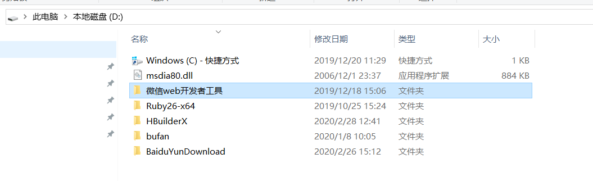
    路径：D:\微信 web 开发者工具

#### 1.4 vue 开发注意事项

##### 1) 生命周期函数

- 应用生命周期 https://uniapp.dcloud.io/frame?id=%e5%ba%94%e7%94%a8%e7%94%9f%e5%91%bd%e5%91%a8%e6%9c%9f
  - 页面生命周期
    - onLoad 用于获取传递页面参数,和调用初始化 api,类似于 vue 中的 created. 在 uniapp 中建议使用 onLoad 代替 created.
    - onReady 类似与 mounted.

##### 2) px 的单位不会被编译.

##### 3)在 H5 平台 使用 v-for 循环整数时和其他平台存在差异，

如 v-for="(item, index) in 10" 中，在 H5 平台 item 从 1 开始，其他平台 item 从 0 开始，可使用第二个参数 index 来保持一致。
在非 H5 平台 循环对象时不支持第三个参数，如 v-for="(value, name, index) in object" 中，index 参数是不支持的。

##### 4)事件映射. 注意: click=> tap

因为：click 在移动端又 300s 的延迟比较明显，影响用户体验，所以应 tap 代替 click
兼容各端，事件需使用 v-on 或 @ 的方式绑定，请勿使用小程序端的 bind 和 catch 进行事件绑定。

##### 5)富文本

pC 端（vue 页面 V3 编译模式）和 H5 端支持 v-html，其他端不支持 v-html。富文本 https://ask.dcloud.net.cn/article/35772

#### 5)组建: created 生命周期函数有效(遇到再说)

#### 6) page.json

文件用来对 uni-app 进行全局配置，决定页面文件的路径、窗口样式、原生的导航栏、底部的原生 tabbar 等。

- tabBar 用于配置底部 tab 入口,是一个数组，只能配置最少 2 个、最多 5 个 tab，tab 按数组的顺序排序.

* icon 不要中文!!! 放到 static 文件夹下

##### 7) 混合开发单位 rpx,与 750 的设置稿一样的像素

##### 8)问题

- vue 原生的 web 应用(电影/乐居移动端) 和 赵老师/张老师小程序(乐居) 和 uniapp 开发的乐居移动端有什么区别? - vue 是基本能力 - 原生小程序是加分项 - uniapp 前瞻性和补充性
  1px--->2rpx;

### 二. 乐居混合开发项目

#### 2.1 建入门文件，配置路径

##### 1）- page.json 里面进行配置路径及导航栏颜色主题色等

- //pages 数组中第一项表示应用启动页，参考：https://uniapp.dcloud.io/collocation/pages

##### 2）swiper 快捷键 usw

#### 2.2 封装 api 请求服务器数据

##### 文档：

- 开发不支持 axios，用 uni.request
- post 提交表单的三种形式: 1 二进制(上传) ; 2 x-www-form-urlencoded 默认表单形式(常用,默认) ; 3 json 字符串形式(新)

##### POST 提交三种形式 1 二进制(上传) ; 2 x-www-form-urlencoded 默认表单形式(常用,默认) ; 3 json 字符串形式(新)

- post : header['content-type'] 为 application/json 的数据，会进行 JSON 序列化。
- post: header['content-type'] 为 application/x-www-form-urlencoded 的数据，会将数据转换为 query string。
- 还有二进制形式
- 请求的时候请求方式，一定要==大写=='GET'

##### 封装步骤：

在根目录新建 api 文件夹---》建一个 request.js 和 host.js

```js
import host from "./host.js";
function http(config) {
  return new Promise((resolve, reject) => {
    var setting = {
      header: {
        "content-type": "application/x-www-form-urlencoded"
      },
      dataType: "json",
      timeout: 60000,
      success: res => {
        //成功 如果是ajax会返回文本类型,但这里会默认对结果进行JSON.parse
        resolve(res.data);
      },
      fail: err => {
        reject(err);
      }
    };
    //合并config配置到默认的setting中
    setting = Object.assign(setting, config);
    // 修改url
    setting.url = host.host + setting.url;
    uni.request(setting);
  });
}
export default http;
```

host.js

```js
export default {
  host: "http://www.bufantec.com"
};
```

在 api 文件夹---》home 文件夹---》home.js 里面放首页的 api

```js
import http from "../request.js";

function getBannerList(data) {
  return http({
    url: "/api/leju/front/home/banners",
    method: "GET",
    data
  });
}
export default {
  getBannerList
};
```

#### 2.3 首页 header-nav 如何使用

uni-app 网址https://uniapp.dcloud.io/component/README---》组件----》自定义导航栏---》点击使用HBuilder导入插件---下载后的软件在components中
用法：

```js
import uniNavBar from "@/components/uni-nav-bar/uni-nav-bar.vue";
export default {
  components: { uniNavBar }
};
```

强调: 不要通过 dom 修改样式, 应该通过数据驱动的思想实现

#### 2.4 如何使最上面的 nav 不出现比如分类页三个字 跨平台 条件编译

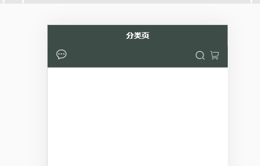
[条件编译:https://uniapp.dcloud.io/platform](https://uniapp.dcloud.io/platform) + 需求: 在所有的一级导航,全部去掉

1. 搜索 去掉默认导航---》uni-app 导航栏开发指南-----》App 单独去除原生导航栏

```js
 "style": {
        "app-plus": {  //每个平台下不显示
            "titleNView": false
        }
    }
    // 比如
    {
			"path": "pages/home/index",
			"style": {
				"navigationBarTitleText": "首页",
				"h5":{  //小写，在h5下不显示
					 "titleNView": false
				}
			}
		},
```

#### 2.5 如何跳转路由

和 a 标签相似：

```html
<navigator
  v-if="kindList.length>0"
  class="block dengju"
  :url="'./product/index?kindId='+kindList[3].id"
>
  <image class="img" :src="kindList[3].img" mode="scaleToFill"></image>
</navigator>
```

#### 2.6 在 h5 标题显示的情况下动态修改标题

1)API--->设置导航条

```js
uni.setNavigationBarTitle({
    title: '新的标题'
});
// 用法
init() {
				var params = {
					...this.page,
					kindId: this.kindId,
				}
				kindApi.getProductList(params).then(res => {
					this.kindList = res.kind;
					this.kindDetailList = res.data.list;
					uni.setNavigationBarTitle({
					    title: this.kindList.ctitle
					});
				})
			},
			// 点击导航栏改变对应的状态
		}
```

#### 2.7 每次请求 10 条数据，上拉刷新把下面 10 条请求出来

1)组件里面==加载更多== -----》LoadMore 加载更多---》点击使用插件

```js
import uniLoadMore from "@/components/uni-load-more/uni-load-more.vue"
components: {
			uniLoadMore
		},
```

2)使用

```html
<!-- 列表结束 -->
<uniLoadMore :status="more"></uniLoadMore>
```

3)此时页面有了一个样式------》触发下面的函数
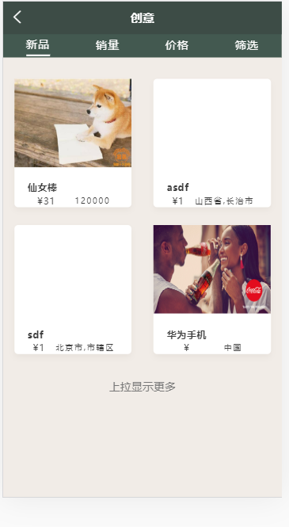 4)框架---左边配置 --->pages--->点击下图选中行的`页面生命周期`
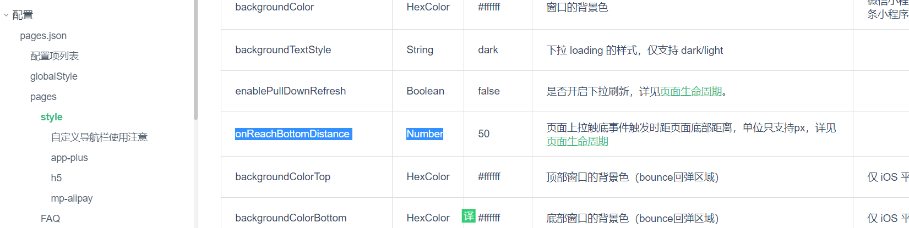 5)点击：页面生命周期
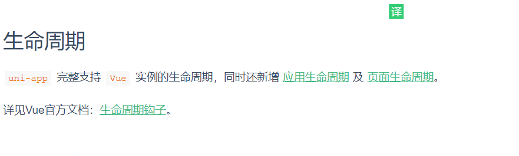 6)此时找到 onReachBottom 页面生命周期
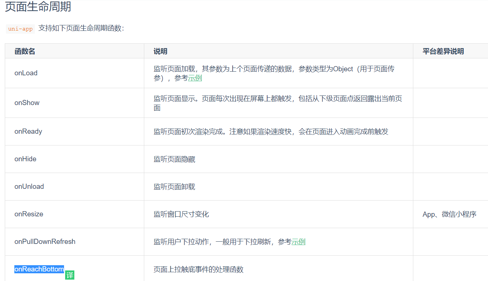 7)页面使用 onReachBottom 生命周期 与 onLoad 同级

```js
onReachBottom(){
			// 如果出发了底部，则应该发送请求，获取新的数据
			this.page.start++;
			this.init();
		},
```

#### 2.8 合并请求的数据

1)

```js
init() {
				var params = {
					...this.page,
					kindId: this.kindId,
				}
				kindApi.getProductList(params).then(res => {
					this.kindList = res.kind;
					uni.setNavigationBarTitle({
						title: res.kind.ctitle
          });
          // 合并请求数据
          this.kindDetailList = this.
          kindDetailList.concat(res.data.list);

				})
			},
			// 点击导航栏改变对应的状态

```

#### 2.9 如何点击价格的时候排序

```js
<view class="list" v-for="item in kindDetailListCom" :key="item.id">
</view>

```

```js
computed:{
				kindDetailListCom() {
				var res = this.kindDetailList;
				// 简易深克隆  clone, 这种clone无法实现方法的clone
				var obj = JSON.parse(JSON.stringify(this.kindDetailList));
				switch (this.show) {
					case 0:
						res = this.kindDetailList;
						break;
					case 3: // 根据价格排序
						res = obj.sort((a, b) => {
							return b.price_now - a.price_now;
						})
						break;
					default:
						break;
				}
				return res;
			}
```

### 三. 项目中遇到的问题

#### 3.1 如何把富文本显示出来，为什么不用 v-html

```html
<!-- product.content=<p>1111</p> -->
<rich-text :nodes="product.content"></rich-text>
```

#### 3.2 登录模块 可以去插件市场 `极简登录注册模板`

下载插件然后复制到自己的项目里面

#### 3.3 登录成功后存储到 loc 里面因为存储的 key 每次要用，所以可以保存一个变量

新建一个 common 文件与 api 同级----》constant.js

```js
export default {
  LEJU_USER: "LEJU_USER_INFO"
};
// 登录成功,跳转个人中心
if (res.code == "S") {
  // 同步存储用户信息
  uni.setStorageSync(constantFile.LEJU_USER, res.data);
  uni.reLaunch({
    url: "../index"
  });
}
```

- 组件里面九宫格

#### 3.4 在 uniApp 里面怎末使用 vuex

1)在 api 的同级目录新建 store 文件夹 里面新建一个 index.js
2)store 文件夹--->新建 modules 文件夹----》user.js 里面的代码

```js
import constantFile from "@/common/constant.js";
export default {
  state: {
    userInfo: {}
  },
  // 一般习惯在mutaton里面函数名大写
  mutations: {
    SET_USER_INFO(state, data) {
      // 1. 存入vuex
      state.userInfo = data;
      // 2. 存入 loc
      uni.setStorageSync(constantFile.LEJU_USER, data);
    }
  },
  getters: {},
  actions: {},
  modules: {}
};
```

3)index.js 里面 的代码

```js
import Vue from "vue";
import Vuex from "vuex";
Vue.use(Vuex);
import user from "./modules/user.js";
export default new Vuex.Store({
  modules: {
    user
  }
});
```

4)在 main.js 里面注册

```js
import Vue from 'vue'
import App from './App'
import store from "@/store/index.js" =====1
Vue.config.productionTip = false

App.mpType = 'app'
Vue.prototype.$store=store;=====3
const app = new Vue({
	store,=======2
    ...App
})
app.$mount()
```

5)在个人中心页面使用

```js
computed:{
			userInfo(){
				return this.$store.getters.userInfo;
			}
		},
```

6)刷新后，vuex 里面的数据就会消失，解决办法
在 store 文件夹---》getters.js 计算属性

```js
import constantFile from "@/common/constant.js";
export default {
  userInfo(state) {
    // 处理userInfo
    //先查看vuex
    var userObj = state.user.userInfo;
    // userObj 没有用户信息，也不是一个空的对象 vuex中 {} 不会被判断为false
    if (userObj.id) {
      return userObj;
    }
    // vuex不存在从loc里面查找
    var userLs = uni.getStorageSync(constantFile.LEJU_USER);
    if (userLs.id) {
      return userLs;
    } else {
      return {};
    }
  }
};
```

在 store 下面的 index.js 里面引入 getters.js
import getters from "./getters.js"

```js
export default new Vuex.Store({
  getters,
  modules: {
    user
  }
});
```

#### 3.5 退出登录

store-->modules-->user.js 里面代码

```js
actions:{
	  // 退出的方法 有接口请求，异步请求，写actions
	  logout({commit}){
		  // 1. 发送退出请求 如果使token模式，没有必要通知服务器退出，比如jwt模式的token,服务器
		  //无法控制合适退出，只会定期刷新token
	  		  userApi.doLogout().then(res=>{
				  // 清空vuex和loc
				  commit('REMOVE_USER_INFO')
			  })
	  }
  },
```

mine 使用

```js
	//退出登录
		logOut(){
				// uni.removeStorageSync(constantFile.LEJU_USER);
				this.$store.dispatch('user/logout')
				uni.showToast({
					title:"已退出"
				})

		}
```

#### 3.5 订单页面登录验证 （uni 没有导航守卫

    - 小程序/iosapp 审核 ,不能进入应用就弹出来强制登陆,人工审核必须有"游客"模式.
    - 因为uniapp没有导航守卫,在需要判断的页面进行判断跳转,但是登陆比较特殊,应该用重定向跳转登录页避免返回.

- 借鉴模板
  gitup 验证模板
  gitup--->uniApp->DCloud---->uni-template-login
- 验证步骤

1. 新建 utils 文件夹(与 App.vue 同级)----》common.js 里面代码

```js
import store from "@/store/index.js";
import constantFile from "@/common/constant.js";
// 实现判断登录的共有方法
function isLogin() {
  // 1.vue不存在
  // ls存在  返回已登录
  //2. ls不存在
  // 处理userInfo
  //先查看vuex
  var userObj = store.state.user.userInfo;
  // userObj 没有用户信息，也不是一个空的对象 vuex中 {} 不会被判断为false
  if (userObj.id) {
    return true;
  }
  // vuex不存在从loc里面查找
  var userLs = uni.getStorageSync(constantFile.LEJU_USER);
  if (userLs.id) {
    store.commit("user/SET_USER_INFO", userLs);
    return true;
  } else {
    return false;
  }
}
export default {
  isLogin
};
```

在 order.vue 里面的 onload

```js
// 没有全局导航守卫，只能在每个页面的onLoad执行一次
		onLoad() {
			console.log(isLogin.isLogin())
			if(isLogin.isLogin()){
					console.log("1111")
			}else{// 如果没有登录，提示登录
			 	console.log("2222")
				uni.showModal({
					title: '未登录',
					content: '您未登录，需要登录后才能查看',
					success: (res) => {
						if (res.confirm) {
							uni.redirectTo({
								url: '../login/login'
							})
						}
					}
				});
			}
		},
```

#### 3.6 检查是否登录的方法

在 utils 文件夹(与 App.vue 同级)----》common.js 里面再写一个 checkLogin

#### 3.7 登录里面注册页面上传头像

html

```html
<view class="avart">
  <button type="default" size="mini" plain="true">上传头像</button>
</view>
```

js 里面方法

```js
	// 上传头像
			selAvatar() {
				// 调用Api ,可以访问手机相册
				uni.chooseImage({
					count: 1, //默认9
					sizeType: ['original', 'compressed'], //可以指定是原图还是压缩图，默认二者都有
					sourceType: ['album'], //从相册选择
					success: function(res) {
						console.log(JSON.stringify(res.tempFilePaths));
						var file=res.tempFilePaths[0]
						// 选中文件对象，接下来上传
						uni.uploadFile({
							url:host.host+ '/api/leju/admin/material/uploadImg', //仅为示例，非真实的接口地址
							filePath:file,
							name: 'file',
							success: (uploadFileRes) => {
								console.log(uploadFileRes.data);
								_this.banSrc= JSON.parse(uploadFileRes.data).ossUrl;
								_this.from.avatar=_this.banSrc;
								console.log(_this.banSrc);
							}
						});
					}
				});

			}
```

#### 3.10 兼容处理 发现页---》好物推荐的大轮播在小程序端不显示，查看元素高度为零

- 如果遇到无法兼容的问题 特殊针对性的处理
- 条件编译 https://uniapp.dcloud.io/platform

#### 3.11 怎么在 home 页推荐--》品类推荐里面点击对应图片跳转到--》发现--》好物推荐---对应的轮播页面=================================没有解决======

- home 页面

```html
<swiper-item
  @tap="goSeries(item.id)"
  class="swiper-item"
  v-for="item in seriesList"
  :key="item.id"
>
  <view class="imgs">
    <image class="bannerImg" :src="item.bg_img" mode=""></image>
  </view>
  <view class="text">
    <view class="title">{{item.cname}}</view>
    <view class="etitle">{{item.ename}}</view>
  </view>
</swiper-item>
```
#### 3.12 小程序中发现页---》好物轮播并没有出现======？不会===========
```js
// 点击系列进入发现---》好物推荐系列页面，因为发现页数组tabBar ，用uni.switchTab不能传参
			// uni.reLaunch在小程序端不能传参，所以用到了
			goSeries(sId){
				// 既然是pc端网页存在的问题 那么可针对网页处理
				// #ifdef H5
					window.sId = sId;
				// #endif
				uni.reLaunch({
				    url: '../find/index?sId='+sId
				});
			},
```

- find->品类推荐组件
  :current-item-id 当:current-item-id 和:item-id 一样的时候显示的轮播

```html
<swiper :vertical="false" class="swiper" :current-item-id="currentItemId">
  <swiper-item
    class="swiper-item"
    v-for="item in seriesAll"
    :key="item.id"
    :item-id="item.id"
  >
  </swiper-item>
</swiper>
```

- find 页面 传过去对应的参数

```html
<!-- 好物内容 -->
<view class="section-good" v-show="show==2">
  <Good :seriesAll="seriesAll" :currentItemId="currentItemId"></Good>
</view>
```

```js
onLoad(option) {
			document.querySelector('uni-page-body').style.height = '100%'
			this.getKindList();
			this.getseriesAll();
			this.sId = option.sId;
			// #ifdef H5
				this.sId = window.sId;
				window.sId = null;
			// #endif
			console.log(this.sId,"this.sId")
		},
		onReady(){
			// 有sId说明从首页跳转的
			if(this.sId){
				// 显示好物推荐的tab卡片
				this.show = '2';
				setTimeout(()=>{
					this.currentItemId = this.sId;
				},200)
			}else{
				this.current = '1';
			}
		},
```
#### 3.12 在h5或者小程序中写样式
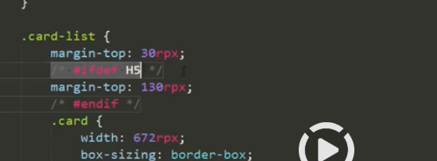
# 问题

1)首页更多后面箭头不显示
引入图书 src="/static/home/banner1.png" 2)品牌推荐下面的标题不能提调节 ?
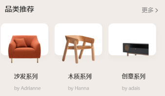
## 四. 打包
### 4.1 小程序打包==============?不知道怎么解决
1)微信小程序打开的页面在右上角有上传
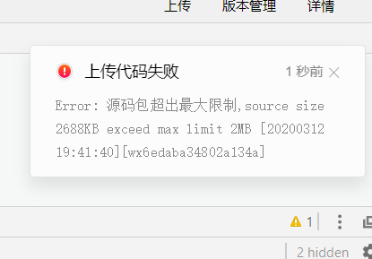

2)上传完后在[微信小程序后台网址](https://mp.weixin.qq.com/wxamp/wacodepage/getcodepage?token=779155647&lang=zh_CN)--->管理---》版本管理
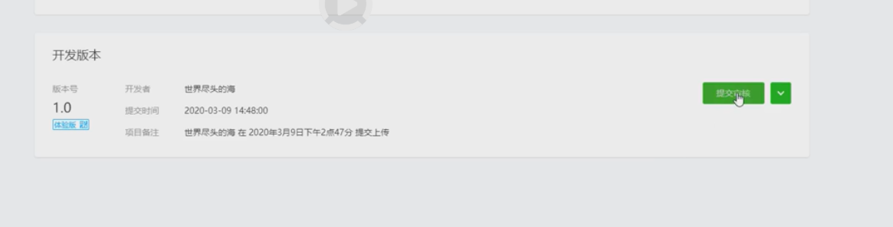
3)可以在详情里面的基本信息查看代码多少M，如果要上线，需要把服务器地址改了，且需要在微信小程序后台添加百名单
### 4.2 h5 打包
1)配置manifest.json

- 运行的基础路径 /leju/
在页面中的效果是
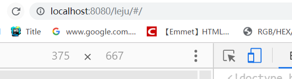
2)点击uniapp--》发行---h5手机版---》打包成功后底下工具栏显示
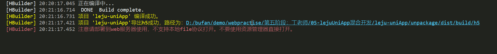
### 4.3 andio 打包
- 可以直接通过usb链接到手机,预览效果
	1. 
	- 前提: 手机开启调试模式 不同的机型开启方式可能有差异. 
	- 问题: 可能存在部分手机连不上. 一部分是电脑杀毒软件的问题,另一方面是android手机差异化太大.推荐小米手机.
	2. 
	- 也可以直接云打包xx.apk
	- manifest.json替换图标
	- 配置manifest.json里面自动生成图标
	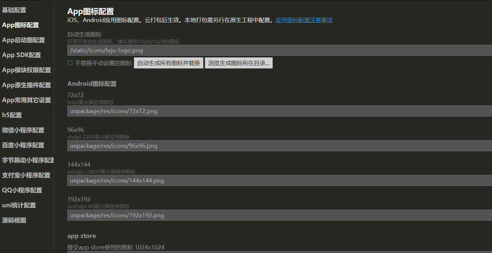
	- 发行-原生App云打包--配置
	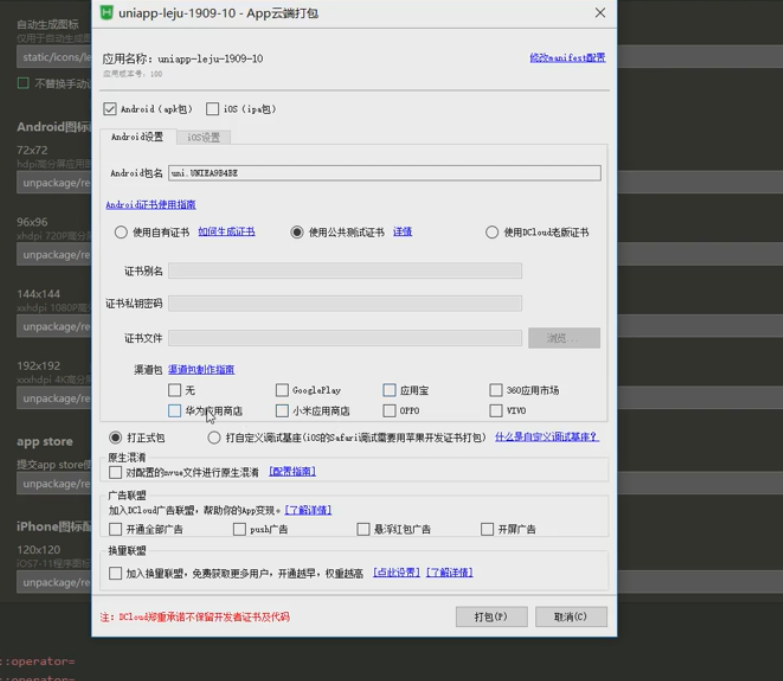
	- 打包完成，底部代码---》点击进去，获取
	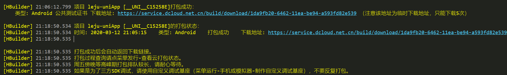
	- 下载后发到QQ就可以下载了