## 一：微信公众号开发

> 仓库地址: https://gitee.com/nevermo2013/wx-demo-1909

### 1.1 了解微信开发做什么

1. 微信小程序开发(原生开发/uniapp)
   原生的小程序没有双向响应和计算属性，对开发不方便。uniapp 开发相对好一些
2. ==微信公众号网页开发 通过认证的公众号后台,添加超链接即可=====下面两条是我们前端做的==

- 网页授权获取用户基本信息：通过该接口，可以获取用户的基本信息(获取用户的 OpenID 是无需用户同意的，获取用户的基本信息则需用户同意授权登陆/投票等)
- 微信 JS-SDK：是开发者在网页上通过 JavaScript 代码使用微信原生功能的工具包，开发者可以使用它在网页上录制和播放微信语音、监听微信分享、上传手机本地图片、拍照等许多能力。==

3. 微信公众号开发 一般是通过自定义服务器接管微信公众号官方后台,自定义交互逻辑,比如医院挂号系统等.后台做的

### 1.2 微信公众号有哪些？有什么区别

1. 服务号

- 服务号：为企业和组织提供更强大的业务服务与用户管理能力，主要偏向服务类交互（功能类似 12315，114，银行，提供绑定信息，服务交互的）

* 比如信用卡,银行的等,==直接存在与微信朋友列表==.
* 主动推送通知消息,比如还有 3 天还款,请留意!
* 一个月只能最多发送 4 条信息.每一条,可以添加 8 条文章链接.
* 服务号给人是无法申请的,必须是公司或者组织.
* 有更大的权限,比如微信支付.

2. 订阅号

- 订阅号: 为媒体和个人提供一种新的信息传播方式，主要功能是在微信侧给用户传达资讯；（功能类似报纸杂志，提供新闻信息或娱乐趣事）
- 比如: 咪蒙 , 知否 ... 个人类型的,直接存在于微信朋友列表的"订阅号"盒子里.
- 新信息不会主动推送通知,需要用户点击进入订阅号查看.
- 每天只能最多发送一条信息.每一条,可以添加 8 条文章链接.
- 可以个人和公司申请.

### 1.3 微信平台

- 微信小程序
- 微信公众号
  - 微信公众平台(区分小程序平台): https://mp.weixin.qq.com
  - 公众号 服务号注册和订阅号和小程序注册不能用同一个邮箱
  - 订阅号可以个人注册,如果需要正常接入开发,需要认证(每年 300).
- 微信开放平台
  - 区分微信公众平台: https://open.weixin.qq.com/

### 1.4 解读微信开发文档

[微信开发文档](https://developers.weixin.qq.com/doc/offiaccount/Getting_Started/Overview.html)

#### 1) 解读

- 为了识别用户，每个用户针对每个公众号会产生一个安全的 OpenID,咪蒙,知否.

* 如果需要在多公众号、移动应用之间做用户共通，则需前往微信开放平台，将这些公众号和应用绑定到一个开放平台账号下,此时会形成一个统一的 UnionID.
* 如果是从微信里面打开一个网站或网页，则需要前往微信开放平台接入
* 测试号申请: https://mp.weixin.qq.com/debug/cgi-bin/sandbox?t=sandbox/login
* 如果开发出问题,注意查看开发文档里面的返回码.
* 公众平台接口调用仅支持 80 端口。

#### 2) 微信公众号网页开发 api---》网页授权

##### 网页授权

- 测试号配置: JS 接口安全域名: bufan.natapp1.cc
  - 指的是自己的域名
  - 配置的时候不能加 http,而且必须是 80 端口

##### 网页授权的两种 scope 的区别说明

- snsapi_base 为 scope 发起的网页授权,是用来获取进入页面的用户的 openid 的.
- 比如,指实现访问量统计.
- 静默授权并自动跳转到回调页的,无需用户授权.

- snsapi_userinfo 为 scope 发起的网页授权，是用来获取用户的基本信息的。
- 比如: 投票,砍一刀,登陆等需要获取用户 openid 而且获取用户名还有头像等信息.
- 这种授权需要用户手动同意，并且由于用户同意过，所以无须关注.

## 二：项目步骤

### 2.1 创建项目

#### 1) 第一步：用户同意授权，获取 code

1. [测试号申请网址:](https://mp.weixin.qq.com/debug/cgi-bin/sandbox?t=sandbox/login) 并关注
2. 在项目里面把文档里面 snsapi_base_url 地址写到页面
   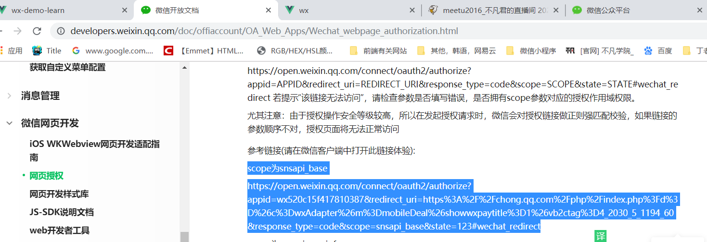
3.

```js
<template>
    <div>
        微信
    </div>
</template>

<script>
var appid='wx19b5dbae6442dfe7'; //测试号管理里面的appID
var host='http://localhost:8080/wx';  //从这个页面发起的授权,从游览器赋值的
// #在url里面会被当成锚点如果是hash模式host='http://localhost:8080/#/wx'和下面123后面的#冲突
var snsapi_userinfo_url=`https://open.weixin.qq.com/connect/oauth2/authorize?appid=${appid}&redirect_uri=${host}&response_type=code&scope=snsapi_base&state=123#wechat_redirect`;
export default {
    props: {

    },
    data() {
        return {
code:'',
          wxClientUser:{}
        };
    },
    created() {
    //  1 第一步：用户同意授权，获取code
    this.code = this.getUrlParams('code');

    if(this.code){
      console.log("已获取code");
       //   2 第二步：通过code换取网页授权access_token
    //  http://a4ajpt.natappfree.cc/wx?code=061MlikB1d84ia0oUXhB1X09kB1MlikO&state=123
      //安全级别较高,这里调用后台接口
        const userInfoUrl = `http://www.bufantec.com/wx/user/getUserInfo?appid=${appid}&code=${this.code}`;
        axios.get(userInfoUrl).then(res=>{
            console.log(res.data.data,"1111")
            localStorage.setItem(openId,res.data.data.openid)
            this.wxClientUser=res.data.data;
        })
    }else{
 window.location.href=snsapi_userinfo_url;
    }
    //会出现下面图1的图片，引导用户跳转，必须在微信客户端打开，打开微信小程序，左上角--》微信开发者工具---》更换开发者模式，可以选择公众号网页调式，然后把npm run serve启动后的地址赋值到地址栏
    //图片如图2，因为请求数据的时候微信服务器不能识别我们写的host重定向的地址,我们必须把host改成微信服务器能访问的地址,备案的域名 如何申请备请备案的域名 看 4)
    // 8)之后点击会出现死循环，这时候需要判断是否返回code
    },
    methods: {
         // 根据url解析 获取key为name 的值,比如 url = xxx.com?code=33&id=123 ;  getUrlParams(id)=>123
        getUrlParams(name) {
            var reg = new RegExp("(^|&)" + name + "=([^&]*)(&|$)", "i"); //定义正则表达式
            var r = window.location.search.substr(1).match(reg);
            if (r != null) return unescape(r[2]);
            return null;
        }
    },
};
</script>
```

==图 1==：
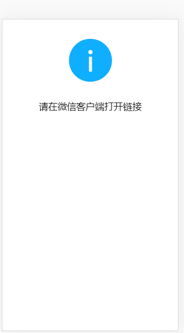

==图 2==
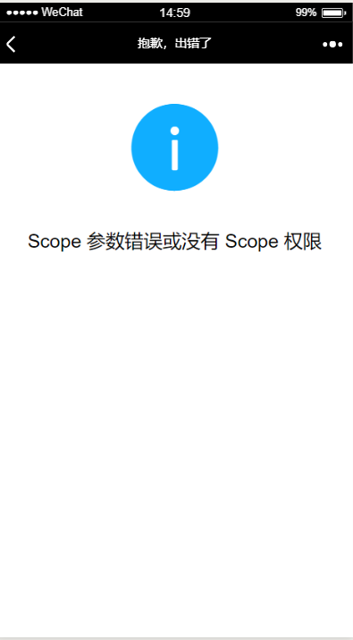

4)内网穿透(拿到备案的域名)natapp

- [网址](https://natapp.cn/)

* 登录 ---》左边购买免费隧道
  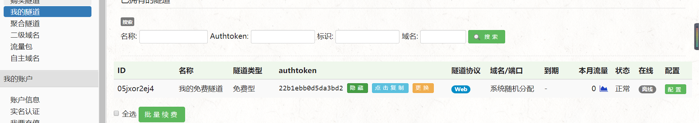

- 导航里面--》教程--》使用本地配置文件 config.ini

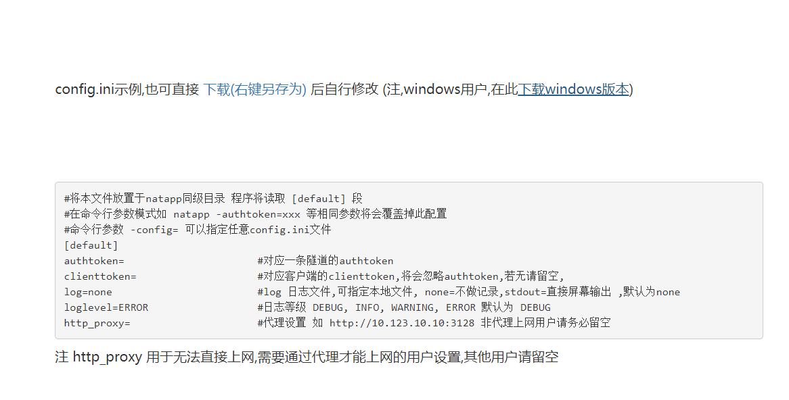 -打开 config.init 把购买隧道里面的 authtoken 夫 hi 到这里面 authtoken=22b1ebb0d5da3bd2

- 双击刚刚下载的内网穿透的程序出现
  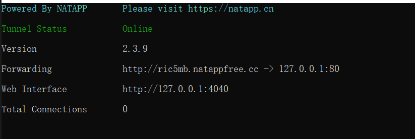
  把域名换成 host 变成 var host=' http://ric5mb.natappfree.cc/wx';

5. 微信开发只支持 80 端口怎么样修改
   新建 vue.config.js 文件 与 pack.json 同级

```js
module.exports = {
  devServer: {
    port: 80,
    disableHostCheck: true
  }
};
```

6)把域名复制到游览器报错
'Invalid Host header'
[百度问题网址](https://blog.csdn.net/Cookysurongbin/article/details/86077241)
解决：devServer 下添加 disableHostCheck: true，跳过检查 重新启动项目 7)因为内外网穿透，网速非常慢
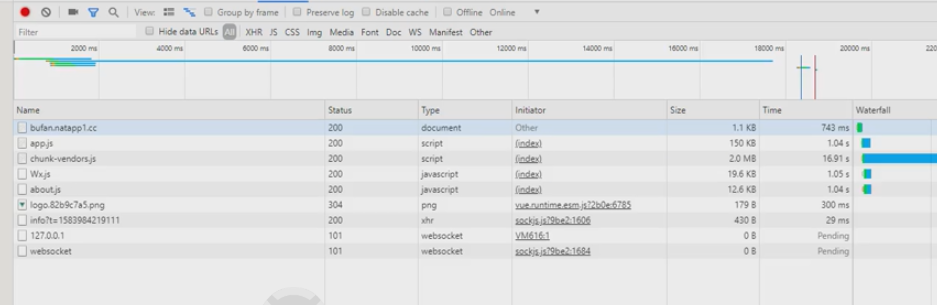
chunk-vendors.js 大约两 M，作用是把公共的包给提取出来，打成一个公共的库
解决：在开发模式可以走生产模式的代码，解决网速的问题 pack.json--》scripts

```js
 "wx": "vue-cli-service serve --mode production"
```

7)点击微信报错
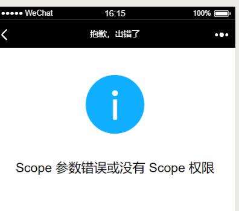
解决：点击[测试号申请网址:](https://mp.weixin.qq.com/debug/cgi-bin/sandbox?t=sandbox/login)----》体验接口权限表--》网页服务--》第一条：网页账号--》点击修改
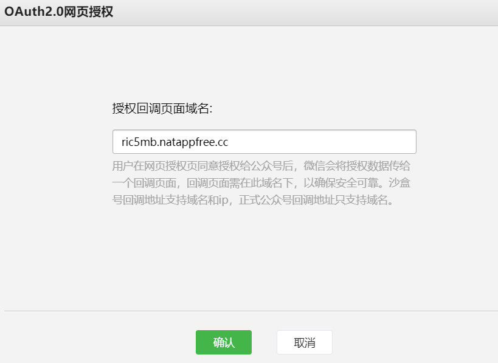
还有里面的==接口配置信息==按照老师的写上
接口配置信息 URL http://bufantec.com/wx/msg Token bufanxueyuan 8)点击微信返回
请求接口成功返回 http://a4ajpt.natappfree.cc/wx?code=061MlikB1d84ia0oUXhB1X09kB1MlikO&state=123 9)根据 url 解析获取 code 在 methods 里面写一个获取 code 的方法，在 created 里面调用

#### 2) 第二步：通过 code 换取网页授权 access_token

尤其注意：由于公众号的 secret 和获取到的 access_token 安全级别都非常高，必须只保存在服务器，不允许传给客户端。后续刷新 access_token、通过 access_token 获取用户信息等步骤，也必须从服务器发起。
所以一般后台写好，我们调用接口，传入参数就可以

> 注意使用前提. 如果希望用不凡君的后台实现微信公众号开发,就必须注册 appId/secret.

##### (1) 前提: 注册 : http://bufantec.com/wx/developer/register?appId=xxxx&appSecret=xxxx

    - 可以重复注册,相同的appId会被覆盖.
    - 类型: get
    - 参数: appId 必须
    - 参数: appSecret 必须

- 查看已注册列表: http://bufantec.com/wx/developer/list
- 查看明细: http://bufantec.com/wx/developer/detail?appId=xxx - 参数: appId
  
  > 不凡君的后台已经实现了与微信服务器的对接,所以需要首先把不凡君的后台配置到微信测试账号(正式账号)的白名单.并且验证通过.测试号配置

* 接口配置信息
  - 接口配置信息
    URL http://bufantec.com/wx/msg 不凡君后台通过这个请求实现了对微信服务器对接的认证.  
    Token bufanxueyuan
    (上面两个配置 必须完全一模一样，模式系统提示配置失败)

##### (2) 调用后台接口

- snsapi_base 通过 code 交换 access_token: /wx/user/getAccessTokenBase - 参数: appId - 参数: code - 当前 api ==有问题 带调试==
  上面接口时用来获取游览量只需要获取凑由于上面接口有问题，所以用下面的接口，可以直接获取用户信息
- snsapi_userinfo 通过 code 交换 access_token /wx/user/getUserInfo
  - 参数: appid
  - 参数: code

## 三：jssdk 使用说明

> 比如实现拍照功能，录音功能等
> [jssdk 网址](https://developers.weixin.qq.com/doc/offiaccount/OA_Web_Apps/iOS_WKWebview.html#联系我们) 左边微信网页开发---》JS_SDK 说明文档

### 1)步骤一：绑定域名

- 在测试号里面的==JS 接口安全域名修改==里面写入对应的域名
  xxxxx.natapp1.cc 注意: 不要添加 http,而且必须是你的自定义域名地址
  告诉微信服务器，是从这里调用的，是值得信任的

### 2)步骤二：引入 JS 文件

在 pulic 文件夹---》index.html

```js
<!-- 引入jssdk -->
    <script src="http://res.wx.qq.com/open/js/jweixin-1.6.0.js"></script>
```

### 3)步骤三：通过 config 接口注入权限验证配置 后台开发注意!!

所有需要使用 JS-SDK 的页面必须先注入配置信息
后台签名 api: /wx/user/getAccessToken?appId=xxx

- 参数: appId (注意: 必须先注册)
  在 methods 里面 写一个

```js
initWxConfig() {
      // 通过后台Api获取签名
      // https://developers.weixin.qq.com/doc/offiaccount/OA_Web_Apps/JS-SDK.html#62
      var configApi = `http://www.bufantec.com/wx/user/getAccessToken?appId=${appid}`;
      axios.get(configApi).then(res => {
        console.log(res.data);
        // 初始化 jssdk配置
        wx.config({
          debug: true, // 开启调试模式,调用的所有api的返回值会在客户端alert出来，若要查看传入的参数，可以在pc端打开，参数信息会通过log打出，仅在pc端时才会打印。
          appId: appid, // 必填，公众号的唯一标识
          timestamp: res.data.timestamp, // 必填，生成签名的时间戳
          nonceStr: res.data.noncestr, // 必填，生成签名的随机串
          signature: res.data.signature, // 必填，签名
          jsApiList: [] // 必填，需要使用的JS接口列表
        });
      });
    }
```

然后微信客户端就会显示 oK 如图片
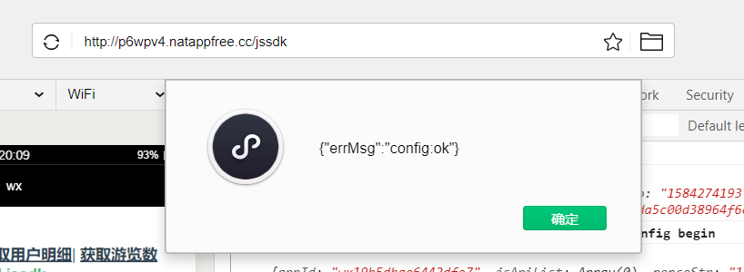

### 4)步骤四：示例功能 (比如上传图片)

在 jssdk 使用说明里面--->接口调用说明
如果是在页面加载好时就调用了 JSAPI，则必须写在 wx.ready 的回调中。

- 选择图片的一个按钮的事件

```js
 // 选择图片
    selecImg() {
      // 初始化完毕之后 就可以调用相关api了
      //   调用了JSAPI，则必须写在wx.ready的回调中
      wx.ready(function() {
        //需在用户可能点击分享按钮前就先调用
        wx.chooseImage({
          count: 1, // 默认9
          sizeType: ["original", "compressed"], // 可以指定是原图还是压缩图，默认二者都有
          sourceType: ["album", "camera"], // 可以指定来源是相册还是相机，默认二者都有
          success: function(res) {
            var localIds = res.localIds; // 返回选定照片的本地ID列表，localId可以作为img标签的src属性显示图片
          }
        });
      });
    }

```

==使用方法必须在==jsApiList==里面注册

```js
wx.config({
  debug: true, // 开启调试模式,调用的所有api的返回值会在客户端alert出来，若要查看传入的参数，可以在pc端打开，参数信息会通过log打出，仅在pc端时才会打印。
  appId: appid, // 必填，公众号的唯一标识
  timestamp: res.data.timestamp, // 必填，生成签名的时间戳
  nonceStr: res.data.noncestr, // 必填，生成签名的随机串
  signature: res.data.signature, // 必填，签名
  jsApiList: ["chooseImage"] // 必填，需要使用的JS接口列表
});
```

### 4)怎么样在手机上预览
1)关注测试号的微信二维码和微信客户端的预览二维码

## 四：加密相关
> 开发中,一般会遇到的3种加密方式.
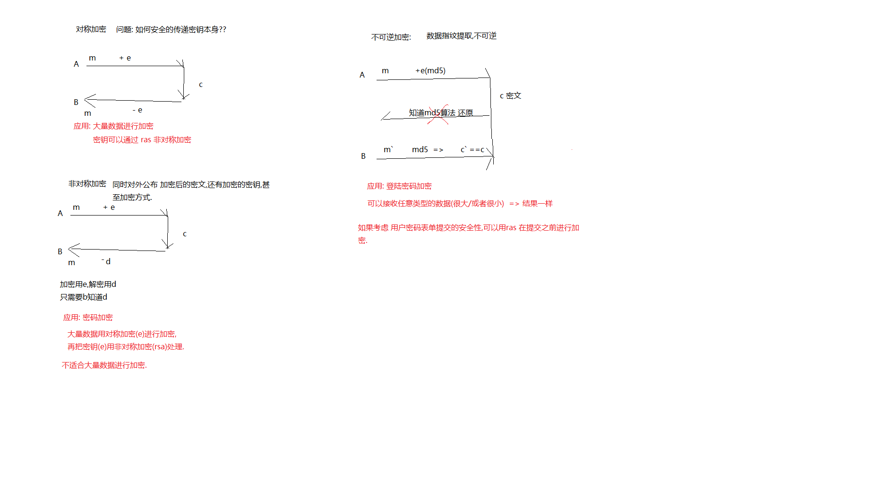
### 对称加密
>采用单钥密码的加密方法，同一个密钥可以同时用来加密和解密，这种加密方法称为对称加密，也称为单密钥加密。常用的单向加密算法：

+ DES（Data Encryption Standard）：数据加密标准，速度较快，适用于加密大量数据的场合；
+ 3DES（Triple DES）：是基于DES，对一块数据用三个不同的密钥进行三次加密，强度更高；
+ AES（Advanced Encryption Standard）：高级加密标准，是下一代的加密算法标准，速度快，安全级别高，支持128、192、256、512位密钥的加密；
+ Blowfish

### 非对称加密
> 公钥与私钥是一对，如果用公钥对数据进行加密，只有用对应的私钥才能解密。可以还原内容.

+ RSA (MIT 1978三个数学教授联合发明的算法,RSA是三个人的名字首字母)
    - 原理,基于大数的质因数分解非常困难,但是如果用两个质因数求积非常简单.
    - 比如分解 1024位(byte) 二进制的数 
    - 破解: 暴力计算破解. 量子计算机(谷歌).

+ ECC（椭圆曲线加密算法）

### 离散哈希/不可逆加密
> 不可逆加密算法的特征是加密过程中不需要使用密钥，输入明文后由系统直接经过加密算法处理成密文，这种加密后的数据是无法被解密的，只有重新输入明文，并再次经过同样不可逆的加密算法处理，得到相同的加密密文并被系统重新识别后，才能真正解密。

+ MD5
+ SHA-1 美国国家安全局设计
+ sha256  美国国家安全局设计改进设计  典型用途  btc(比特币)

## 五微信支付相关

### 前提
+ 必须是认证的服务号
+ 必须绑定商户平台
+ 文档: https://pay.weixin.qq.com/wiki/doc/api/index.html


### 支付场景
+ jssdk 支付  微信客户端打开商家网页的支付形式
+ h5支付  微信外网页 打开直接微信支付

### 支付api
+ jssdk支付api  /wx/pay/paySign
    - 参数: appId  
+ h5页面支付 /wx/pay/wap2
    - 参数: 无
