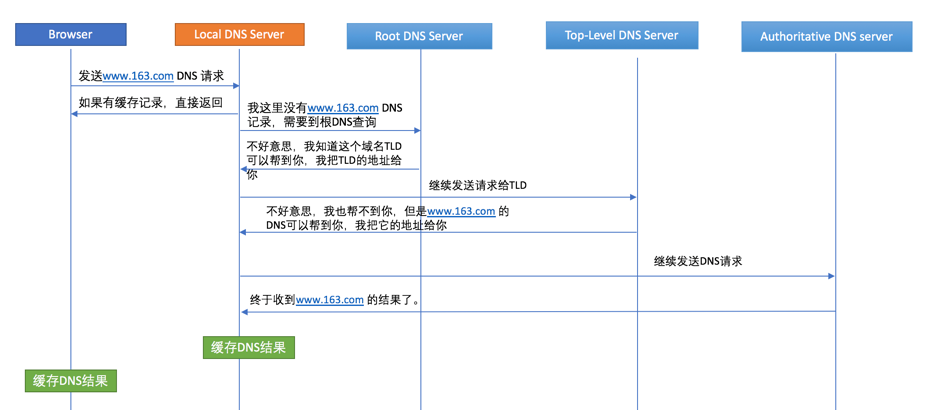
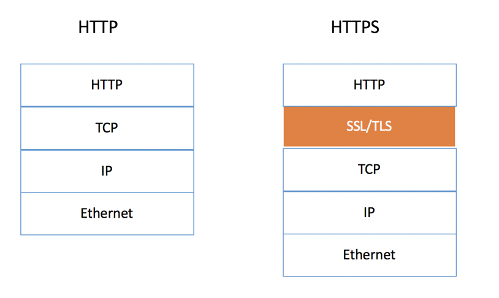
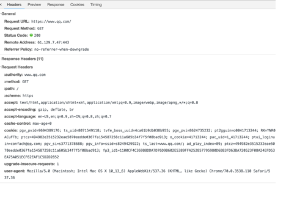
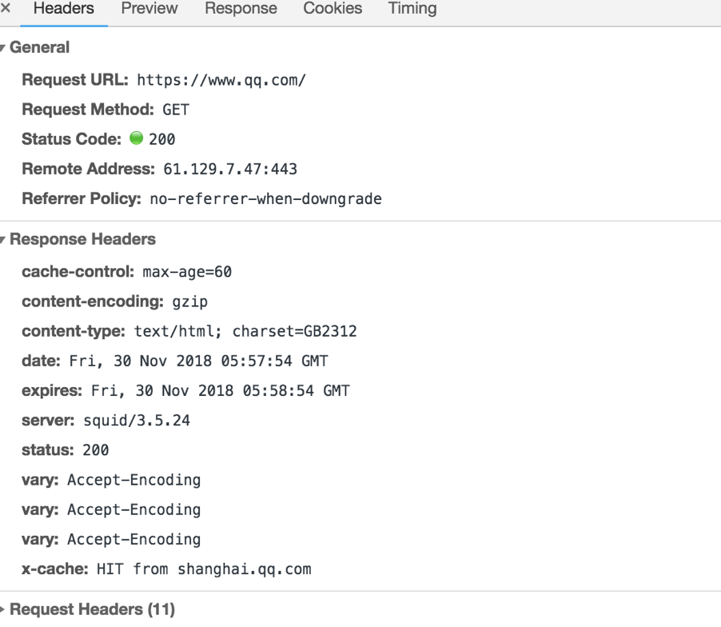

# 1. 游览器从输入 url 到页面加载做了哪些工作
[详细介绍网址](https://www.cnblogs.com/confach/p/10050013.html)
### 涉及到的知识面

DNS的解析原理，常用命令，端口等
TCP/IP模型，三次握手，四次挥手。
HTTP/HTTPS的原理和解析。
浏览器render一个页面
Web安全性问题
抓包，分析TCP模型，三次握手，SSL/TLS，让学起来不再枯燥。
其他一些高级话题。

## 几大步骤

### 1) DNS 查询
假设输入的URL是包含域名的，那肯定会涉及到DNS解析。当然，如果URL仅仅是IP，那就不会涉及到DNS的。域名的出现是为了方便记忆，因为域名比IP好记。我们这里假设URL包含域名。

首先游览器向在本地域名服务器中根据域名查询IP地址，如果没有找到的情况下，本地域名服务器会向根域名服务器发送一个请求。如果根域名服务器也不存在该域名时，本地域名会向com顶级域名服务器（TLD）发送一个请求，依次类推下去。直到最后本地域名服务器得到google的IP地址并把它缓存到本地，供下次查询使用。
需要说明的是Root DNS Server一般有13个，后面有个点（.），别忘了。
a.root-servers.net.
c.root-servers.net.
j.root-servers.net.
b.root-servers.net.
i.root-servers.net.
d.root-servers.net.
k.root-servers.net.
f.root-servers.net.
l.root-servers.net.
h.root-servers.net.
m.root-servers.net.
g.root-servers.net.
e.root-servers.net.
#### 关联DNS的优化
我们发现，一个DNS查询在没有缓存的情况下会有6步，这将是一个耗时的过程，如果DNS 查询时间过长，甚至会影响到用户体验。
#### DNS 10问
如果面试，下面10问基本可以覆盖全了，答案在上面已经说过了：
1.  为什么要用域名？
    
2.    DNS解析的基本流程？
3.    DNS的根域名是什么，有几个Server？TLD DNS是什么？
4.    DNS的优化策略是什么？在各个环节怎么做的？Chrome和各个操作系统怎么做的？
5.    DNS负载均衡是什么，为什么要用？
6.    DNS的记录类型有哪些？CNAME一般用在哪些场合？举例子说明一下。
7.    DNS的常用工具和命令有哪些？
8.    DNS查询是用TCP还是UDP？一般用哪个端口？
9.    DNS抓包抓过吗？Wireshark有用过吗？
10.  请说明一下www.google.com 和google.com的区别，如何设置它们的DNS？
### 2) TCP 连接
DNS解析返回域名的IP之后，接下来就是浏览器要和该IP建立TCP连接了。为什么是TCP而不是UDP？那是因为HTTP是基于TCP上的。这里涉及到另外一个话题：TCP/IP 模型。这个已经在大学的课本上学过了，我们再复习一下。
####  TCP/IP模型
TCP/IP模型一般分为4层

#### TCP三次握手与四次挥手
所谓三次握手(Three-way Handshake)，是指建立一个 TCP 连接时，需要客户端和服务器总共发送3个包。
三次握手的目的是连接服务器指定端口，建立 TCP 连接，并同步连接双方的序列号和确认号，交换 TCP 窗口大小信息。在 socket 编程中，客户端执行 connect() 时。将触发三次握手。

TCP拆除需要发送四个包，因此称为四次挥手(Four-way handshake)，也叫做改进的三次握手。客户端或服务器均可主动发起挥手动作，在 socket 编程中，任何一方执行 close() 操作即可产生挥手操作。
##### 三次握手
1）比如我需要一个资料，我给小红打电话，我需要什么什么资料，你给我发到我的邮箱，2）然后小红回应，好的，把资料发给我，3）然后我收到后回复小红，我已经收到了你的信息，这是三次握手。一直没有挂断电话
##### 四次挥手
 1）我拿到资料要挂断电话,给小明发信息，我拿到东西，要挂断电话了，但是你也可以发送一些相关的数据给我，2）小红回答说，我知道了 3）那我挂了
 4）好的你挂吧
### 3) 发送 HTTP 请求
  #### HTTPS证书
  越来越多的网站开始使用HTTPS（Apple要求App都须用HTTPS）。对于HTTPS，需要有一个SSL/TLS的鉴权/认证，才能建立TCP链接。

下图描述了HTTP和HTTPS的区别。



### 4) Server 处理 HTTP 请求并返回 HTTP 报文
#### HTTP/HTTPS请求和响应
前面TCP连接已经建立好了，意味着桥已经搭好了，下一步就该传输HTTP消息了。
- HTTP 请求

Request URL：就是请求的URL
Request Method： GET， POST， PUT，DELETE， OPTIONS， HEAD
- HTTP 响应
 
 最常见的就是Status Code（ 200， 302， 307， 404， 500），server等。
### 5) 浏览器解析并 render 页面
### 6) HTTP 连接断开

# 2. httP 的含义和 Toc

# 3. 利用 es6 的语法实现数组的并集，交集，差集
- 数组去重（set）
1)
```js
// set 它类似于数组成员的都是唯一
// 用途  用于数组去重
var arr = [0, 1, 0, 1, 2, 3, 0];
var set = new Set(arr); //不改变原数组
console.log(arr, set); //) [0, 1, 0, 1, 2, 3, 0] Set(4) {0, 1, 2, 3}
var newArr = Array.from(set);
console.log(newArr, set); //newArr原型指向的是数组，set原型指的还是Set
```

2)经人提醒，再补充一种，[...new Set(arr)] 

- 两个数组的并集
1)var arr = [1, 2];
var arr1 = [3, 4, 5];
console.log([...arr, ...arr1]); //1,2,3,4,5

交集

# 4. rem的含义
rem是相对长度单位，相对于HTML根元素
可以是js动态设置html的fontSize
# 5.作用域
 闭包里面的变量是局部标量,
 # 6.函数防抖和函数节流
 区别：防抖事将多次执行变为最后一次执行，节流是将多次执行变为每个一段时间执行
 ## 防抖
抖动停止后的时间超过设定的时间时执行一次函数。注意：这里的抖动停止表示你停止了触发这个函数，从这个时间点开始计算，当间隔时间等于你设定时间，才会执行里面的回调函数。如果你一直在触发这个函数并且两次触发间隔小于设定时间，则一定不会到回调函数那一步。·

主要应用场景有：input验证、搜索联想、resize
主要应用场景有：scroll、touchmove
 ## 节流概念
 按照设定的时间固定执行一次函数，比如200ms一次。注意：固定就是你在mousemove过程中，执行这个节流函数，它一定是200ms（你设定的定时器延迟时间）内执行一次。没到200ms，一定会返回，没有执行回调函数的。

# 7.JS中的垃圾回收机制
由于字符串、对象和数组没有固定大小，所有当他们的大小以知时，才能对他们进行动态的存储分配。JavaScript程度每次创建字符串、数组或对象时，解释器都必须分配内存来存储那个实体。只要像这样动态地分配了内存，最终都要释放这些内存以便他们能够被再用，否则，javascript的解释器将会消耗完系统中所有可用的内存，造成系统崩溃。
 javascript的解析器可以检测到何时程序不再使用一个对象了，当他确定了一个对象是无用的时候，他就知道不再需要这个对象，可以把它所占用的内存释放掉了。
- 垃圾回收的方法：标记清除、计数引用。
# 8.CSS 预处理器 sass,less,stylus优缺点
## less
优点：Less 从语言特性的设计到功能的健壮程度和另外两者相比都有一些缺陷，但用 Less可以满足大多数场景的需求。

缺点：但相比另外两者，基于 Less 开发类库会复杂得多，实现的代码会比较脏，能实现的功能也会受到 DSL 的制约。
## stylus
优点： Stylus 语义更清晰、比 Sass 更接近 CSS 语法，使得刚刚转用 CSS 预编译的开发者能够更平滑地进行切换。

Sass 在三者之中历史最久，也吸收了其他两者的一些优点。

优点：语义明晰但是代码很容易显得累赘。

主项目基于 Ruby 可能也是一部分人不选择它的理由（Less 开始也是基于 Ruby 开发，后来逐渐转到 less.js 项目中）。

Sass 有一个「事实标准」库——Compass，于是对于很多开发者而言省去了选择类库的烦恼，对于提升开发效率也有不小的帮助。

Stylus 的语法非常灵活，很多语义都是根据上下文隐含的。

基于 Stylus 可以写出非常简洁的代码，但对使用团队的开发素养要求也更高，更需要有良好的开发规范或约定。

总的来说，三种预处理器百分之七八十的功能是类似的。

Less 适合帮助团队更快地上手预处理代码的开发，而 Sass 和 Stylus 的差异更在于口味。

比如有的人喜欢 jQuery 用一个 $ 做大部分的事，而另一些人觉得不一样的功能就该有明确的语义上的差别。在这里我不会做具体的推荐。当然，再次声明一下由于我个人接触 Less 开发比较多，所以可能遇到的坑也多一些，文中没有列出 Sass 和 Stylus 的问题并不代表他们没有。

# 9.出现乱码的解决方法
造成html网页乱码原因：html源代码内中文字内容与html编码不同造成。但无论是哪种情况造成乱码在网页开始时候都需要设置网页编码。
## 一、乱码造成原因 
1. 比如网页源代码是gbk的编码，而内容中的中文字是utf-8编码的，这样浏览器打开即会出现html乱码。反之网页是编码utf-8，内容是gbk也会出现乱码。
2. html网页编码是gbk，而程序从数据库中调出呈现是utf-8编码的内容也会造成编码乱码。

## 二、解决乱码方法
- html网页源代码编码与中文字输入编码不同。
使用软件进行编辑HTML网页内容，推荐使用DW软件进行HTML代码编辑和开发。
尽量不要直接使用记事本进行编辑HTML代码。
- 如果网页设置编码是gbk的，而数据库储存数据编码格式是UTF-8的，这个时候程序查询数据库数据显示数据前进乡程序转码即可。
例如PHP程序+mysql查询显示数据转码：
1、mysql_query("SET NAMES 'UTF8'"); //将查询数据转码为utf8，也就是转换为utf-8
2、mysql_query("SET NAMES 'GBK'");//将查询数据转码为GBK,如gbk2312
<meta http-equiv="Content-Type" content="text/html; charset=utf-8" />
你网页没有设置meta charset编码造成。导致浏览器不能识别你网页默认编码类型 

- 浏览器造成乱码
如果浏览器浏览时候出现网页乱码，在浏览器中找到转换编码的菜单。

# 10.多人合作项目中的git基本用法 
git远端的master作为发布分支，所有的代码修改都不要在这个分支中进行！
首先，在本地master的基础上新建一个分支，作为某个功能的开发分支
```js
git checkout mater # 切换到本地master分支
git pull             # 将远端的最新master分支代码同步到本地
git checkout -b newDevelopBranch    # 新建一个名为newDevelopBranch的分支
git push --set-upstream origin newDevelopBranch    # 在远端也建立一个newDevelopBranch分支，并与本地的同名分支联系起来
```
继而，在本地分支中完成相应的功能开发后：
1】先切换到本地master分支中，对代码进行同步更新，

2】回到新建的开发分支中将最新的本地master分支merge到这个开发分支中，

3】将开发分支push到远端，在远端提交merge请求，将远端的开发分支合并到远端的master分支中

这个时候合作伙伴再pull最新的master分支代码时候，就能将你的开发成果同步到他的电脑上去了。
```js
git checkout master # 切换到master分支
git pull            # 同步最新的master分支代码
git checkout newDevelopBranch    # 切换到本地的开发分支
git merge master    # 将最新的master代码合并到自己的开发分支中
# 如果出现了merge冲突（conflict），则执行以下mergeTool指令解决冲突
git mergetool        # 进入beyondCompare软件中解决冲突
git commit -m "merge master into newDevelopBranch"    # 提交
git push            # 将合并了最新master的newDevelopBranch推到远端
```
# 11 vuex的使用使用场景有哪些？什么时候合适使用vuex,什么时候不合适使用vuex
# 12.常看的前端书
1. 《JavaScript 语言精粹(修订版)》可以深入理解 JavaScript 的特性
2. 《数据结构与算法 JavaScript 描述》
3. 《CSS 揭秘》
4. 《JavaScript 高级程序设计, 第 3 版》
5. 《ECMAScript 6 入门》
6. 《JavaScript 函数式编程》
# 13.MVP ,MVVM MVC...都代表什么意思
key 值唯一的   <div className="TopBar"></div>  <ul className="nav">

​      <li className="item"></li>

​    </ul> 

 


